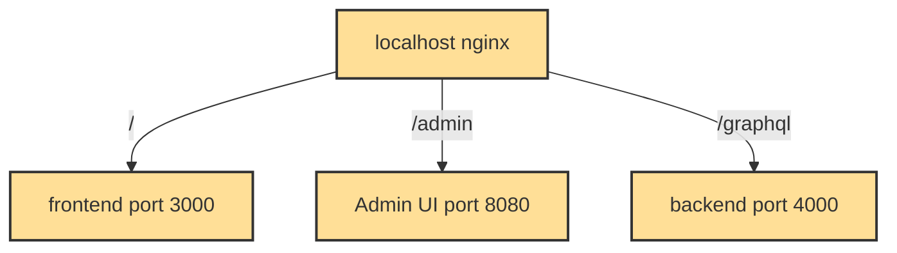

# Gradido

Healthy money for a healthy world


The Gradido model can create global prosperity and peace
The Corona crisis has fundamentally changed our world within a very short time.
The dominant financial system threatens to fail around the globe, followed by mass insolvencies, record unemployment and abject poverty. Only with a sustainable new monetary system can humanity master these challenges of the 21st century. The Gradido Academy for Bionic Economy has developed such a system.

Find out more about the Project on its [Website](https://gradido.net/). It is offering vast resources about the idea. The remaining document will discuss the gradido software only.

## Getting Started

We are still in active development, so some things might not work as expected. If you encounter any issues, please feel free to report them via the [Issue Tracker](https://github.com/gradido/gradido/issues). Your feedback is valuable as we continue to build a more sustainable financial system!

### Get Gradido to your local machine
Clone the Gradido repository to your local machine.

```bash
git clone https://github.com/gradido/gradido.git
cd gradido
```

For local development, you can run Gradido with **Docker** or **natively**, depending on your preferences and system setup. If you don't have a native MariaDB or MySQL installation, Docker can be used to handle the database as well.

### Docker Setup
You can also run Gradido using Docker.

- **Development Mode (Hot-Reload)**:

```bash
docker compose up
```

- **Production Build**:

```bash
docker compose -f docker-compose.yml up
```

This will launch the following services as containers:
| Service | Description |
| --- | --- |
| gradido | Backend & Frontend (All Modules) |
| mariadb | MariaDB Database Server |
| nginx | Webserver acting as a reverse proxy |

#### Nginx Routing Overview


### Database Setup
Gradido requires a running **MariaDB** or **MySQL** database instance.
By default, the application expects the following credentials:
- Database name: gradido_community (will be automatically created on startup)
- User: root
- Password: (empty)

You can either run the database **natively** on your system, or use **Docker** to spin up the database along with an optional phpMyAdmin interface:

- Run database using Docker:

```bash
docker compose up mariadb
```

- To launch phpMyAdmin along with the database:

```bash
docker compose up mariadb phpmyadmin
```
Once started, phpMyAdmin will be available at:
http://localhost:8074

### Native Setup
Install all node modules with [Bun](https://bun.sh/) and [Turborepo](https://turborepo.com/docs/getting-started/installation) (globally, for convenience):

```bash
bun install
bun install --global turbo@^2
```

- **Development Mode (Hot-Reload)**:
Launches Gradido with hot-reloading for fast iteration.

```bash
turbo dev
```

- **Production Build**: 
Builds and runs Gradido optimized for production.
A deployment script for Hetzner Cloud is available [here](./deployment/hetzner_cloud/README.md).

```bash
turbo start
```

[More Infos for using turbo](./working-native.md)


### For Windows

#### docker

The installation of dockers depends on your selected product package from the [dockers page](https://www.docker.com/). For windows the product *docker desktop* will be the choice. Please follow the installation instruction of your selected product.

##### known problems

* In case the docker desktop will not start correctly because of previous docker installations, then please clean the used directories of previous docker installation - `C:\Users` -  before you retry starting docker desktop. For further problems executing docker desktop please take a look in this description "[logs and trouble shooting](https://docs.docker.com/desktop/windows/troubleshoot/)"
* In case your docker desktop installation causes high memory consumption per vmmem process, then please take a look at this description "[vmmen process consuming too much memory (Docker Desktop)](https://dev.to/tallesl/vmmen-process-consuming-too-much-memory-docker-desktop-273p)"


### ⚡ Workspaces and Bun Compatibility
The project now uses **Workspaces**, and work is ongoing to make all modules **Bun-compatible**. You can currently use `bun install`, but not all modules are fully Bun-compatible yet.

To install bun, run:

```bash
curl -fsSL https://bun.sh/install | bash
```

To install dependencies with Bun: 
```bash
bun install 
```

### EMFILE: too many open files
With
```bash
bun docker_dev
```
or also
```bash
turbo dev
```
Many files will be watched by the various services.
This can lead to this error: **EMFILE: too many open files**
If increasing ulimit don't help, consider starting only the services on 
which you are working on in dev mode and the rest in production mode.

For example if you are only working on the frontend, you can start the frontend in dev mode and the rest in production mode:
```bash
bun docker_dev frontend
```
and in another bash
```bash
bun docker backend admin database nginx --no-deps
```
or local with turbo
```bash
turbo frontend#dev backend#start admin#start --env-mode=loose
```

Tip: for local setup use a local nginx server with similar config like docker nginx [nginx.conf](./nginx/gradido.conf) but replace docker image name with localhost

### Testing
This project uses a mocked `log4js` logger for tests.

- **clearLogs()**: Clears all collected logs. Call in `beforeEach` to start with a clean slate.
- **printLogs()**: Prints all collected logs since the last call to clearLogs for debugging purposes.
- Supports log levels: `trace`, `debug`, `info`, `warn`, `error`, `fatal`.
- Logs include context and additional arguments.
- Example:

```ts
import { clearLogs, printLogs } from 'config-schema/test/testSetup'

beforeEach(() => {
    clearLogs()
})
describe('test', () => {
  it('test', () => {
    expect(functionCall()).toBe(true)
    printLogs()
  })
})
```

#### Include Paths by test framework: 
- jest (backend, dht-node, federation): 
```ts
import { clearLogs, printLogs } from 'config-schema/test/testSetup'
```
- vitest (frontend, admin, database): 
```ts
import { clearLogs, printLogs } from 'config-schema/test/testSetup.vitest'
```
- bun (shared, core): 
```ts
import { clearLogs, printLogs } from 'config-schema/test/testSetup.bun'
```


#### Attention! 
It isn't tested for parallel running tests yet.
Currently Modules `frontend`, `admin`, `share` and `core` running the tests in parallel,
`database`, `backend`, `dht-node` and `federation` are running the tests still serially.

### Clear
In root folder calling `bun clear` will clear all turbo caches, node_modules and build folders of all workspaces for a clean rebuild.

```bash
bun clear
```


## Services defined in this package

- [frontend](./frontend) Wallet frontend
- [admin](./admin) Admin interface
- [backend](./backend) GraphQL & Business logic backend
- [dht-node](./dht-node) DHT Node Discover other Gradido Communities
- [dlt-connector](./dlt-connector) DLT Connector (WIP), connect to blockchain
- [federation](./federation) Federation, process incoming requests from another gradido communities
- [database](./database) Contains EntityORM entities and migration code for database
- [mariadb](./mariadb) Database server
- [config-schema](./config-schema) Contains common configuration schemas
- [e2e-tests](./e2e-tests) End-to-end tests


### Open the wallet

Once you have gradido up and running you can open [http://localhost/](http://localhost/) and create a new wallet account.

## How to release

A release is tagged on Github by its version number and published as github release. This is done automatically when a new version is defined in the [package.json](./package.json) and merged into master - furthermore we set all our sub-package-versions to the same version as the main package.json version to make version management as simple as possible.
Each release is accompanied with release notes automatically generated from the git log which is available as [CHANGELOG.md](./CHANGELOG.md).

To generate the Changelog and set a new Version you should use the following commands in the main folder

```bash
git fetch --all
bun release
```

The first command `git fetch --all` will make sure you have all tags previously defined which is required to generate a correct changelog. The second command `bun release` will execute the changelog tool and set version numbers in the main package and sub-packages. It is required to do `bun install` before you can use this command.
After generating a new version you should commit the changes. This will be the CHANGELOG.md and several package.json files. This commit will be omitted in the changelog.

Note: The Changelog will be regenerated with all tags on release on the external builder tool, but will not be checked in there. The Changelog on the github release will therefore always be correct, on the repo it might be incorrect due to missing tags when executing the `bun release` command.

## How the different .env work on deploy

Each component (frontend, admin, backend and database) has its own `.env` file. When running in development with docker and nginx you usually do not have to care about the `.env`. The defaults are set by the respective config file, found in the `src/config/` folder of each component. But if you have a local `.env`, the defaults set in the config are overwritten by the `.env`. If you do not use docker, you need the `.env` in the frontend and admin interface because nginx is not running in order to find the backend. 

Each component has a `.env.dist` file. This file contains all environment variables used by the component and can be used as pattern. If you want to use a local `.env`, copy the `.env.dist` and adjust the variables accordingly.

Each component has a `.env.template` file. These files are very important on deploy. They use COMMUNITY_HOST instead of different urls for different modules because in deploy using nginx is expected for routing incoming request to the correct module

There is one `.env.dist` in the `deployment/bare_metal/` folder. This `.env.dist` contains all variables used by the components, e.g. unites all `.env.dist` from the components. On deploy, we copy this `.env.dist` to `.env` and set all variables in this new file. The deploy script loads this variables and provides them by the `.env.templates` of each component, creating an `.env` for each component (see in `deployment/bare_metal/start.sh` the `envsubst`).

To avoid forgetting to update an existing `.env` in the `deployment/bare_metal/` folder when deploying, we have an environment version variable inside the codebase of each component. You should update this version, when environment variables must be changed or added on deploy. The code checks, that the environement version provided by the `.env` is the one expected by the codebase.


## Troubleshooting

| Problem                                          | Issue                                                | Solution                                                                      | Description                                                                 |
| ------------------------------------------------ | ---------------------------------------------------- | ----------------------------------------------------------------------------- | --------------------------------------------------------------------------- |
| docker-compose raises database connection errors | [#1062](https://github.com/gradido/gradido/issues/1062) | End `ctrl+c` and restart the `docker-compose up` after a successful build | Several Database connection related errors occur in the docker-compose log. |
| Wallet page is empty                             | [#1063](https://github.com/gradido/gradido/issues/1063) | Accept Cookies and Local Storage in your Browser                              | The page stays empty when navigating to[http://localhost/](http://localhost/)  |

## Useful Links

- [Gradido.net](https://gradido.net/)


## Attributions


Browser compatibility testing with [BrowserStack](https://www.browserstack.com/).


## License
See the [LICENSE](LICENSE.md) file for license rights and limitations (Apache-2.0 license).

