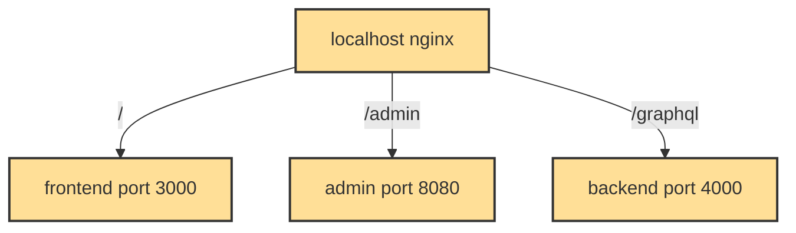

# Gradido

Healthy money for a healthy world

The Gradido model can create global prosperity and peace
The Corona crisis has fundamentally changed our world within a very short time.
The dominant financial system threatens to fail around the globe, followed by mass insolvencies, record unemployment and abject poverty. Only with a sustainable new monetary system can humanity master these challenges of the 21st century. The Gradido Academy for Bionic Economy has developed such a system.

Find out more about the Project on its [Website](https://gradido.net/). It is offering vast resources about the idea. The remaining document will discuss the gradido software only.

## Installing / Getting started

### 1. Clone Sources

Clone the repo and pull all submodules

```bash
git clone git@github.com:gradido/gradido.git
```

You can either run gradido complete in docker or native and only the db in docker

### 2a Full Docker

You need to have docker and docker compose installed

- Details for [docker](https://www.docker.com/get-started/) setup
- Details for [docker compose](https://docs.docker.com/compose/install/) setup

#### For Release
```bash 
docker compose -f docker-compose.yml up
```

#### For Developing
```bash 
docker compose up
```

You can now open gradido at [http://localhost](http://localhost)

That will start gradido in a docker container, together with 
a docker container for nginx, maildev, phpmyadmin and mariadb
- nginx listen on port 80
- phpmyadmin can be opened at [http://localhost:8074](http://localhost:8074)
- maildev can be opened at [http://localhost:1080](http://localhost:1080)

If localhost didn't work, use http://127.0.0.1:3000 instead

#### Nginx Routes



### 2b Native, Database in Docker
You need to have Yarn installed, along with Node.js v18.20.7 or higher. Additionally, you will need Docker and Docker Compose for running the database in a Docker container. Alternatively, you can use a native MariaDB or MySQL installation.

- Details for [yarn](https://phoenixnap.com/kb/yarn-windows) setup

```bash
yarn global add turbo
yarn install
docker compose up mariadb
```
and in a separate terminal

#### For Release
```bash 
turbo start
```
This will build all modules and start the server

#### For Developing
```bash 
turbo dev
```
This will run all modules in dev mode, reload on change

You can now open gradido at [http://localhost:3000](http://localhost:3000)

If localhost didn't work, use http://127.0.0.1:3000 instead

### ⚡ Workspaces and Bun Compatibility
The project now uses **Workspaces**, and work is ongoing to make all modules **Bun-compatible**. You can currently use `bun install`, but not all modules are fully Bun-compatible yet.

To install bun, run:

```bash
curl -fsSL https://bun.sh/install | bash
```

To install dependencies with Bun: 
```bash
bun install 
```

Note that some modules are still not fully compatible with Bun. Therefore, continue using **Yarn** for development if you run into any issues.

##### known problems

* In case the docker desktop will not start correctly because of previous docker installations, then please clean the used directories of previous docker installation - `C:\Users` -  before you retry starting docker desktop. For further problems executing docker desktop please take a look in this description "[logs and trouble shooting](https://docs.docker.com/desktop/windows/troubleshoot/)"
* In case your docker desktop installation causes high memory consumption per vmmem process, then please take a look at this description "[vmmen process consuming too much memory (Docker Desktop)](https://dev.to/tallesl/vmmen-process-consuming-too-much-memory-docker-desktop-273p)"


## Services defined in this package

- [admin](./admin) Wallet backend
- [backend](./backend) GraphQL & Business logic backend
- [config](./config) Contains common configuration schemas
- [database](./database) Contains EntityORM entities and migration code for database
- [dht-node](./dht-node) DHT Node Discover other Gradido Communities
- [dlt-connector](./dlt-connector) DLT Connector (WIP), connect to blockchain
- [federation](./federation) Federation, process incoming requests from another gradido communities
- [frontend](./frontend) Wallet frontend


## How to release

A release is tagged on Github by its version number and published as github release. This is done automatically when a new version is defined in the [package.json](./package.json) and merged into master - furthermore we set all our sub-package-versions to the same version as the main package.json version to make version management as simple as possible.
Each release is accompanied with release notes automatically generated from the git log which is available as [CHANGELOG.md](./CHANGELOG.md).

To generate the Changelog and set a new Version you should use the following commands in the main folder

```bash
git fetch --all
yarn release
```

The first command `git fetch --all` will make sure you have all tags previously defined which is required to generate a correct changelog. The second command `yarn release` will execute the changelog tool and set version numbers in the main package and sub-packages. It is required to do `yarn install` before you can use this command.
After generating a new version you should commit the changes. This will be the CHANGELOG.md and several package.json files. This commit will be omitted in the changelog.

Note: The Changelog will be regenerated with all tags on release on the external builder tool, but will not be checked in there. The Changelog on the github release will therefore always be correct, on the repo it might be incorrect due to missing tags when executing the `yarn release` command.

## How the different .env work on deploy

Each component has its own `.env` file. When running in development with docker and nginx you usually do not have to care about the `.env`. The defaults are set by the respective config file, found in the `src/config/` folder of each component. But if you have a local `.env`, the defaults set in the config are overwritten by the `.env`. If you do not use docker, you need the `.env` in the frontend and admin interface because nginx is not running in order to find the backend. 

Each component has a `.env.dist` file. This file contains all environment variables used by the component and can be used as pattern. If you want to use a local `.env`, copy the `.env.dist` and adjust the variables accordingly.

Each component has a `.env.template` file. These files are very important on deploy. They use COMMUNITY_HOST instead of different urls for different modules because in deploy using nginx is expected for routing incoming request to the correct module

There is one `.env.dist` in the `deployment/bare_metal/` folder. This `.env.dist` contains all variables used by the components, e.g. unites all `.env.dist` from the components. On deploy, we copy this `.env.dist` to `.env` and set all variables in this new file. The deploy script loads this variables and provides them by the `.env.templates` of each component, creating an `.env` for each component (see in `deployment/bare_metal/start.sh` the `envsubst`).

We have a validation schema for all config variables which will check that all needed config variables are existing and make sense. If some config variables are missing or not correct, the deploy will fail.


## Config examples for different working styles
### Full Docker Development
- nothing todo here, the defaults are set for this case

### Full Docker Deployment


### Local Development


## Troubleshooting

| Problem                                          | Issue                                                | Solution                                                                      | Description                                                                 |
| ------------------------------------------------ | ---------------------------------------------------- | ----------------------------------------------------------------------------- | --------------------------------------------------------------------------- |
| docker-compose raises database connection errors | [#1062](https://github.com/gradido/gradido/issues/1062) | End `ctrl+c` and restart the `docker-compose up` after a successful build | Several Database connection related errors occur in the docker-compose log. |
| Wallet page is empty                             | [#1063](https://github.com/gradido/gradido/issues/1063) | Accept Cookies and Local Storage in your Browser                              | The page stays empty when navigating to[http://localhost/](http://localhost/)  |

## Useful Links

- [Gradido.net](https://gradido.net/)


## Attributions


Browser compatibility testing with [BrowserStack](https://www.browserstack.com/).


## License
See the [LICENSE](LICENSE.md) file for license rights and limitations (Apache-2.0 license).

