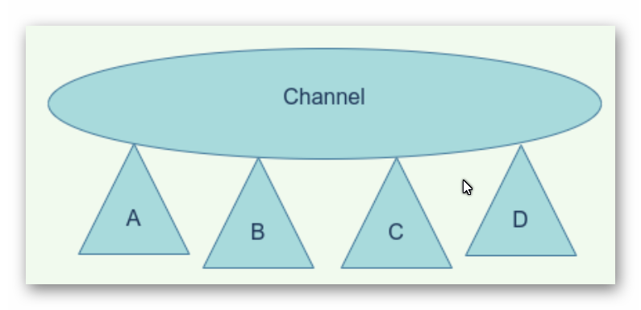
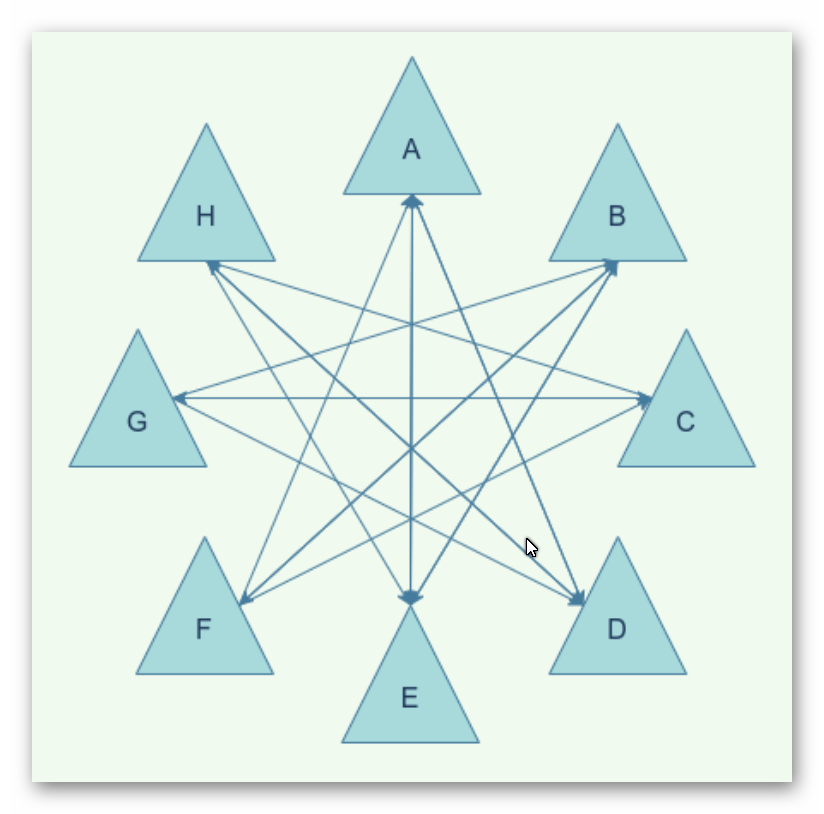
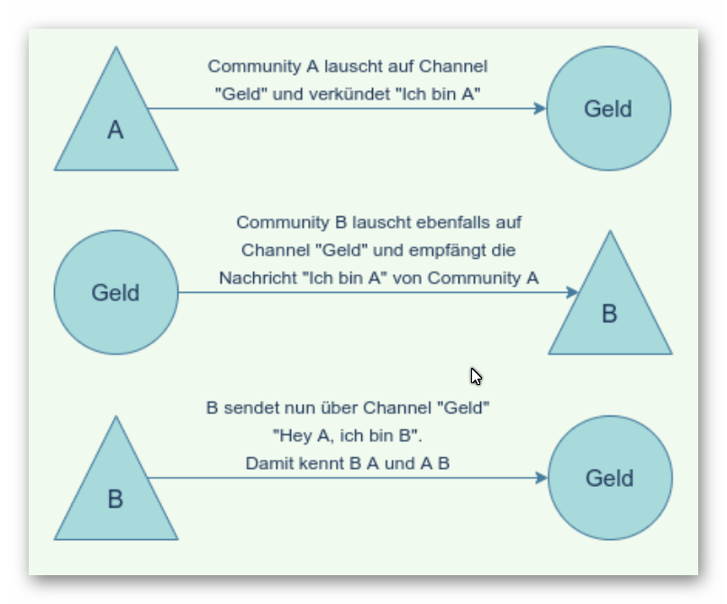
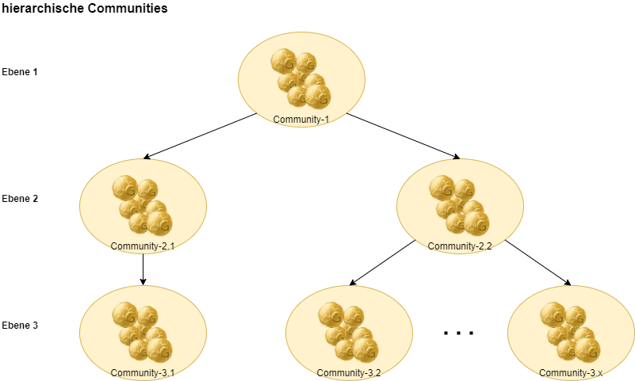
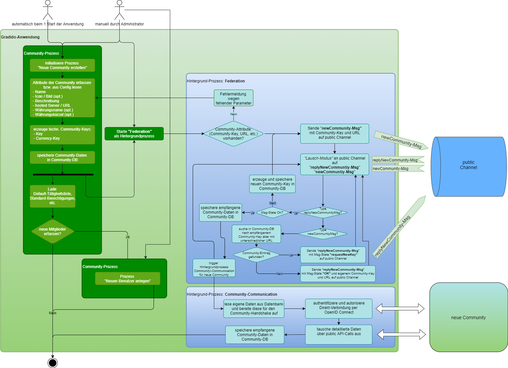

# Verwaltung der Communities

Diese Konzept beschreibt den Begriff "Community" im Kontext von Gradido, welche Eingenschaften eine Community hat und was man mit einer Community alles machen kann.

## Die Bedeutung des Begriffs Community

Eine Community bedeutet im Kontext von Gradido eine Gemeinschaft von Personen, die sich nach der Philosophie von Gradido zu einer gemeinsamen Gruppierung zusammenschließen. Unter dem gemeinsamen Zusammenschluß folgen sie also einerseits gemäß der Gradido-Philosophie der *Natürlichen Ökonomie des Lebens* und andererseits ihrer ursprünglichen Idee eine Gemeinschaft zu bilden.

Als Gradido System-Komponente beinhaltet die *Community*  die grundlegenden Funktionalitäten und Prozesse zur Verwaltung der Gruppenmitglieder, ihrer Registrierungs- und Systemzugriffe, die Konten- und Geldverwaltung einerseits und andererseits die Funktionalitäten und Prozesse zur Vernetzung und Kommunikation von mehreren Communities untereinander .

Innerhalb der Community-Komponente erfolgt die Umsetzung und Verwaltung des *lebendigen Geldes*. Soll heißen hier werden die Mechanismen zur Dreifachen-Schöpfung vollzogen, die das geschöpfte Geld nach den Community-Regeln auf die drei Arten von Empfängerkonten (AktivesGrundeinkommenkonto, Gemeinwohlkonto und Ausgleichs- und Umweltkonto) verteilt. Ein Community-Mitglied kann über seinen Community-Zugang auf sein persönliches Benutzerkonto zugreifen und darüber sein Gradido-Geld verwalten. Neben der Einsicht auf seinen aktuellen Kontostand kann er u.a. seine regelmäßig geschöpften Gradido einsehen, mit vorhandenen Gradido bezahlen oder einem anderen Mitglied Gradido überweisen. Die Geldbewegungen werden als eine Liste von Transaktionen geführt und die Vergänglichkeit der Gradidos immer aktuell zur Anzeige gebracht.

Nach der Bedeutung des Begriffs Community werden nun die Eigenschaften einer Community detailliert beschrieben, damit all die zuvor erwähnten Möglichkeiten der Community abbildbar sind.

## Eigenschaften einer Community

Hier werden die Eigenschaften einer Community beschrieben, die notwendig sind, um die oben erwähnten Möglichkeiten der Komponente zu erfüllen. Es geht dabei um verschiedene Themen und ihre dazu notwendigen Prozesse, die wiederum unter Verweiß in anderen Dokumenten detailter beschrieben sind.

### Währung

In einer Community werden die Prozesse der 3-fachen-Geldschöpfung, sowie der Transfer von Geld in der *Gradido-Währung* ablaufen. Mit dem Erstellen einer neuen Community wird technisch gesehen gleichzeitig auch eine eigene *Community-Gradido* Währung bei der Schöpfung erzeugt.

Ziel dieser Community eigenen Währung ist für die Gemeinschaft über ein Währungs-Branding sich marketingstechnisch hervorheben zu können. Zum Beispiel könnte eine Community aus der Region "Liebliches Taubertal" sich über den *Community-Gradido* den sogenannten "Taubertäler" erzeugen, den die Mitglieder dann aber auch überregional mit anderen Communities in Umlauf bringen und somit Werbung für ihre Region machen.

| PR-Kommentare          |                                                                                                                                                                                                                                                                                                                                                                                                                                                                                                                                                                                                                                                                                                                                                                                                                                                                                                                                                                   |
| ---------------------- | ----------------------------------------------------------------------------------------------------------------------------------------------------------------------------------------------------------------------------------------------------------------------------------------------------------------------------------------------------------------------------------------------------------------------------------------------------------------------------------------------------------------------------------------------------------------------------------------------------------------------------------------------------------------------------------------------------------------------------------------------------------------------------------------------------------------------------------------------------------------------------------------------------------------------------------------------------------------- |
| Ulf 07.11.2021         | Was hälst du von einem Namen für die Währung "Der Taubertäler", den jede Community definieren kann, sich aber auch zu einer anderen anschließen kann. Dies ist aber nur das Branding in Sachen Anzeige & Marketing. Darunter liegt der Gradido - dieser ist weiter aufgestellt als nur regional - nämlich weltweit. Auch hier müssen "Bösewichte" ausgeschlossen werden können - Prozess & Regeln dafür?  Ich mache mir einfach ein wenig Sorgen, dass wir die Anforderung "Jeder Coin hat eine eindeutige Community-Prägung" nicht erfüllen können mit der aktuellen Implementierung und ich habe auch Schwierigkeiten mir vorzustellen, wie sich das mit Schwundgeld verhalten soll - insbesondere mit stärker schwindendem Geld bei größerer Geldmenge. Der Schwund ist also auf alle meine Coins gebunden, währen die Prägung auf den jeweiligen Coin passiert. Ich glaube das ist sehr schwierig beides entsprechend abzubilden. |
| Claus-Peter 25.11.2021 | Ich kann die Bedenken einerseits verstehen und andererseits die Visionen von Bernd nachvollziehen. Dass diese nicht immer einfach unter einen Hut zu bringen sind, ist klar und dennoch möchte ich diese zumindest in den fachlichen Anforderungen nicht einfach rausstreichen. Wie diese dann technisch zu konzipieren sind ist und bleibt letztendlich genau unsere Aufgabe.                                                                                                                                                                                                                                                                                                                                                                                                                                                                                                                                                                              |

Andererseits soll aber, wenn eine Community sich bei der Geldschöpfung nicht an die Regel der *Gradido-Philosopie* hält, eine technische Möglichkeit geschaffen sein, dass diese Community in ihrer weiteren Geldschöpfung und dem Handel *ihrer* Währung sanktioniert werden kann.

Aber grundsätzlich bleibt bei allen *Community-Gradido*-Währungen die Vergänglichkeit als Sicherungsmechanismus des Geldvolumens und der 1:1 Umtausch zwischen verschiedenen *Community-Gradidos* bestehen.

#### Schutz vor Falschgeld

- Blacklisting
- Bereinigung durch Bezahlen nach Priorisierung
  - 1. GDD von der Community des Empfängers
    2. GDD von anderen Communities nach Menge von wenig nach viel
    3. GDD von der eigenen Community
    4. geblacklistete werden gar nicht verwendet und vergehen

* Vergänglichkeitsbereinigung
  * 1. GDD anderer Communities nach Menge von wenig nach viel

| PR-Kommentare          |                                                                                                                                                                                                                                                                                                                                                                                                                                                                                                                                                                                                                                                                                                                                                                                                                                                                                                                                                                                                                                                                                                                              |
| ---------------------- | ---------------------------------------------------------------------------------------------------------------------------------------------------------------------------------------------------------------------------------------------------------------------------------------------------------------------------------------------------------------------------------------------------------------------------------------------------------------------------------------------------------------------------------------------------------------------------------------------------------------------------------------------------------------------------------------------------------------------------------------------------------------------------------------------------------------------------------------------------------------------------------------------------------------------------------------------------------------------------------------------------------------------------------------------------------------------------------------------------------------------------- |
| Ulf 07.11.2021         | Wenn die geblacklisteten Coins prioritisiert vergehen kann der findige Angreifer den Verfall umgehen, indem er sich ungültige/blacklistete Coins erschafft, die dann genau seinem Verfall entsprechen.                                                                                                                                                                                                                                                                                                                                                                                                                                                                                                                                                                                                                                                                                                                                                                                                                                                                                                                      |
| Claus-Peter 25.11.2021 | Das Kapitel "Schutz vor Falschgeld" ist wohl eher noch im Status "Brainstorming" zu verstehen. Hier wurden mögliche Regeln notiert, die noch nicht in ihrer Gänze durchdacht und konzipiert sind. Der Punkt Vergänglichkeitsbereinigung sagt folgendes aus: Kontostand am 01.01.2021: - 100 GDD aus der eigenen Community - 100 GDD aus Community A - 100 GDD aus Community B - gesamt 300 GDD  Nach einem Jahr ohne irgendwelche weiteren Transaktionen ergibt sich folgendes am 31.12.2021: - Vergänglichkeit mit 365 Tagen bei 300 GDD = 150 GDD (nicht gerechnet, sondern 50%) - die 150 GDD Vergänglichkeit als Tx-Buchung führt zu folgendem Kontostand:   * 100 GDD aus der eigenen Community   * 50 GDD aus der Community A   * 0 GDD aus der Community B   * gesamt 150 GDD  Soweit der Gedankengang zur Bereinigung des Kontos mit GDD aus anderen Communities. Das hat keine Auswirkung auf die Wertigkeit, sondern soll sich allein auf die Reduktion der Viefältigkeit an Community-Währungen im eigenen Konto führen. |

* Bezahl-Vorbereitung
  * Austausch von Blacklist zw. Teilnehmer
  * ggf. Übersteuern der Balcklist falls gewünscht

| PR-Kommentare          |                                                                                                                                                                                                                                                                                                                                                                                                                                                                                                                  |
| ---------------------- | ---------------------------------------------------------------------------------------------------------------------------------------------------------------------------------------------------------------------------------------------------------------------------------------------------------------------------------------------------------------------------------------------------------------------------------------------------------------------------------------------------------------- |
| Ulf 07.11.2021         | Ich denke die vervielfachung von Coins und damit eine Ab/Auf-Wertung der jeweiligen Währen einer Community ist entgegen dem Konzept von Gradido. Gradido schafft eine stabile Zeit-Tausch-Einheit. Diese sollte Weltweit den gleichen Wert haben - warum sollte der Peruaner für seine Zeit weniger Gradido bekommen als ein Europäer? Das zementiert einfach weiterhin die bestehende Ordnung auf dem Planeten. Wollen wir das? Daher mein Credo: Niemals einen Faktor zwischen Communities einführen. |
| Claus-Peter 25.11.2021 | Den Kommentar verstehe ich nicht in Bezug auf die zitierten Dokument-Zeilen. Wo finden sich Hinweise auf eine Ab/Auf-Wertung der Währung? Das Blacklisting ist mit Sicherheit ein sehr sensibler Punkt und muss genauestens und tiefer durchdacht und konzipiert werden. Ansonsten stimme ich dem Inhalt und deinem Credo voll zu.                                                                                                                                                               |

### Anzeige und -Darstellung

Da es also mehrere Communities geben wird, benötigt jede Community ihren eigenen Namen und gar ein Symbol oder Bild, um eine optische Unterscheidung oder gar eigenes Branding bei der Anzeige in den Systemen sicherzustellen. Für eine Aussendarstellung wäre eine Beschreibung der Community und ihre eigene Philosopie, was die Community auszeichnet hilfreich. Diese Werte müssen vom Community-Administrator gepflegt werden können.

### Mitgliederverwaltung

Für die Verwaltung von Community-Mitgliedern werden entsprechende Verwaltungsprozesse wie Registrierung, Login mit Autentifizierung, eine Benutzerverwaltung für neue, bestehende und ausscheidende Mitgleider benötigt. Die Benutzerverwaltung stellt zusätzlich die Anforderung, dass ein Community-Mitglied eindeutig identifizierbar ist und das Community übergreifend. Das bedeutet es kann eine Person immer nur einmal existieren und darf auch niemals in mehreren Communities gleichzeitig Mitglied sein. Denn es muss sichergestellt werden, dass eine Person sich keine unerlaubte Vorteile durch zum Beispiel mehrfache Geldschöpfung in mehreren Communities verschafft. 

Die Details der Mitgliederverwaltung werden beschrieben im Dokument [BenutzerVerwaltung](.\BenutzerVerwaltung.md).

### Community-Netzwerk

Ein grundlegender Ansatz des Gradido-Systems beinhaltet die Einstufung aller beteiligten Gradido-Communities als gleichberechtigte Einheiten. Diese bilden unterneinander ein Kommunikations-Netzwerk zum Austausch an Informationen, aber auch zum Aufbau eines gemeinsamen Verbundes weiterer Aktivitäten.

#### Vernetzung

Die Vernetzung der Gradido-Communities erfolgt automatisch über eine Channel-Infrastruktur.

Das bedeutet mit dem Aufsetzen und Inbetriebnehmen einer neuen Community erfolgt eine automatisierte Vernetzung der neuen Community mit den schon existierenden Communities über einen dedizierten Kommunikationskanal. Dies dient in aller erster Linie dazu, dass sich alle Gradido-Communities untereinander kennen lernen. Das dadurch entstehende Netzwerk von Gradido-Communities benötigt somit keinen zentralen Knoten, der die Verwaltung der dem Netzwerk beigetretenen Instanzen übernehmen müsste.

Alle späteren Aktivitäten wie u.a. das gemeinsame Handeln oder Gradido-Transfer erfolgen dann in direkter Kommunikation zwischen zwei Communities. Dabei lauschen die Communities an nach fachlichen Themen separierte Kommunikationskanäle. Sobald eine direkt an eine Community adressierte oder auch wenn eine für eine Community interessante Nachricht empfangen wird, erfolgt die weitere Verarbeitung dieser Nachricht in direktem Austausch der beiden betroffenen Communities. Durch die Teilnahme einer Community an spezifischen fachlichen Kommunikationskanäle lernen sich die Communities untereinander an ihren spezifischen Interessen besser kennen bzw. können auch durch aktives Propagieren die engere Vernetzung zwischen den Communities beschleunigen.

#### Ausfallsicherheit

Ein weiterer wichtiger Aspekt der Community-Vernetzung ist die Sicherstellung der Ausfallsicherheit. Dabei erfolgt im Community-Netzwerk die Verteilung von Community eigenen Daten auf Knoten anderer Communities. Dadurch kann jederzeit bei einem Ausfall eines Netzwerkknotens und den damit betroffenen Communities einerseits ein online Fail-Over-Szenario betrieben werden und/oder andererseits der Wiederaufbau eines neuen Knotens mit den verlorenen Community-Daten und aus dem Netzwerk wiederhergestellten Daten erfolgen.

#### Eindeutige Mitgliedschaft

Durch das Community-Netzwerk erfolgt  auch der sehr wichtige Prozess der Sicherstellung, dass eine natürliche Person sich nur einmal bei einer Community im gesamten Community-Netzwerk registrieren darf. Dazu erfolgt ein Informationsaustausch über einen bestimmten Kommunikationskanal zwischen allen Communities untereinander. Das dazu notwendige Protokoll und die benötigten Daten werden im technischen Konzept definiert. Die Entscheidung, ob die Überprüfung der eindeutigen Mitgliedschaft direkt mit dem eigentlichen Registrierungsprozess eines Mitglieds gekoppelt werden kann oder ob diese nachträglich asynchron im Hintergrund stattfinden muss, findet erst bei der technischen Konzeption ggf. durch ein technisches Proof-of-Concept statt.

| PR-Kommentar           |                                                                                                                                                                                                                                                                                                                                                                                                                                                                                                                                                                                                                                                                                                                                                                                                                                                                                                                                                                                                                                                                                                                                                                                                                                                                                                                |
| ---------------------- | -------------------------------------------------------------------------------------------------------------------------------------------------------------------------------------------------------------------------------------------------------------------------------------------------------------------------------------------------------------------------------------------------------------------------------------------------------------------------------------------------------------------------------------------------------------------------------------------------------------------------------------------------------------------------------------------------------------------------------------------------------------------------------------------------------------------------------------------------------------------------------------------------------------------------------------------------------------------------------------------------------------------------------------------------------------------------------------------------------------------------------------------------------------------------------------------------------------------------------------------------------------------------------------------------------------- |
| Ulf 07.11.2021         | Diese Anforderung ist technisch nicht zu erfüllen. 1. Eine Identifikation einer Person erfolgt immer mithilfe eines technischem Identifiers wie z.B. der Personalausweisnummer, EMail, Telefonnummer oder anderes. Schon durch diese Abstraktion kann ein Nutzer mehr als eine Identität aufbauen (2 Telefonnummer z.B.) 2. Die Prüfung auf Eindeutigkeit in einem dezentralen Netzwerk kann nicht sichergestellt werden, da Teile des Netzwerks zum Zeitpunkt der Prüfung nicht erreichbar oder gar unbekannt sein können. 3. Bedarf es den Austausch der Personen-Identifikation zwischen dem Communties: "kennst du email@domain.com?". Diese Daten können verschlüsselt werden z.B mit `hash(salt,email)` welche dann an jede Community geschickt werden: kennst du `hash(salt,email), salt`? Was dazu führt, dass jede Community den hash aller seiner EMails errechen muss - die Skalierung ist entsprechend schlecht.  Alternativ kann hier eine Blockchain eingesetzt werden, welche `hash(salt,email), salt` speichert und als dezentrales Nachschlagewerk für alle zugänglich ist. Hier erwarte ich ein Konzept, bevor wir das umsetzen können. Die Sicherheit der Nutzerdaten ist ebenfalls genau zu untersuchen, wenn wir das ganze ins Internet blasen. |
| Claus-Peter 25.11.2021 | Ja da gebe ich dir nach heutigem Stand vollkommen Recht, dass es dafür derzeit keine 100% technische Lösung gibt. Trotzdem ist das Thema fachlich gewünscht und wir müssen uns Gedanken machen, wie wir dafür eine technische Lösung finden können, die nahezu an die Anforderungen heranreicht. Genau deshalb endet dieser Absatz mit dem Hinweis auf die technsiche Konzeption.                                                                                                                                                                                                                                                                                                                                                                                                                                                                                                                                                                                                                                                                                                                                                                                                                                                                                                                  |

### Hirarchische Community

Um die Vision Gradido als Währung nicht nur in Communities als gemeinsame Interessensgemeinschaften zu etablieren, sondern auch für ganze Communen, Bundesländer, Nationen oder gar weltweit, bedarf es einer Strukturierung von Communities. Dazu dient das Konzept der *hierarchischen Community*, seinen Ursprung in der Abbildung des Föderalismus von Deutschland findet. Das bedeutet, dass eine baumartige Struktur von Communities aufgebaut werden kann, wie nachfolgendes Bild schemenhaft zeigt:

| PR-Kommentar           |                                                                                                                                                                                                                                                                                                                                                                                                                                                                                                                                                                                                                                                            |
| ---------------------- | ---------------------------------------------------------------------------------------------------------------------------------------------------------------------------------------------------------------------------------------------------------------------------------------------------------------------------------------------------------------------------------------------------------------------------------------------------------------------------------------------------------------------------------------------------------------------------------------------------------------------------------------------------------- |
| Ulf 25.11.2021         | Ich denke Förderalismus wie in der Bundesrepublik ist mit Gradido nicht möglich. Es ergibt sich durch das Schwundgeld einfach keine Vorteile eines Förderalismus. Szenario Straßenbau zwischen zwei Communties: - Warum sollte Geld von beiden Communities auf ein drittes Konto fließen, wenn es dort doch nur vergeht? - Ist es nicht realistischer, dass beide Communties sich auf den Straßenbau einigen und das Geld direkt an den Auftragnehmer überweisen, um dem Schwund so weit es geht zu entgehen.  Warum sollte sich eine Community einer anderen unterordnen? Was sind die Vorteile? *Nur ein Gedanke* |
| Claus-Peter 25.11.2021 | Ich kann deinen Gedanken und Bedenken folgen, doch andererseits kann ich auch dem Föderalismus etwas abgewinnen. Klar würde sich eine Community schwer tun, sich einer anderen Community unterzuordnen. Doch genau da beginnt die Überlegung, wie man ein Community-übergreifendes Projekt organisieren könnte? Da gibt es schon Vorteile, die natürlich noch feiner konzipiert und ausformuliert werden müssen. Daher sollten wir die Hierarchie von Communities nicht im Vorhinein ausschließen.                                                                                                                                            |

Es wird somit zwischen zwei Communities aus direkt benachbarten Ebenen eine Parent-Child-Beziehung erzeugt. Dadurch gehen diese beiden Communities eine besondere Beziehung untereinander ein, die zu folgenden veränderten Eigenschaften und Verhalten der Parent- und der Child-Community führen:

#### Parent-Community

* kann 1 bis n Child-Communities besitzen
* verwaltet keine Mitglieder mit AGE-Konto
* verwaltet nur noch Community eigenes Allgemeinwohl-Konto und AUF-Konto
* benötigt in der Parent-Child-Beziehung einen besonderen Verteilungsschlüssel für das geschöpfte Geld  auf die beiden Allgemeinwohl- und AUF-Konten in Richtung Child- nach Parent-Community
* bedarf spezieller Administrations-Rechte und Rollen zum Auf- und Abbau der Child-Community-Beziehungen
* bedarf spezieller Administrationsprozesse zur Verwaltung der Parent-Aufgaben:
  * Auf- und Abbau der Parent-Child-Beziehung
  * Verschiebung aller Mitglieder von der Parent- in die Child-Community
  * Stoppen des Sicherstellungsprozesses, dass eine *natürliche Person* nur Mitglied einer einzigen Community ist, sobald die erste Child-Beziehung aufgebaut ist und alle Mitglieder dorthin verschoben sind
  * Prozess zur Aufnahme der geschöpften Allgemeinwohl- und AUF-Gelder aus den Child-Communities
  * stoppt den Schöpfungsprozess sobald eine Child-Beziehung aufgebaut ist
  * startet den Schöpfungsprozess sobald die letzte Child-Beziehung aufgelöst ist
  * Aufnahmeprozess von Mitgliedern aus einer Child-Community, bevor dessen Beziehung aufgelöst wird
  * starten des Sicherstellungsprozesses, dass eine *natürliche Person* nur Mitglied einer einzigen Community ist, sobald die letzte Child-Beziehung aufgelöst ist

#### Child-Community

* besitzt genau eine Parent-Community
* **sofern es eine Community der untersten Ebene ist:**
  * verwaltet die Mitglieder mit AGE-Konto
  * nimmt die *natürliche Personen*-Mitglieder aus der Parent-Community auf
  * bietet einen Wechsel-Prozess für ein Mitglied aus dieser Community in eine andere (Child)-Community
  * läuft hier der automatische 3-fach-Schöpfungsprozess inklusive der Verteilung des geschöpften Geldes gemäß dem zuvor definierten Verteilungsschlüssel innerhalb der Community
  * wird hier sicher gestellt, dass nur auf PersonalAccounts von *natürlichen Personen* und nicht auf ImpersonalAccounts von *Projekten/Vereine/Firmen* Geld geschöpft wird
* **sofern es eine Parent-Community gibt:**
  * läuft hier der Verteilungsprozess aus der Schöpfung auf das Allgemeinwohl- und AUF-Konto gemäß des Verteilungsschlüssels in Richtung von Child nach Parent also von unten nach oben
* hier läuft der Prozess zur Sicherstellung, dass eine *natürliche Person* nur Mitglied einer einzigen (Child)-Community ist
*

### Geldschöpfung

Eine Community stellt die Mechanismen für die Dreifache-Geldschöpfung bereit. Dazu müssen zuerst die Verteilungsschlüssel auf die drei Kontoarten definiert bzw. konfigurierbar sein. Diese Konfigurationswerte werden vom Community-Administrator gepflegt. Sie dienen als Grundlage für die Höhe der regelmäßig geschöpften Beträge auf die drei Empfängerkonto-Typen. Die regelmäßige Geldschöpfung läuft teilweise automatisiert im Hintergrund und muss den Regeln der Nartürlichen Ökonomie des Lebens folgen. Die Details der Dreifachen Geldschöpfung sind in dem Dokument [RegelnDerGeldschoepfung](./RegelnDerGeldschoepfung.md) beschrieben.

### Konto-Verwaltung

Für die Dreifach-Geldschöpfung verwaltet die Community drei Arten von Konten: das AktiveGrundeinkommen-Konto pro Mitglied, das Community-eigene Gemeinwohlkonto und das Community-eigene Ausgleichs- und Umweltkonto(AUF).

Für jedes Mitglied der Community wird also ein eigenes AktiveGrundeinkommen-Konto verwaltet, auf das ein Drittel der monatlichen Geldschöpfung unter Einhaltung der AGE-Regeln fließt. Das Gemeinwohlkonto und das AUF-Konto existieren pro Community einmal und auf jedes der beiden Konten fließen monatlich die beiden anderen Drittel der Geldschöpfung.

Somit muss also eine Community für jede Kontoart die entsprechenden Kontoverwaltungsprozesse anbieten. Einmal in Verbindung pro Mitglied für das AGE-Konto und dann jeweils eine Verwaltung für das Gemeinwohlkonto und eine Verwaltung für das AUF-Konto. Die Berechtigungen für die Zugriffe auf die drei Kontoarten müssen ebenfalls in der Community gepflegt und kontrolliert werden. Das bedeutet die Community muss ihren Mitgliedern auf ihre eigenen AGE-Konten Zugriffsrechte erteilen und diese auch kontrollieren, so dass keine unerlaubten Zugriffe stattfinden können. Dann müssen in der Community bestimmte Mitglieder Sonderberechtigungen erhalten, um die Verwaltung des Gemeinwohlkontos und des AUF-Kontos durchführen zu können. Die Verwaltung der Berechtigungen ist wiederum alleine dem Community-Administrator erlaubt. Die Details der Kontenverwaltung ist im Dokument [KontenVerwaltung](.\KontenVerwaltung.md) beschrieben.

### Tätigkeitsverwaltung

Hier handelt es sich um eine Verwaltung von Tätigkeitsbeschreibungen, die von den Community-Mitgliedern als akzeptierte und berechtigte Leistungen zur Geldschöpfung als *Aktives Grundeinkommen* angesehen werden. Das heißt die Community muss unter den Mitgliedern eine Liste erarbeiten, die alle Tätigkeiten enthält, aus denen sich ein Mitglied dann eine oder mehrere auswählen kann, um sich sein Aktives Grundeinkommen damit zu decken. Die einzelnen Tätigkeiten sollen auch fachlich strukturierbar sein z.B. Kunst, Soziales, Gesundheit, Produktion, etc. . Die Menge und Definition der einzelnen Tätigkeiten und Strukturen unterliegt einer stetigen Anpassung nach den Bedürfnissen der Community-Mitglieder, um den natürlichen Veränderungen des miteinander Lebens gerecht werden zu können. Ob zu einer Tätigkeitsbeschreibung auch gleich eine Wertigkeit definiert werden soll, ist noch offen. Man kann aber sicherlich sagen, dass manche Tätigkeiten dem Gemeinwohl dienlicher sind als andere. Aber auch das ist wiederum eine Ansichtsache und muss unter den Community-Mitgliedern vereinbart werden.

| PR-Kommentar           |                                                                                                                                                                                                                                                                                                                                                                                                                                                                                                                                                                                                                                                                                                                                                                                       |
| ---------------------- | ------------------------------------------------------------------------------------------------------------------------------------------------------------------------------------------------------------------------------------------------------------------------------------------------------------------------------------------------------------------------------------------------------------------------------------------------------------------------------------------------------------------------------------------------------------------------------------------------------------------------------------------------------------------------------------------------------------------------------------------------------------------------------------- |
| Ulf 07.11.2021         | Was ist wenn Tätigkeit A in Community X vergütet wird und Tätigkeit B in Community Y: - Ich übe Tätigkeiten A & B aus - Muss ich mich entscheiden, welche Tätigkeit ich vergütet wissen will? (Stichwort eindeutige Registrierung im gesammten Netzwerk)                                                                                                                                                                                                                                                                                                                                                                                                                                                                                                             |
| Claus-Peter 25.11.2021 | Gute Frage! Ich denke wir sollten im 1. Schritt damit beginnen, dass jede Community ihre eigene Aktivitätenliste pflegt. Es werden dann wohl gleiche Aktivitäten in mehreren Listen der verschiedenen Communities auftauchen.  Ich kann aber als Mitglied der Community A eine Tätigkeit A.X von einem Mitglied aus Community B bestätigt bekommen und natürlich auch von Mitgliedern aus meine Community A.  Dazu müssen dann natürlich die notwendigen Informationen zw. den Communities für eine Cross-Community-Bestätigung ausgetauscht werden. Das führt dann genau zu dem gewünschten Effekt, dass zw. zwei Communities ein Informationsaustausch stattfindet, der dann eine Aussage über den Cross-Handel und das Vertrauen ermöglicht. |

Zu der Liste der Tätigkeiten gibt es einen weiteren Prozess, der in dem Dokument [RegelnDerGeldschoepfung](./RegelnDerGeldschoepfung.md) näher beschrieben ist. Hier kann soviel erst einmal gesagt werden, dass die Tätigkeitenliste als Grundlage dient, damit ein Mitglied für seine erbrachten Leistungen für das Allgemeinwohl dann sein monatliches *Aktives Grundeinkommen* gutgeschrieben bekommt. Dieses Gutschreiben des AGEs unterliegt noch einer vorherigen Bestätigung von anderen Community- oder auch Community übergreifenden Mitgliedern. Somit erfolgt dadurch eine implizite Vernetzung der Mitglieder durch dieses aktive Bestätigen anderer Leistungen, was gleichzeitig wieder Vorraussetzung ist, um sein eigenes AGE zu erhalten.

### Berechtigungsverwaltung

Die Community muss für die verschiedenen Eigenschaften und Prozesse eine eigene Berechtigungsverwaltung zur Verfügung stellen. Für die verschiedenen Berechtigungen muss ein Rollen- und Rechte-Konzept administrierbar sein, so dass für die verschiedenen Mitglieder der Community die Zugriffe feingranular definiert, gesteuert und kontrolliert werden können. Allein der Administrator hat die Rechte auf die Berechtigungsverwaltung zuzugreifen. Das System muss diese hinterlegten Rollen und Rechte dann auf die verwalteten Mitglieder abbilden und für jeden Zugriff auf die Community entsprechend kontrollieren, freigeben oder verhindern.

### Vernetzung und Vertrauensbildung

Mit der Vernetzung der Communities und dem gemeinsamen Handel zwischen Community-Mitgliedern innerhalb des gesamten Netzwerks entsteht automatisch ein Vertrauensverhältnis zwischen den verschiedenen Communities und auch zwischen den Community-Mitgliedern. Diese sich dynamisch verändernde Vertrauensverhältnisse können als Graph aufbereitet und zu weiteren Auswertungen bzw. Priorisierungen von fachlichen Prozessen herangezogen werden. Da in dem Gradido-Netzwerk der Mensch und das gegenseitige Vertrauen im Mittelpunkt steht, benötigt er für seine Bewertungen und Entscheidungen von Handel und Austausch mit anderen Communities bzw. anderen Mitgliedern ein Werkzeug, das ihm diese Informationen liefern kann. Das bedeutet in der Gradido-Anwendung werden statistische Werte über die Kommunikation zwischen Communities und zwischen Mitgliedern erhoben, die als Grundlage für den Vertrauensgraphen dienen.

### Attribute einer Community

In diesem Kapitel werden die Attribute beschrieben, die in einer Community zu speichern sind.

#### Name

Das Attribut *Name* dient zur möglichst eindeutigen Benennung der Community. Er wird als Menschen lesbare Anzeige und als Unterscheidungskriterium bei mehreren Communities eingesetzt. Nur der Community Administrator kann diesen setzen und verändern.

#### Bild

Das Attribut *Bild* wird für die Anzeige einer Community verwendet und kann nur vom Community-Administrator gesetzt werden.

#### Beschreibung

Das Attribut *Beschreibung* ist ein Text, der die Philosophie der Community ausdrücken soll. Hier können sich die Community-Mitglieder eine gemeinsame Formulierung ausdenken, die nach ihrer Vorstellung den Kern und die Grundregeln ihrer Gemeinschaft am besten ausdrücken. Dies könnte wie eine Art Aussendarstellung für neue Mitglieder dienen. Aber nur der Community-Administrator hat die Schreib-Rechte für dieses Attribut.

#### Serverzuordnung

Das Attribut *Serverzuordnung* ist technisch motiviert und dient zusammen mit dem Attribut Name der eindeutigen Identifikation einer Community. Bei der Gründung einer neuen Community muss festgelegt werden auf welchem Server diese Community gehostet wird - auf einem schon vorhandenen Server oder ein extra für diese Community neu aufgesetzter Server. Das Attribut Serverzuordnung muss aber für eine Virtualisierung und technische Skalierung auf mehrere Server-Instanzen vorbereitet sein, sodass keine direkte physische Hardware-Serverzuordnung hierdurch fixiert ist. Aber auch ein eventueller Umzug der Community von einem Server auf einen anderen Server muss möglich sein. Der Community-Administrator hat alleiniges Zugriffsrecht auf dieses Attribut.

#### Liste von Benutzer

Dieses Listenattribut beinhaltet Benutzer-Elemente, die erfolgreich als Mitglied der Community registriert sind. Die Details eines Benutzer-Elements werden in dem Dokument [BenutzerVerwaltung](./BenutzerVerwaltung.md) beschrieben. Ein Benutzer-Element besitzt wiederum ein Konto, das für die Community als Ziel der Schöpfung für das AGE des Mitglieds dient. Gleichzeitig wird für ein Benutzer-Element aber auch unterschieden zwischen einem Menschkonto (PersonalAccount) und einem Sachkonto (ImpersonalAccount). Denn nur für ein Benutzerelement mit PersonalAccount, sprich für eine *natürliche Person*, darf Geld für das AGE geschöpft werden, wohingegen für ein Benutzerelement mit ImpersonalAccount, sprich für ein *Projekt/Verein/Sache*, kein Geld geschöpft werden darf.

#### Gemeinwohlkonto

Das Attribut *Gemeinwohlkonto* dient als ein Konto-Element, das den Kontotyp Gemeinwohlkonto repräsentiert. Alle Kontobewegungen, wie Geldschöpfung, Geldtransfers, etc., die das Gemeinwohl dieser Community betreffen, werden über dieses Attribut abgewickelt. Details zu Kontobewegungen werden im Dokument [KontenVerwaltung](KontenVerwaltung.md) beschrieben und die Regeln und Vorgänge der Geldschöpfung sind im Dokument [RegelnDerGeldschoepfung](RegelnDerGeldschoepfung.md) zu finden. Auf dieses Attribut haben nur Mitglieder mit entsprechenden Zugriffsrechten die Erlaubnis und Möglichkeiten darauf Einsicht zu nehmen und Prozesse auszulösen.

#### Ausgleichs- und Umweltkonto AUF-Konto

Das Attribut *Ausgleichs- und Umweltkonto* dient als ein Konto-Element, das den Kontotyp AUF-Konto repräsentiert. Alle Kontobewegungen, wie Geldschöpfung, Geldtransfers, etc., die das AUF-Konto dieser Community betreffen, werden über dieses Attribut abgewickelt. Details zu Kontobewegungen werden im Dokument [KontenVerwaltung](KontenVerwaltung.md) beschrieben und die Regeln und Vorgänge der Geldschöpfung sind im Dokument [RegelnDerGeldschoepfung](RegelnDerGeldschoepfung.md) zu finden. Auf dieses Attribut haben nur Mitglieder mit entsprechenden Zugriffsrechten die Erlaubnis und Möglichkeiten darauf Einsicht zu nehmen und Prozesse auszulösen.

#### Verteilungsschlüssel der Dreifachen-Schöpfung

Im Attribut *Verteilungsschlüssel* der Dreifach-Schöpfung werden die für die Community festgelegten Verteilschlüssel konfiguriert. Diese Werte dienen als Grundlage für die Geldschöpfung innerhalb dieser Community. Nur der Administrator hat Zugriffsrechte auf dieses Attribut.

Sobald die Community in einer Parent-Child-Beziehung steht, muss das Attribut *Verteilungsschlüssel* ebenfalls die Verteilung der Allgemeinwohl- und AUF-Gelder zwischen Child und Parent-Community definieren. Die erweiterte Konfiguration des Verteilungsschlüssel muss Teil des Aufbau-Prozesses einer Parent-Child-Beziehung sein bzw. währenddessen geprüft und konfiguriert werden.

#### Parent

Das Attribut *Parent* dient für den hierarchischen Aufbau von Communities. Es enthält den Bezug auf die Community, die für diese Community als Eltern-Community eingerichtet ist. Eine Child-Community kann maximal eine Parent-Community haben. Durch diesen Bezug zu der Parent-Community werden einzelne Prozesse zwischen der Parent- und der Child-Community freigeschalten. Damit ergeben sich erweiterte Möglichkeiten u.a. für die Community-Mitglieder beider Communities, wie beispielsweise das Community übergreifende Handeln zwischen den Community-Mitgliedern oder eine veränderte Verteiltung der Gemeinwohl- und AUF-Schöpfung, etc.. Die Administration dieses Attributes erfolgt implizit über die fachlichen Prozesse, die den Auf- und Abbau einer Parent-Child-Beziehung zwischen zwei Communities steuern. Diese können nur durch den Adminitrator und seiner Berechtigung ausgelöst werden. Die Beschreibung dieser Prozesse ist weiter unten im Kapitel **Anwendungsfälle auf einer Community** zu finden.

#### Liste Children

Das Attribut *Liste Children* dient ebenfalls dem hierarchischen Aufbau von Communities. Es enthält die Bezüge auf die Communities, die für diese Community als Child-Community eingerichtet sind. Eine Parent-Community kann mehrere Child-Communities haben. Durch diesen Bezug zu den Child-Communities werden einzelne Prozesse zwischen der Parent- und den Child-Communities freigeschalten. Damit ergeben sich erweiterte Möglichkeiten u.a. für die Community-Mitglieder beider Communities, wie beispielsweise das Community übergreifende Handeln zwischen den Community-Mitgliedern oder eine veränderte Verteiltung der Gemeinwohl- und AUF-Schöpfung, etc.. Die Administration dieses Attributes erfolgt implizit über die fachlichen Prozesse, die den Auf- und Abbau einer Parent-Child-Beziehung zwischen zwei Communities steuern. Diese können nur durch den Administrator und seiner Berechtigung ausgelöst werden. Die Beschreibung dieser Prozesse ist weiter unten im Kapitel **Anwendungsfälle auf einer Community** zu finden.

## Anwendungsfälle auf einer Community

Die nachfolgenden Anwendungsfälle beschreiben die fachlichen Vorraussetzungen, den fachlichen Ablauf und die fachlichen Veränderungen bzw. den fachlichen Status, der am Ende des erfolgreich abgeschlossenen Anwendungsfalles erreicht wird. Desweiteren erfolgt die fachliche Beschreibung der möglichen Fehlerfälle, in die ein Anwendungsfall münden kann und welcher fachlicher Status am Ende des Anwendungsfalles herrschen soll.

### Neue Community erstellen

Der Prozess *Neue Community erstellen* kann in zwei grundlegende Schritte untergliedert werden. Im ersten Schritt erfolgt der Aufbau und die Einrichtung der technischen Infrastruktur, die für den Betrieb der neuen Community benötigt wird. Im zweiten Schritt wird dann die eigentliche Inbetriebnahme der neuen Community durchgeführt, bei der die notwendigen Registrierungsschritte für den fachlichen Austausch an Informationen zwischen den schon bestehenden Communities und der neuen Community erfolgt. Der erste Schritt wird hier im Kapitel Vorraussetzungen beschrieben. Der zweite Schritt dieses Prozesse erfolgt als Ablaufbeschreibung der Registrierungsschritte im Kapitel Ablauf.

#### Vorraussetzungen

Um eine neue Community zu erstellen wird eine dafür speziell konzepierte Infrastruktur benötigt. Die technischen Details dieser Infrastruktur werden in der *technischen Infrastruktur Beschreibung* als eigenständiges Dokument dem Administrator der neuen Community zur Verfügung gestellt. Diese ist neben den Installationsskripten und Anwendungsdateien Teil des Auslieferungspaketes der Gradido-Anwendung.

Sobald der Administrator die geforderte Infrastruktur in Betrieb genommen und darauf die entsprechenden Installationsskripte ausgeführt hat erfolgt die eigentliche Erstellung und Registrierung der neue Community. Das heißt beim erstmaligen Start der Gradido-Anwendung wird automatisch der Prozess *Neue Community erstellen* gestartet.

#### Ablauf

Der Prozess *Neue Community erstellen* wird entweder automatisiert beim erstmaligen Start der Gradido-Anwendung auf einer neuen Infrastruktur gestartet oder manuell, wenn eine neue Community auf einer schon bestehenden Infrastruktur zusätzlich eingerichtet werden soll. Die nachfolgende Ablaufgrafik zeigt die logischen Schritte, die in dem Prozess durchlaufen werden:

#### Ende Status

1. Community-Infrastruktur ist installiert und aktiv
2. neue Community ist erzeugt und Daten in der Community-DB gespeichert
3. der Hintergrundprozess "Community-Vernetzung" ist am Laufen
   * die initiale "newCommunity-Msg" mit den eigenen Community-Daten ist in den Public-Channel versendet
   * ein Listener lauscht am Public-Channel auf Antworten (replyNewCommunityMsg) der schon existenten Communities
   * ein Listener lauscht am Public-CHannel auf initiale "newCommunity-Msg" anderer neuer Communities
4. mit dem ersten Empfangen einer Reply-Msg einer anderen Community, wird der Community-Connection Prozess gestartet, der mit jedem Empfang von neuen Community-Daten eine P2P-Verbindung zu dieser Community aufbaut, um direkt detaillierte Daten auszutauschen
5. die vordefinierte Tätigkeitsliste ist geladen
6. die vordefinierten Berechtigungen sind aktiv
7. optional sind schon Mitglieder erfasst und in der Datenbank gespeichert

#### Fehlerfälle

### Community bearbeiten

*Allgemeine fachliche Beschreibung des Anwendungsfalles.*

#### Vorraussetzungen

#### Ablauf

#### Ende Status

#### Fehlerfälle

### Community löschen

*Allgemeine fachliche Beschreibung des Anwendungsfalles.*

#### Vorraussetzungen

#### Ablauf

#### Ende Status

#### Fehlerfälle

### Trusted Community verbinden

*Allgemeine fachliche Beschreibung des Anwendungsfalles.*

#### Vorraussetzungen

#### Ablauf

#### Ende Status

#### Fehlerfälle

### Trusted Community lösen

*Allgemeine fachliche Beschreibung des Anwendungsfalles.*

#### Vorraussetzungen

#### Ablauf

#### Ende Status

#### Fehlerfälle

### Parent Community einrichten

*Allgemeine fachliche Beschreibung des Anwendungsfalles.*

#### Vorraussetzungen

#### Ablauf

#### Ende Status

#### Fehlerfälle

### Parent Community löschen

*Allgemeine fachliche Beschreibung des Anwendungsfalles.*

#### Vorraussetzungen

#### Ablauf

#### Ende Status

#### Fehlerfälle

# Besprechung 19.08.2021 19:00 mit Bernd

## Kreis-Mensch-Sein-Community

Felix Kramer

noch keine eigene Währung, wollen gerne Gradido

haben auch aktives Grundeinkommen

passt aber nicht ganz zur Gradido Philosophie, weil Gemeinwohlleistung zu unterschiedlich bewertet werden.

-> Colored Gradido?

Community-Creation

GDD1 (gold) ist existent

Felix baut GGD2-Infrastruktur auf

* Frage: willst du GDD1(gold) oder eigene Währung?
* Antwort: nein ich will eigene GDD2 (rot)
  * muss neue Währung erzeugen
* Antwort: ja, dann Anfrage an GDD1, dass GDD2 auch Goldene GDD1 schöpfen darf?
  * Ja wird akzeptiert
  * dann bekommt GDD2 die Lizenz goldene GDD1 schöpfen kann

Kommt später heraus, dass GDD2 nicht mehr den goldenen Regeln entspricht, dann muss die Lizenz zum goldene GDD1 Schöpfen für GDD2 gesperrt werden.

Bisher geschöpfte goldene GDD2 beleiben aber erhalten.

Es darf keine Markierung des Bot-Mitglieds geben, da Missbrauch/Fehler möglich

Identität für ein Mitglied muss Human/Nichthuman enthalten

GDD2 muss mit Lizenzentzug wechseln auf eigene Währung um weiterschöpfen zu können.

Mitgliederwechsel in andere Community muss dann auch Währungswechsel berücksichtigen.

Bestcase: 1 Blockchain pro Währung

GDD1(gold) existent

GDD2(gold) soll gegründet werden

GDD2 baut Infrasturktur auf

Frage an GDD2, ob goldene oder andere?

### Tätigkeiten, die von der Community aktzeptiert werden

Nachweise für durchgeführte Tätigkeiten, bevor diese dem AGE-Konto gutgeschrieben werden?

Liste der Tätigkeiten muss von Community erstellt, bestätigt und verwaltet werden

Bei Tätigkeit von x Stunden für das  AGE muss aus der Liste die passende Tätigkeit gewählt werden und per Nachweis (andere Mitglieder, Video, o.ä.)

Bei Krankheit o.ä. muss es aber möglich sein, dass dennoch Geld auf das AGE-Konto kommt.

| PR-Kommentar           |                                                                                                                                                                                                                                                                                                                                                                             |
| ---------------------- | --------------------------------------------------------------------------------------------------------------------------------------------------------------------------------------------------------------------------------------------------------------------------------------------------------------------------------------------------------------------------- |
| Ulf 07.11.2021         | Definition? Ist Faulheit eine Krankheit?                                                                                                                                                                                                                                                                                                                                    |
| Claus-Peter 25.11.2021 | :-) Das kommt auf die solidarische Einstellung der Community an ;-)  da drängt sich mir die Gegenfrage auf: Bis zu welchem Alter bekommt ein Kind sein AGE-Geld geschöpft nur durch seine blos Existenz? Oder andersherum, ab und bis zu welchem Alter muss eine Gegenleistung erbracht werden, Stichworte: unbeschwerte Kindheit und wohlverdiente Altersruhe? |

Kontaktförderung durch gewichtete Tätigkeitsbestätigung ( bei mind. 2 Bestätigungen pro Tätigkeit muss mind. ein neues Mitglied dabei sein)

Liste von Mitgliedern, die ich bestätigt habe:

* Kontaktpflege
* Gewichtung
* Vernetzung

Ricardo Leppe Podcast Lern und Memotechniken
