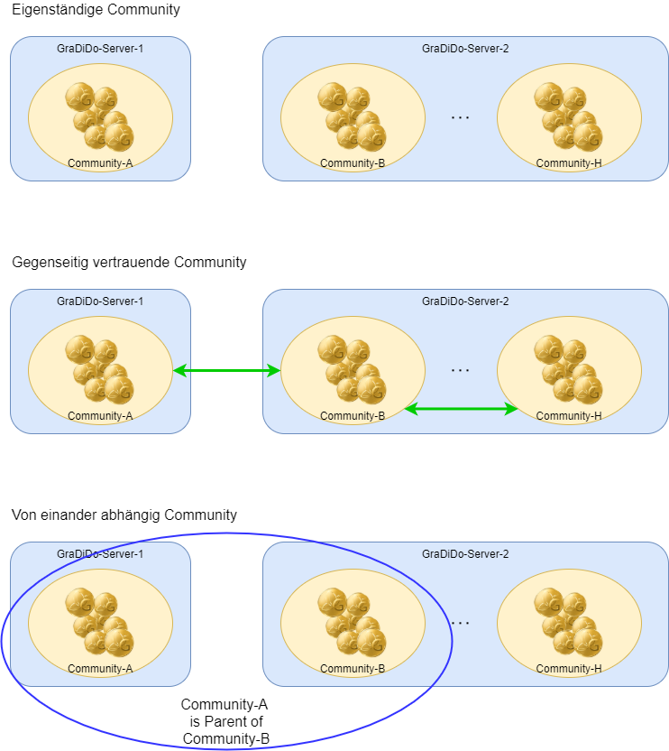

# Verwaltung der Communities

Diese Konzept beschreibt den Begriff "Community" im Kontext von Gradido, welche Eingenschaften eine Community hat und was man mit einer Community alles machen kann.

## Die Bedeutung des Begriffs Community

Eine Community bedeutet im Kontext von Gradido eine Gemeinschaft von Personen, die sich nach der Philosophie von Gradido zu einer gemeinsamen Gruppierung zusammenschließen. Unter dem gemeinsamen Zusammenschluß folgen sie der Natürlichen Ökonomie des Lebens. Die Community dient dabei als Rahmen für die Gruppe von Personen, um ihnen den geregelten Zugang zu ermöglichen. Unter dem Begriff "Zugang zur Community" wird die Registrierung eines Benutzerkontos für eine Person verstanden. Dabei erfolgt eine Autentifizierung der Person, um einen personenspezifischen Zugriff auf die Community-Funktionalitäten zu ermöglichen. Denn eine Community bietet einer Person eine Vielzahl an Funktionalitäten, die ein Community-Mitglied nutzen kann. So steht die Verwaltung und das Handeln mit Gradido-Geld als die Hauptfunktionalität einer Community im Vordergrund. Doch sind auch weitere Funktionalitäten, wie eine Selbstdarstellung über Benutzerprofile oder ein sich Vernetzen mit Community-Mitgliedern, aber auch ein Community übergreifendes Vernetzen als soziale Netzewerke möglich. So können aus kleinen Communities über Vertrauensverhältnisse Zusammenschlüsse mehrere eigenständigen Communities entstehen oder auch eine Hierarchie von Communities als Parent-Child-Verbindung aufgebaut werden (siehe weiter unten "Community-Modelle").

Innerhalb der Community erfolgt die Umsetzung und Verwaltung des "lebendigen Geldes". Soll heißen hier werden die Mechanismen zur Dreifachen-Schöpfung vollzogen, die das geschöpfte Geld nach den Community-Regeln auf die drei Arten von Empfängerkonten (Benutzerkonto, Gemeinwohlkonto und Ausgleichs- und Umweltkonto) verteilt. Ein Community-Mitglied kann über seinen Community-Zugang auf sein persönliches Benutzerkonto zugreifen und darüber sein Gradido-Geld verwalten. Neben der Einsicht auf seinen aktuellen Kontostand kann er u.a. seine regelmäßig geschöpften Gradido einsehen, mit vorhandenen Gradido bezahlen oder einem anderen Mitglied Gradido überweisen. Die Geldbewegungen werden als eine Liste von Transaktionen geführt und die Vergänglichkeit der Gradidos immer aktuell zur Anzeige gebracht.

Nach der Bedeutung des Begriffs Community werden nun die Eigenschaften einer Community detailliert beschrieben, damit all die zuvor erwähnten Möglichkeiten der Community abbildbar sind.

## Eigenschaften einer Community

Hier werden die Eigenschaften einer Community beschrieben, die notwendig sind, um die oben erwähnten Möglichkeiten der Community zu erfüllen. Es geht dabei um verschiedene Themen und ihre dazu notwendigen Prozesse, die wiederum unter Verweiß in anderen Dokumenten detailter beschrieben sind.

### Anzeige und -Darstellung

Da es also mehrere Communities geben wird, benötigt jede Community ihren eigenen Namen und gar ein Symbol oder Bild, um eine optische Unterscheidung bei der Anzeige in den Systemen sicherzustellen. Für eine Aussendarstellung wäre eine Beschreibung der Community und ihre eigene Philosopie, was die Community auszeichnet hilfreich. Diese Werte müssen vom Community-Administrator gepflegt werden können.

### Mitgliederverwaltung

Für die Verwaltung von Community-Mitgliedern werden entsprechende Verwaltungsprozesse wie Registrierung, Login mit Autentifizierung, eine Benutzerverwaltung für neue, bestehende und ausscheidende Mitgleider benötigt. Die Benutzerverwaltung stellt zusätzlich die Anforderung, dass ein Community-Mitglied eindeutig identifizierbar ist und das Community übergreifend. Das bedeutet es kann eine Person immer nur einmal existieren und darf auch niemals in mehreren Communities gleichzeitig Mitglied sein. Denn es muss sichergestellt werden, dass eine Person sich keine unerlaubte Vorteil durch zum Beispiel mehrfache Geldschöpfung in mehreren Communities verschafft. Die Details der Mitgliederverwaltung werden beschrieben im Dokument [BenutzerVerwaltung](.\BenutzerVerwaltung.md).

### Community-Vernetzung

Für die Community-Vernetzung sind Verwaltungsprozesse zwischen den Communities und auch den Community-Mitgliedern notwendig, um entsprechende Vertrauensverhältnisse aufzubauen. Diese müssen den notwendigen Sicherheitsansprüchen genügen, da darauf aufbauend dann später die Geld-Flüsse abgewickelt werden. Entsprechend den Community-Modellen (siehe im folgenden Unterkapitel **Community Modelle**) wird ein Prozess benötigt, der die Hierarchie bzw. das Vertrauensverhältnis zwischen zwei eigenständigen Communities aufbaut und daraus dann die möglichen Funktionalitätserweiterungen für die Mitglieder bzw. den Communities freischaltet bzw. unterstützt. Zusätzlich wird auch der jeweilige umgekehrte Prozess benötigt, der eine bestehende Hierarchie bzw. ein bestehendes Vertrauensverhältnis zwischen zwei Communities auflöst und löscht, sowie die daraus resultierenden Funktionseinschränkungen für die Mitglieder und die betroffenen Communities.

Zum besseren Verständnis der Community-Vernetzung erfolgt hier eine Beschreibung der möglichen Konstellationen, wie sich Communities miteinander verbinden können.

#### Community Modelle

Bei Gradido werden verschiedene Modelle von Community-Abhängigkeiten unterstützt. Dabei soll unterschieden werden zwischen:

* eigenständige Community
* sich gegenseitig vertrauende Communities
* von einander abhängige (vererbende) Communities
* Mischung aus den vorherigen Modellen

Das nachfolgende Bild zeigt einen ersten Eindruck über die unterschiedlichen Community-Modelle:

##### Eigenständige Community

Eine eigenständige Community zeichnet sich darin aus, dass sie keine Beziehung zu einer anderen Community aufgebaut hat. Das heißt sie hat weder eine vertrauenswürdige Verknüpfung mit einer zweiten Community, noch hat sie eine Verbindung zu einer Parent-Community und besitzt auch selbst keine Verbindung zu einer Child-Community. Somit kann diese Community für ihre Mitglieder nur Community intern wirksame Prozesse anbieten. Das heißt es ist kein Community übergreifender Handel bzw. Austausch von Gradido möglich. Andererseits werden in dieser Community die Prozesse freigeschaltet, dass ein Aufbau eines vertrauenswürdiges Verhältnis zu einer anderen Community erlaubt, der Aufbau einer Parent-Beziehung und auch der Aufbau einer Child-Beziehung ermöglicht. Die zugehörigen Abbau-Prozesse dagegen sind nicht freigeschalten. Der Community übegreifende Überprüfungsprozess bei der Mitglieder-Registrierung zur eindeutigen Identifikation in der Mitglieder-Verwaltung zählt dabei nicht als vertrauenswürdige Verbindung zwischen Communities.

##### Gegenseitig vertrauende Communities

*Hier soll beschrieben werden, was den Unterschied auszeichnet zu einer "Eigenständigen Community", wie man das gegenseitige Vertrauen (sprich Verknüpfung) zwischen zwei oder mehreren Communities auf- und wieder abbaut, was bedarf es an Vorraussetzungen für einen Vertrauens-Auf/Abbau und welche Konsequenzen der Auf- und Abbau des gegenseitigen Vertrauens haben soll.*

Das Modell der sich *gegenseitig vertrauenden Communities* entspringt der Idee des sich miteinander Vernetzens und damit das Handeln und Agieren mit Gradido-Mitgliedern, die nicht in der eigenen Community als Mitglied registriert sind. Um dies zu ermöglichen bedarf es einem Aufbau-Prozess zwischen zwei Communities, die sich zukünftig gegenseitig ein enges Vertrauen schenken. Auf der Basis dieses Vertrauens tauschen die beiden Communities Informationen untereinander aus, so dass für die Mitglieder beider Communities die Funktionalitäten auf der Gradido-Plattform so transparent erscheinen, als ob sie alle Mitglied einer Community wären. Das würde sich beispielsweise bei der Suche nach einem bestimmten Community-Mitglied auswirken, da nun alle Mitgleider beider Communities in einer Liste zur Anzeige gebracht werden können. Oder der Transfer von Gradidos von einem Mitglied zu einem anderen Mitglied ist über dieses Community-Verhältnis nun auch Community übergreifend möglich. Auch weitere Angebote, die bisher nur in einer Community zur Verfügung standen, sind nun auch den Mitgliedern der anderen Community zugänglich.

Während des Aufbau-Prozesses werden neben den eigentlichen Security relevanten Informationen für den Aufbau und die Sicherstellung des Vertrauensverhältnisses auch fachliche Informationen ausgetauscht. Unter fachlichen Informationen sind die nun freigeschaltenen Angebote beider Communities gemeint. Somit werden in der einen Community nun auch die fachlichen Prozesse und Angebote der anderen Community zugänglich und freigeschalten und umgekehrt. Wie feingranular die Prozesse und Angebote dabei ausgetauscht und freigeschaltet werden unterliegt einer administrativen Konfiguration der jeweiligen Community. Das heißt der Administrator jeder Community kann im Vorfeld selektiv konfigurieren welche Angebote und Prozesse beim Aufbau-Prozess für ein Vertrauensverhältnis mit einer anderen Community übertragen und freigeschaltet werden. Diese Konfiguration sollte zuvor Community intern abgestimmt sein, um nicht schon zu Beginn der Zusammenarbeit der beiden Communities irgendwelche Missstimmungen unter den Mitgliedern zu verursachen. Die Details des *Vertrauensverhältnis Aufbau-Prozesses* sind weiter unten im Kapitel **Anwendungsfälle** beschrieben.

##### Abhängige Communities

*Hier soll beschrieben werden, was den Unterschied zu eigenständigen und sich gegenseitig vertrauenden Communities zu den hier abhängigen  (sprich vererbten) Communities auszeichnet, welche Vorraussetzungen bedarf der Auf/Abbau einer abhängigen Community und welche Konsequenzen hat der Auf- und Abbau von abhängigen Communities.*

Das Modell der *abhängigen Communities* findet seinen Ursprung den Föderalismus von Deutschland in einer Community-Struktur abbilden zu können. Das bedeutet, dass eine baumartige Struktur von Communities aufgebaut werden kann, wie nachfolgendes Bild schemenhaft zeigt:

Es wird somit zwischen zwei Communities aus benachbarten Ebenen eine Parent-Child-Beziehung erzeugt. Dadurch gehen diese beiden Communities eine besondere Beziehung untereinander ein, die zu folgenden veränderten Eigenschaften und Verhalten der Parent- und der Child-Community führen:

###### Parent-Community

* kann 1 bis n Child-Communities besitzen
* verwaltet keine Mitglieder mit AGE-Konto
* verwaltet nur noch Community eigenes Allgemeinwohl-Konto und AUF-Konto
* benötigt in der Parent-Child-Beziehung einen besonderen Verteilungsschlüssel für das geschöpfte Geld  auf die beiden Allgemeinwohl- und AUF-Konten in Richtung Child- nach Parent-Community
* bedarf spezieller Administrations-Rechte und Rollen zum Auf- und Abbau der Child-Community-Beziehungen
* bedarf spezieller Administrationsprozesse zur Verwaltung der Parent-Aufgaben:
  * Auf- und Abbau der Parent-Child-Beziehung
  * Verschiebung aller Mitglieder von der Parent- in die Child-Community
  * Stoppen des Sicherstellungsprozesses, dass eine *natürliche Person* nur Mitglied einer einzigen Community ist, sobald die erste Child-Beziehung aufgebaut ist und alle Mitglieder dahin verschoben sind
  * Prozess zur Aufnahme der geschöpften Allgemeinwohl- und AUF-Gelder aus den Child-Communities
  * stoppt den Schöpfungsprozess sobald eine Child-Beziehung aufgebaut ist
  * startet den Schöpfungsprozess sobald die letzte Child-Beziehung aufgelöst ist
  * Aufnahmeprozess von Mitgliedern aus einer Child-Community, bevor dessen Beziehung aufgelöst wird
  * starten des Sicherstellungsprozesses, dass eine *natürliche Person* nur Mitglied einer einzigen Community ist, sobald die letzte Child-Beziehung aufgelöst ist

###### Child-Community

* besitzt genau eine Parent-Community
* **sofern es eine Community der untersten Ebene ist:**
  * verwaltet die Mitglieder mit AGE-Konto
  * nimmt die *natürliche Personen*-Mitglieder aus der Parent-Community auf
  * bietet einen Wechsel-Prozess für ein Mitglied aus dieser Community in eine andere (Child)-Community
  * läuft hier der automatische 3-fach-Schöpfungsprozess inklusive der Verteilung des geschöpften Geldes gemäß dem zuvor definierten Verteilungsschlüssel innerhalb der Community
  * wird hier sicher gestellt, dass nur auf PersonalAccounts von *natürlichen Personen* und nicht auf ImpersonalAccounts von *Projekten/Vereine/Firmen* Geld geschöpft wird
* **sofern es eine Parent-Community gibt:**
  * läuft hier der Verteilungsprozess aus der Schöpfung auf das Allgemeinwohl- und AUF-Konto gemäß des Verteilungsschlüssels in Richtung von Child nach Parent also von unten nach oben
* hier läuft der Prozess zur Sicherstellung, dass eine *natürliche Person* nur Mitglied einer einzigen (Child)-Community ist
*

##### Mischung aus den vorherigen Modellen

*Hier soll beschrieben werden welche möglichen Mischungen von Modellen erlaubt sind und welche nicht, was hat eine Mischungsvariante an Konsequenzen, wie wird eine Mischungsvariante auf/abgebaut, welche Vorraussetzungen bedarf es für den Auf/Abbau einer Mischungsvariante.**

### Geldschöpfung

Eine Community stellt die Mechanismen für die Dreifache-Geldschöpfung bereit. Dazu müssen zuerst die Verteilungsschlüssel auf die drei Kontoarten definiert bzw. konfigurierbar sein. Diese Konfigurationswerte werden vom Community-Administrator gepflegt. Sie dienen als Grundlage für die Höhe der regelmäßig geschöpften Beträge auf die drei Empfängerkonto-Typen. Die regelmäßige Geldschöpfung läuft automatisiert im Hintergrund und muss den Regeln der Nartürlichen Ökonomie des Lebens folgen. Die Details der Dreifachen Geldschöpfung sind in dem Dokument [RegelnDerGeldschoepfung](./RegelnDerGeldschoepfung.md) beschrieben.

### Konto-Verwaltung

Durch die Dreifach-Geldschöpfung verwaltet die Community auch die drei Arten von Konten: Benutzerkonto, Gemeinwohlkonto und Ausgleichs- und Umweltkonto(AUF).

Für jedes Mitglied der Community wird also ein eigenes Benutzerkonto verwaltet, auf das ein Drittel der monatlichen Geldschöpfung fließt. Das Gemeinwohlkonto und das AUF-Konto existieren pro Community einmal und auf jedes der beiden Konten fließen monatlich die beiden anderen Drittel der Geldschöpfung.

Somit muss also eine Community für jede Kontoart die entsprechenden Kontoverwaltungsprozesse anbieten. Einmal in Verbindung pro Mitglied für das Benutzerkonto und dann jeweils eine Verwaltung für das Gemeinwohlkonto und eine Verwaltung für das AUF-Konto. Die Berechtigungen für die Zugriffe auf die drei Kontoarten müssen ebenfalls in der Community gepflegt und kontrolliert werden. Das bedeutet die Community muss ihren Mitgliedern auf ihre eigenen Benutzerkonten Zugriffsrechte erteilen und diese auch kontrollieren, so dass keine unerlaubten Zugriffe stattfinden können. Dann müssen in der Community bestimmte Mitglieder Sonderberechtigungen erhalten, um die Verwaltung des Gemeinwohlkontos und des AUF-Kontos durchführen zu können. Die Verwaltung der Berechtigungen ist wiederum alleine dem Community-Administrator erlaubt. Die Details der Kontenverwaltung ist im Dokument [KontenVerwaltung](.\KontenVerwaltung.md) beschrieben.

### Berechtigungsverwaltung

Die Community muss für die verschiedenen Eigenschaften und Prozesse eine eigene Berechtigungsverwaltung zur Verfügung stellen. Für die verschiedenen Berechtigungen muss ein Rollen- und Rechte-Konzept administrierbar sein, so dass für die verschiedenen Mitglieder der Community die Zugriffe feingranular definiert, gesteuert und kontrolliert werden können. Allein der Administrator hat die Rechte auf die Berechtigungsverwaltung zuzugreifen. Das System muss diese hinterlegten Rollen und Rechte dann auf die verwalteten Mitglieder abbilden und für jeden Zugriff auf die Community entsprechend kontrollieren, freigeben oder verhindern.

### Attribute einer Community

In diesem Kapitel werden die Attribute beschrieben, die in einer Community zu speichern sind.

#### Name

Das Attribut *Name* dient zur möglichst eindeutigen Benennung der Community. Er wird als Menschen lesbare Anzeige und als Unterscheidungskriterium bei mehreren Communities eingesetzt. Nur der Community Administrator kann diesen setzen und verändern.

#### Bild

Das Attribut *Bild* wird für die Anzeige einer Community verwendet und kann nur vom Community-Administrator gesetzt werden.

#### Beschreibung

Das Attribut *Beschreibung* ist ein Text, der die Philosophie der Community ausdrücken soll. Hier können sich die Community-Mitglieder eine gemeinsame Formulierung ausdenken, die nach ihrer Vorstellung den Kern und die Grundregeln ihrer Gemeinschaft am besten ausdrücken. Dies könnte wie eine Art Aussendarstellung für neue Mitglieder dienen. Aber nur der Community-Administrator hat die Schreib-Rechte für dieses Attribut.

#### Serverzuordnung

Das Attribut *Serverzuordnung* ist technisch motiviert und dient zusammen mit dem Attribut Name der eindeutigen Identifikation einer Community. Bei der Gründung einer neuen Community muss festgelegt werden auf welchem Server diese Community gehostet wird - auf einem schon vorhandenen Server oder ein extra für diese Community neu aufgesetzter Server. Das Attribut Serverzuordnung muss aber für eine Virtualisierung und technische Skalierung auf mehrere Server-Instanzen vorbereitet sein, sodass keine direkte physische Hardware-Serverzuordnung hierdurch fixiert ist. Aber auch ein eventueller Umzug der Community von einem Server auf einen anderen Server muss möglich sein. Der Community-Administrator hat alleiniges Zugriffsrecht auf dieses Attribut.

#### Liste von Benutzer

Dieses Listenattribut beinhaltet Benutzer-Elemente, die erfolgreich als Mitglied der Community registriert sind. Die Details eines Benutzer-Elements werden in dem Dokument [BenutzerVerwaltung](./BenutzerVerwaltung.md) beschrieben. Ein Benutzer-Element besitzt wiederum ein Konto, das für die Community als Ziel der Schöpfung für das AGE des Mitglieds dient. Gleichzeitig wird für ein Benutzer-Element aber auch unterschieden zwischen einem Menschkonto (PersonalAccount) und einem Sachkonto (ImpersonalAccount). Denn nur für ein Benutzerelement mit PersonalAccount, sprich für eine *natürliche Person*, darf Geld für das AGE geschöpft werden, wohingegen für ein Benutzerelement mit ImpersonalAccount, sprich für ein *Projekt/Verein/Sache*, kein Geld geschöpft werden darf.

#### Gemeinwohlkonto

Das Attribut *Gemeinwohlkonto* dient als ein Konto-Element, das den Kontotyp Gemeinwohlkonto repräsentiert. Alle Kontobewegungen, wie Geldschöpfung, Geldtransfers, etc., die das Gemeinwohl dieser Community betreffen, werden über dieses Attribut abgewickelt. Details zu Kontobewegungen werden im Dokument [KontenVerwaltung](KontenVerwaltung.md) beschrieben und die Regeln und Vorgänge der Geldschöpfung sind im Dokument [RegelnDerGeldschoepfung](RegelnDerGeldschoepfung.md) zu finden. Auf dieses Attribut haben nur Mitglieder mit entsprechenden Zugriffsrechten die Erlaubnis und Möglichkeiten darauf Einsicht zu nehmen und Prozesse auszulösen.

#### Ausgleichs- und Umweltkonto AUF-Konto

Das Attribut *Ausgleichs- und Umweltkonto* dient als ein Konto-Element, das den Kontotyp AUF-Konto repräsentiert. Alle Kontobewegungen, wie Geldschöpfung, Geldtransfers, etc., die das AUF-Konto dieser Community betreffen, werden über dieses Attribut abgewickelt. Details zu Kontobewegungen werden im Dokument [KontenVerwaltung](KontenVerwaltung.md) beschrieben und die Regeln und Vorgänge der Geldschöpfung sind im Dokument [RegelnDerGeldschoepfung](RegelnDerGeldschoepfung.md) zu finden. Auf dieses Attribut haben nur Mitglieder mit entsprechenden Zugriffsrechten die Erlaubnis und Möglichkeiten darauf Einsicht zu nehmen und Prozesse auszulösen.

#### Verteilungsschlüssel der Dreifachen-Schöpfung

Im Attribut *Verteilungsschlüssel* der Dreifach-Schöpfung werden die für die Community festgelegten Verteilschlüssel konfiguriert. Diese Werte dienen als Grundlage für die Geldschöpfung innerhalb dieser Community. Nur der Administrator hat Zugriffsrechte auf dieses Attribut.

Sobald die Community in einer Parent-Child-Beziehung steht, muss das Attribut *Verteilungsschlüssel* ebenfalls die Verteilung der Allgemeinwohl- und AUF-Gelder zwischen Child und Parent-Community definieren. Die erweiterte Konfiguration des Verteilungsschlüssel muss Teil des Aufbau-Prozesses einer Parent-Child-Beziehung sein bzw. währenddessen geprüft und konfiguriert werden.

#### Parent

Das Attribut *Parent* dient für den hierarchischen Aufbau von Communities. Es enthält den Bezug auf die Community, die für diese Community als Eltern-Community eingerichtet ist. Eine Child-Community kann maximal eine Parent-Community haben. Durch diesen Bezug zu der Parent-Community werden einzelne Prozesse zwischen der Parent- und der Child-Community freigeschalten. Damit ergeben sich erweiterte Möglichkeiten u.a. für die Community-Mitglieder beider Communities, wie beispielsweise das Community übergreifende Handeln zwischen den Community-Mitgliedern oder eine veränderte Verteiltung der Gemeinwohl- und AUF-Schöpfung, etc.. Die Administration dieses Attributes erfolgt implizit über die fachlichen Prozesse, die den Auf- und Abbau einer Parent-Child-Beziehung zwischen zwei Communities steuern. Diese können nur durch den Adminitrator und seiner Berechtigung ausgelöst werden. Die Beschreibung dieser Prozesse ist weiter unten im Kapitel **Anwendungsfälle auf einer Community** zu finden.

#### Liste Children

Das Attribut *Liste Children* dient ebenfalls dem hierarchischen Aufbau von Communities. Es enthält die Bezüge auf die Communities, die für diese Community als Child-Community eingerichtet sind. Eine Parent-Community kann mehrere Child-Communities haben. Durch diesen Bezug zu den Child-Communities werden einzelne Prozesse zwischen der Parent- und den Child-Communities freigeschalten. Damit ergeben sich erweiterte Möglichkeiten u.a. für die Community-Mitglieder beider Communities, wie beispielsweise das Community übergreifende Handeln zwischen den Community-Mitgliedern oder eine veränderte Verteiltung der Gemeinwohl- und AUF-Schöpfung, etc.. Die Administration dieses Attributes erfolgt implizit über die fachlichen Prozesse, die den Auf- und Abbau einer Parent-Child-Beziehung zwischen zwei Communities steuern. Diese können nur durch den Administrator und seiner Berechtigung ausgelöst werden. Die Beschreibung dieser Prozesse ist weiter unten im Kapitel **Anwendungsfälle auf einer Community** zu finden.

#### Liste Trusted Communities

Das Attribut *Liste Trusted Communities* dient dem Aufbau von gleichberechtigten Community-Gruppierungen. Es enthält die Referenzen auf die Communities, die für diese Community als vertrauenswürdige Communities eingerichtet sind. Eine vertrauenswürdige Community-Gruppierung kann mehrere gleichberechtigte Communities haben. Durch diesen Bezug zu den vertrauenswürdigen Communities werden einzelne Prozesse zwischen den sich gegenseitig vertrauenden Communities freigeschalten. Damit ergeben sich erweiterte Möglichkeiten u.a. für die Community-Mitglieder beider Communities, wie beispielsweise das Community übergreifende Handeln zwischen den Community-Mitgliedern, etc.. Zwischen zwei *Trusted Communities* erfolgt keine Verteilung gemäß einem Verteilungsschlüssel von geschöpftem Geld das für das Allgemeinwohl- bzw. AUF-Konto bestimmt ist. Dies bleibt Eigentum jeder Community trotz vertrauenswürdiger Beziehung untereinander.

Die Administration dieses Attributes erfolgt implizit über die fachlichen Prozesse, die den Auf- und Abbau einer vertrauenswürdigen Beziehung zwischen zwei Communities steuern. Diese können nur durch den Adminitrator und seiner Berechtigung ausgelöst werden. Die Beschreibung dieser Prozesse ist im nachfolgenden Kapitel **Anwendungsfälle auf einer Community** zu finden.

## Anwendungsfälle auf einer Community

Die nachfolgenden Anwendungsfälle beschreiben die fachlichen Vorraussetzungen, den fachlichen Ablauf und die fachlichen Veränderungen bzw. den fachlichen Status, der am Ende des erfolgreich abgeschlossenen Anwendungsfalles erreicht wird. Desweiteren erfolgt die fachliche Beschreibung der möglichen Fehlerfälle, in die ein Anwendungsfall münden kann und welcher fachlicher Status am Ende des Anwendungsfalles herrschen soll.

### Neue Community erstellen

*Allgemeine fachliche Beschreibung des Anwendungsfalles.*

#### Vorraussetzungen

#### Ablauf

#### Ende Status

#### Fehlerfälle

### Community bearbeiten

*Allgemeine fachliche Beschreibung des Anwendungsfalles.*

#### Vorraussetzungen

#### Ablauf

#### Ende Status

#### Fehlerfälle

### Community löschen

*Allgemeine fachliche Beschreibung des Anwendungsfalles.*

#### Vorraussetzungen

#### Ablauf

#### Ende Status

#### Fehlerfälle

### Trusted Community verbinden

*Allgemeine fachliche Beschreibung des Anwendungsfalles.*

#### Vorraussetzungen

#### Ablauf

#### Ende Status

#### Fehlerfälle

### Trusted Community lösen

*Allgemeine fachliche Beschreibung des Anwendungsfalles.*

#### Vorraussetzungen

#### Ablauf

#### Ende Status

#### Fehlerfälle

### Parent Community einrichten

*Allgemeine fachliche Beschreibung des Anwendungsfalles.*

#### Vorraussetzungen

#### Ablauf

#### Ende Status

#### Fehlerfälle

### Parent Community löschen

*Allgemeine fachliche Beschreibung des Anwendungsfalles.*

#### Vorraussetzungen

#### Ablauf

#### Ende Status

#### Fehlerfälle
