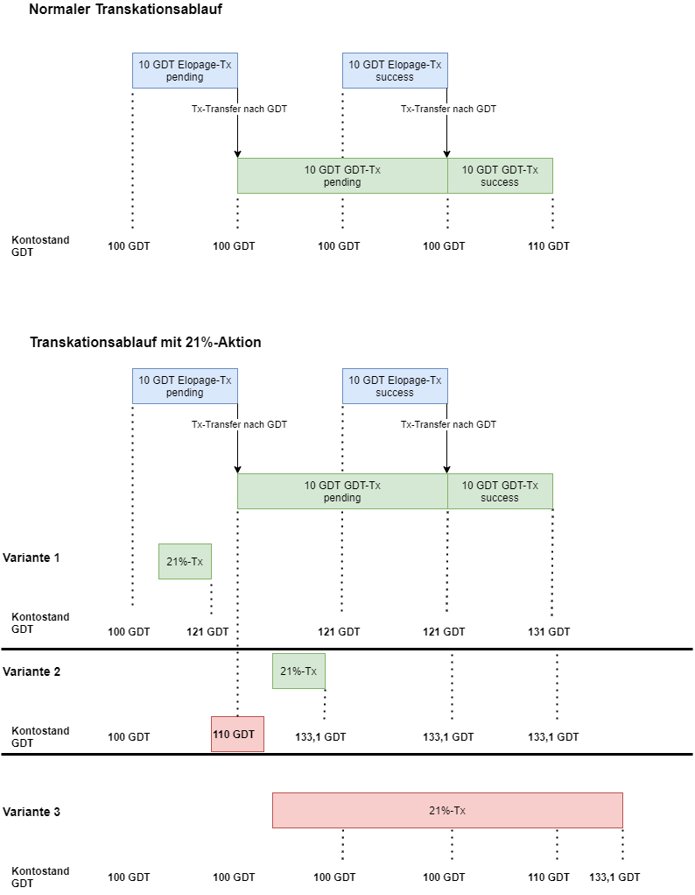

# GraDiDo-Transaktionen

Im Kontext von GraDiDo gibt es unterschiedliche Arten von Transaktionen:

* das Schöpfen von GraDiDo (GDD)
* das Übertragen von GDD
* die Vergänglichkeit von GDD
* das Schöpfen von GraDiDo-Transform (GDT)
* das Übertragen von GDT
* das Umwandeln von GDT in GDD

Dieses Konzept beschreibt für jede Art der Transaktion ihre fachliche Bedeutung, die notwendigen Vorraussetzungen, der fachliche Ablauf und den Ende-Status nach erfolgreicher Transaktionsbearbeitung. Desweiteren werden für jede Transaktionsart alle fachlich möglichen Fehlerfälle aufgeführt und welchen Endstatus die abgebrochene Transaktion dann hinterläßt.

## Schöpfen von GDD

*Hier erfolgt die fachliche Beschreibung der Transaktion*

### Vorraussetzungen

### Ablauf

### Ende Status

### Fehlerfälle

## Übertragen von GDD

*Hier erfolgt die fachliche Beschreibung der Transaktion*

### Vorraussetzungen

### Ablauf

### Ende Status

### Fehlerfälle

## Vergänglichkeit von GDD

*Hier erfolgt die fachliche Beschreibung der Transaktion*

### Vorraussetzungen

### Ablauf

### Ende Status

### Fehlerfälle

## Schöpfen von GDT

*Hier erfolgt die fachliche Beschreibung der Transaktion*

Das Schöpfen von Gradido-Transform wird aktuell (07.2021) über die Plattform Elopage abgewickelt. Das heißt ein auf Elopage registriertes Mitglied zahlt dort eine Summe von Euros auf sein Konto ein. Diese Transaktion in Elopage wird vom GDT-Server abgegriffen und in der GDT-Datenbank gespeichert.

Folgende Transaktions-Konstellationen können fachlich zwischen Elopage und dem GDT-Server auftreten bzw. müssen von den beteligten Systemen abgewickelt werden:

In Variante 1 ist zu sehen, dass die 21%-Transaktion vor der Übertragung der Elopage-Transaktion stattgefunden hat und die Berechnung des GDT-Kontostandes davon unberührt bleibt.

In Variante 2 taucht nun die Frage auf, wie man mit offenen Transaktionen aus Elopage umgeht. Sollen diese in der 21%-Transaktion mitberücksichtigt werden, dann hätte das eine Änderung der Kontostandsberechnung gegenüber Variante 1 zur Folge. Sollen diese offenen Transaktionen nicht mitberücksichtigt werden, dann wäre kein Unterschied gegenüber Variante 1.

In Variante 3 ist aber zu sehen, dass ein nicht berücksichtigen der offenen Transaktion einen weiteren Effekt nach sich zieht. Denn eine offene Transaktion könnte ja auch nicht erfolgreich committet, sondern könnte aus welchem Grund auch immer gecancelt werden. Das würde bedeuten, dass die 21%-Transaktion erst abgeschlossen werden kann, sobald die offene Transaktion erfolgreich beendet ist.

### Vorraussetzungen

### Ablauf

### Ende Status

### Fehlerfälle

## Übertragen von GDT

*Hier erfolgt die fachliche Beschreibung der Transaktion*

### Vorraussetzungen

### Ablauf

### Ende Status

### Fehlerfälle

## Umwandeln von GDT in GDD

*Hier erfolgt die fachliche Beschreibung der Transaktion*

### Vorraussetzungen

### Ablauf

### Ende Status

### Fehlerfälle
