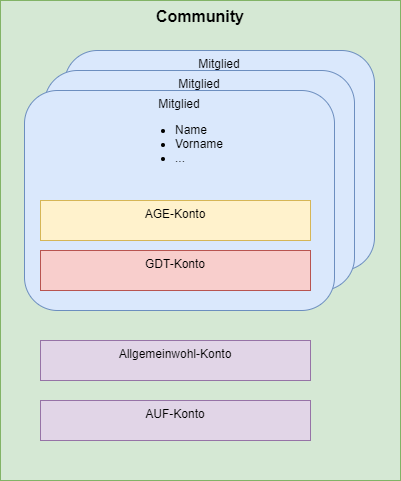

# Kontoverwaltung

In Gradido werden mehrere Arten von Konten notwendig sein:

* Mitglieder-Konten
  * AGE-Konto in GDD mit Vergänglichkeit
  * Konto in GDT ohne Vergänglichkeit
* Community-Konten
  * Allgemeinwohl-Konto in GDD mit Vergänglichkeit
  * AUF-Konto in GDD mit Vergänglichkeit

Ziel der Kontoverwaltung soll sein, dass es ein Basistyp eines Kontos gibt, der alle gemeinsamen Eigenschaften der verschiedenen Kontenarten beinhaltet. Ob es für die Unterschiede der verschiedenen Kontenarten dann eigene abgeleitete Konto-Typen geben wird oder ob in dem Basistyp die Unterschiede über Steuerungsattribute, wie Vergängglichkeits-Flag oder Währungsattribut, geregelt wird, bleibt der technischen Implementierung überlassen.

Grundlegend wird aber die Gradido-Anwendung die Implementierung aller Kontenarten enthalten und keine Separierung in eigenständigen Anwendungsinstanzen vorsehen.

## Eigenschaften

Die Basiseigenschaften eines Kontos in Gradido enthalten folgende Attribute:

* Name
* Währung
* Amount
* Vergänglichkeits-Flag
* Liste der Transaktionen

Beim Anlegen eines Kontos wird der Name, die Währung, der Amount-Wert auf 0,00 und das Flag der Vergänglichkeit gemäß Verwendungszweck des Kontos initialisiert. Im Anwendungsfall *Transaktion verarbeiten* wird ja nach Konto-Initialisierung (sprich Währung und Vergänglichkeitsflag) und Transaktionstyp die entsprechende Transaktionsverarbeitungslogik auf dem Amount des Kontos ausgeführt. Am Ende der Transaktionsverarbeitung wird die Transaktion in die Liste der Transaktionen aufgenommen und dient lediglich zur Nachvollziehbarkeit der Konto-Bewegungen bei der Anzeige. Die Details der Transaktionsverarbeitung wird im Kapitel **Transaktion verarbeiten** näher beschrieben.

Menschkonto (HumanAccount, PersonalAccount) vs Sachkonto (ItemAccount, ImpersonalAccount )

## Anwendungsfälle

### Konto neuanlegen

### Konto bearbeiten

### Konto löschen

### Konto ent/sperren

### Transaktion verarbeiten
