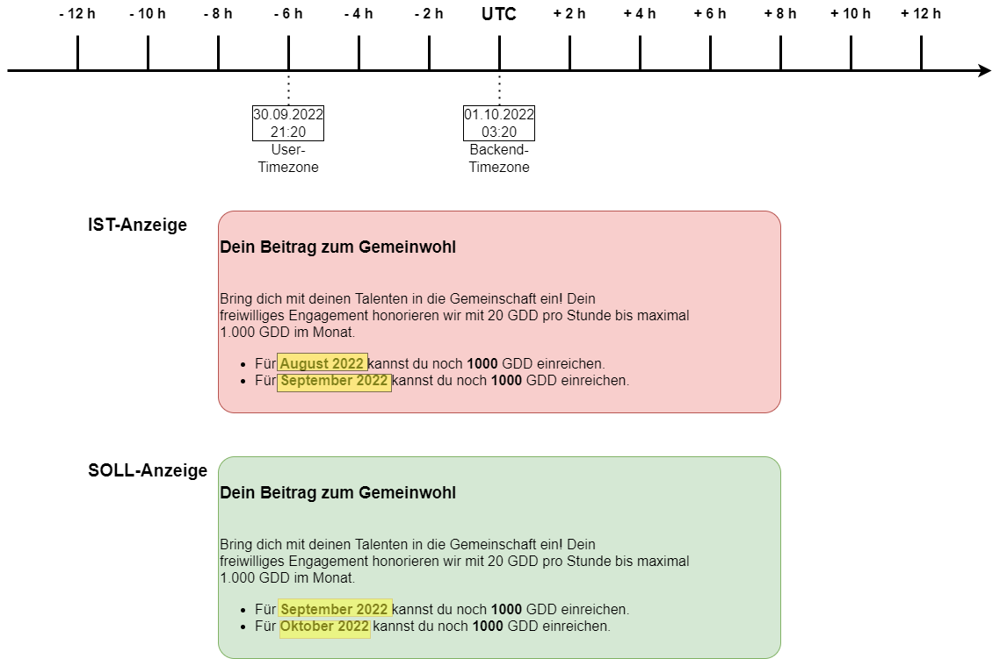
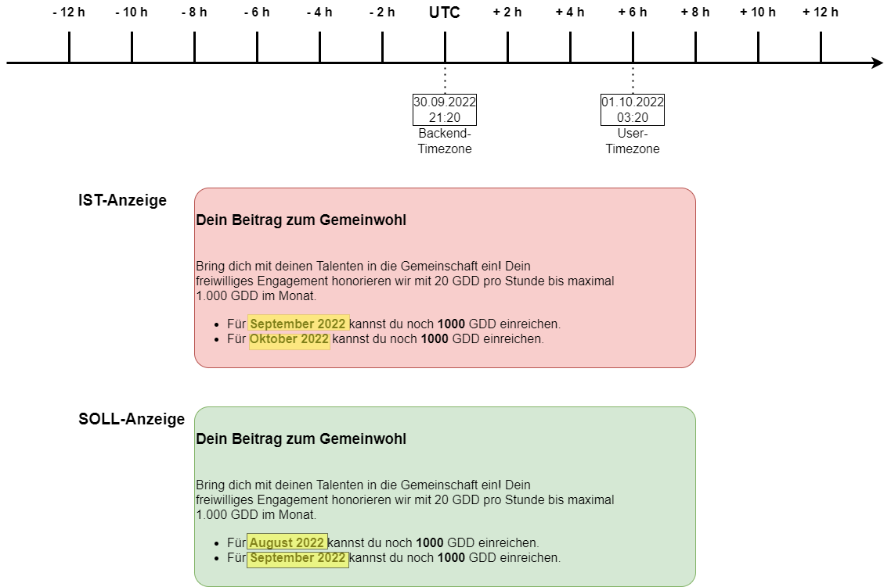

# Bestimmung der Schöpfungsmonate

Die Gradido-Anwendung erlaubt aktuell (10.2022), dass der User seine eigenen Gemeinwohl-Aktivitäten erfasst. Dabei wird ihm, ausgehend vom aktuellen Datum, für den aktuellen Monat und für den vorherigen Monat jeweils seine noch schöpfbaren Beträge bis zu den maximal erlaubten  1.000 GDD pro Monat angezeigt. Wenn der User nun eine neue Gemeinwohl-Aktivität erfassen will, dann muss er dazu auch ein Zieldatum angeben, um festzulegen, für welchen Monat der Betrag geschöpft werden soll.

Da es nun aber auf der Welt verschiedene Zeitzonen gibt und ein User von überall auf der Welt seine Contributions erfassen können soll, muß die Anwendung für die daraus resultierenden Zeit-Konstellationen vorbereitet sein.

## Zeit-Konstellationen

Das Backend und damit alle Zeitangaben, die in Gradido gespeichert werden, sind per Definition in der Weltzeit angegeben, sprich als UTC-Zeit ohne Offset. Damit wird gewährleistet, dass egal von wo ein User seine Daten erfasst, alle gespeicherten Daten zeitlich einheitlich vorliegen.

Wenn aber ein User sich nun aber in einer anderen Zeitzone befindet, dann müssen die daraus resultierenden Konstellationen beachtet werden.

### Zeitzone mit negativem Offset zu UTC

Der User befindet sich in einer Zeitzone, die zur UTC-Zeit einen negativen Offset hat und somit das Frontend sich zeitlich hinter der Backend-Zeit liegt.

In dem oben dargestellten Beispiel möchte der User am 30.09.2022 um 21:20 Uhr seine Gemeinwohlaktivitäten erfassen. Dabei wird ihm vom System die für ihn erlaubten beiden Monate mit den jeweiligen noch offenen Summen angezeigt. Wie man erkennen kann zeigt das Frontend die Monate August 2022 und September 2022 an, da der User sich im September 2022 befindet.

Nach der UTC-Zeit müssten aber die Monate September 2022 und Oktober 2022 angezeigt werden, da im Backend mit der UTC-Zeit die beiden Beträge für den aktuellen und den vorherigen Monat ermittelt werden.

Hier entsteht durch die fehlende Information vom Backend, welcher Betrag für welchen Monat gültig ist, die Lücke für das Frontend. Es muss also in der Liste der Beträge jeweils der zugehörige Gültigkeitsmonat mit Jahresangabe geliefert werden.

#### offene Fragen

* Wie soll die Kommunikation mit dem User gestaltet werden?
* Soll dem User der aktuelle und der vorherige Monat gemäß seiner User-Timezone angezeigt werden?
* Oder soll dem User der aktuelle und der vorherige Monat gemäß der Server-UTC-Timezone angezeigt werden?
* Wie vermittelt man dem User aussagekräftig diesen eventuellen Zeitversatz?
* Kann der User aktzeptieren, dass er, obwohl er nach seiner Zeitzone noch im September 2022 ist, dann plötzlich nicht mehr für August aber schon für Oktober schöpfen kann?
* Könnte der User nachvollziehen, wenn bei einem UserTimeOffset von -6 h, er evtl. nur bis zum 30.09.2022 18:00:00 für den Monat August 2022 noch Beträge schöpfen kann?
* Könnte der User nachvollziehen, wenn bei einem UserTimeOffset von -6 h, er evtl. ab dem 30.09.2022 18:00:00 schon für den Monat Oktober 2022 Beträge schöpfen kann?
* Könnte eine Datums- und Uhrzeit-Anzeige der beiden Zeitzonen - UserTimezone und UTC-Zeitzone - hier hilfreich ?
* Da in jedem Fall sichergestellt wird, dass niemals mehr als 1.000 GDD pro Monat geschöpft werden können, was wäre, wenn dem User, in dem Zeitfenster seines UserTimeOffsets zur UTC-Zeit ein Monatswechsel enthalten ist, einfach drei Monate zur Schöpfung angeboten werden?
  * bis 30.09.2022 18:00:00 kann der User für August und September schöpfen
  * ab 30.09.2022 18:00:01 kann der User für August, September, Oktober schöpfen
  * ab 01.10.2022 00:00:00 kann der User für September und Oktober schöpfen

### Zeitzone mit positivem Offset zu UTC

Der User befindet sich in einer Zeitzone, die zur UTC-Zeit einen positiven Offset hat und somit das Frontend sich zeitlich vor der Backend-Zeit liegt.

In dem oben dargestellten Beispiel möchte der User am 01.10.2022 um 03:20 Uhr seine Gemeinwohlaktivitäten erfassen. Dabei wird ihm vom System die für ihn erlaubten beiden Monate mit den jeweiligen noch offenen Summen angezeigt. Wie man erkennen kann zeigt das Frontend die Monate September 2022 und Oktober 2022 an, da der User sich im Oktober 2022 befindet.

Nach der UTC-Zeit müssten aber die Monate August 2022 und September 2022 angezeigt werden, da im Backend mit der UTC-Zeit die beiden Beträge für den aktuellen und den vorherigen Monat ermittelt werden.

Hier entsteht durch die fehlende Information vom Backend, welcher Betrag für welchen Monat gültig ist, die Lücke für das Frontend. Es muss also in der Liste der Beträge jeweils der zugehörige Gültigkeitsmonat mit Jahresangabe geliefert werden.

#### offene Fragen

* Wie soll die Kommunikation mit dem User gestaltet werden?
* Soll dem User der aktuelle und der vorherige Monat gemäß seiner User-Timezone angezeigt werden?
* Oder soll dem User der aktuelle und der vorherige Monat gemäß der Server-UTC-Timezone angezeigt werden?
* Wie vermittelt man dem User aussagekräftig diesen eventuellen Zeitversatz?
* Kann der User aktzeptieren, dass er, obwohl er nach seiner Zeitzone schon im Oktober 2022 ist, dann plötzlich noch nicht für Oktober aber noch für August schöpfen kann?
* Könnte der User nachvollziehen, wenn bei einem UserTimeOffset von +6 h, er evtl. nur bis zum 01.10.2022 06:00:00 für den Monat August 2022 noch Beträge schöpfen kann?
* Könnte der User nachvollziehen, wenn bei einem UserTimeOffset von +6 h, er evtl. erst ab dem 01.10.2022 06:00:00 für den Monat Oktober 2022 Beträge schöpfen kann?
* Könnte eine Datums- und Uhrzeit-Anzeige der beiden Zeitzonen - UserTimezone und UTC-Zeitzone - hier hilfreich ?
* Da in jedem Fall sichergestellt wird, dass niemals mehr als 1.000 GDD pro Monat geschöpft werden können, was wäre, wenn dem User, in dem Zeitfenster seines UserTimeOffsets zur UTC-Zeit ein Monatswechsel enthalten ist, einfach drei Monate zur Schöpfung angeboten werden?
  * bis 30.09.2022 23:59:59 kann der User für August und September schöpfen
  * ab 01.10.2022 00:00:00 kann der User für August, September, Oktober schöpfen
  * ab 01.10.2022 06:00:00 kann der User für September und Oktober schöpfen

## Lösungsansatz

* es wird die aktuelle Zeit des Users als ClientRequestTime vom Frontend in das Backend geliefert
* Vor der Ermittlung der Schöpfungsmonate wird geprüft, welche Zeit - ClientRequestTime oder Backend-UTC-Zeit - am weitesten vorangeschritten ist
* aus dem am weitesten vorangeschrittenen Zeitpunkt wird die Liste der zu ermittelnden Monate berechnet
  * bei ClientRequestTime mit negativem Offset - hier -6 h - wird die UTC-Zeit verwendet
  * bei ClientRequestTime mit positivem Offset - hier +6 h - wird die ClientRequest-Zeit verwendet
* es wird immer eine Liste von statt bisher 3 nun 4 Monate ermittelt, da im Admin-Interface drei Monate zurück noch geschöpft werden kann
* In der Liste der Monate wird neben der Monat- und Jahresangabe auch der noch offene Schöpfungsbetrag geliefert
* Im Frontend wird aus der Liste gemäß der ClientRequestTime der aktuelle und der vorherige Monat zur Anzeige gebracht
  * bei ClientRequestTime von -6 h - hier 30.09.2022 und UTC-Zeit 01.10.2022
    * vom Backend geliefert: Juli, August, September, Oktober
    * im Frontend angezeigt: August, September
      * **hier kann der User entgegen der Serverzeit im August und somit im dritten Monate zurück noch schöpfen**
    * in Admin angezeigt: Juli, August, September
  * bei ClientRequestTime von +6 h - hier 01.10.2022 und UTC-Zeit 30.09.2022
    * vom Backend geliefert: Juli, August, September, Oktober
    * im Frontend angezeigt: September, Oktober
      * **hier kann der User entgegen der Serverzeit schon im Oktober und somit einen Monat voraus schon schöpfen**
    * in Admin angezeigt: August, September, Oktober
*
