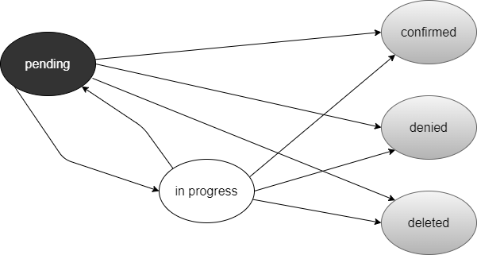
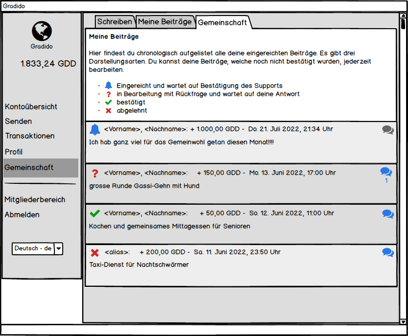
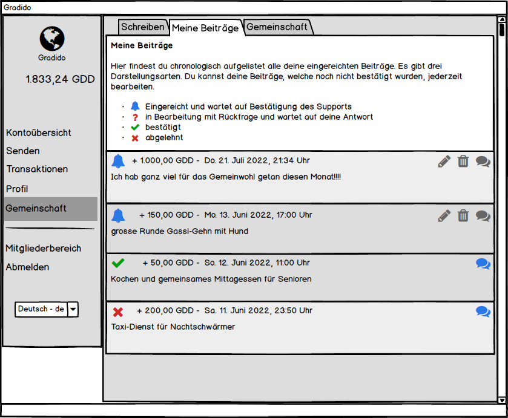
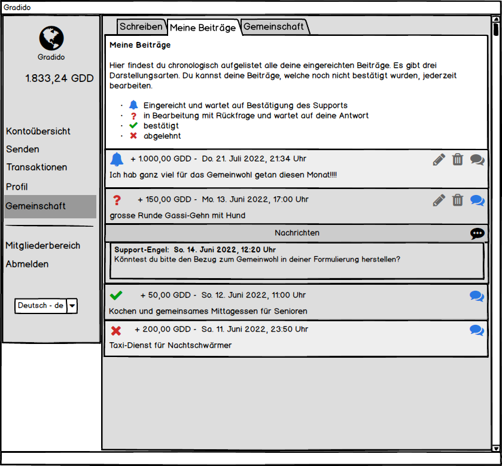
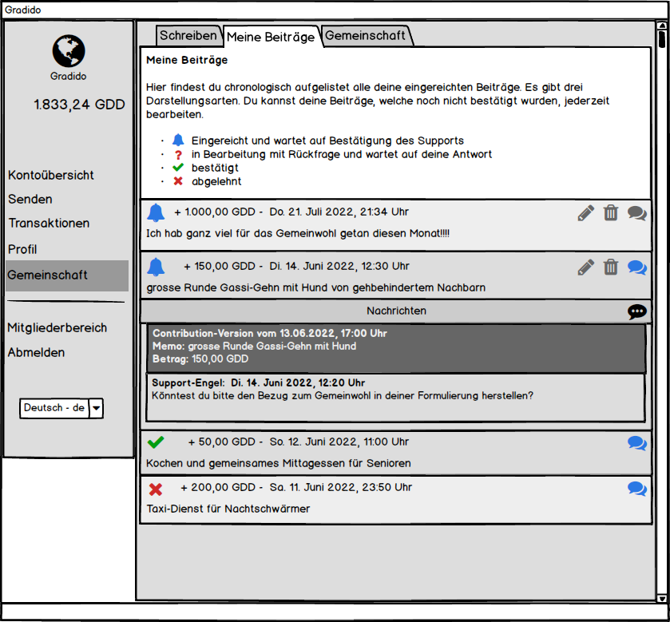
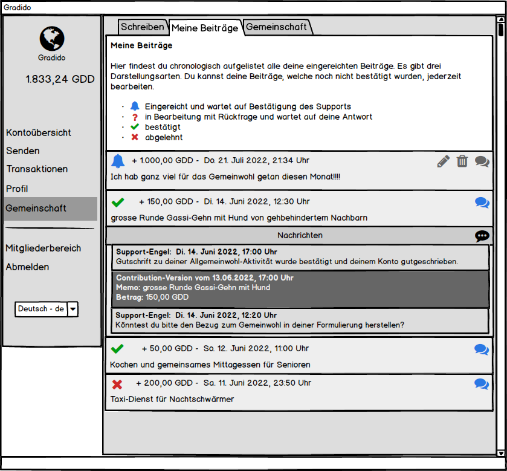
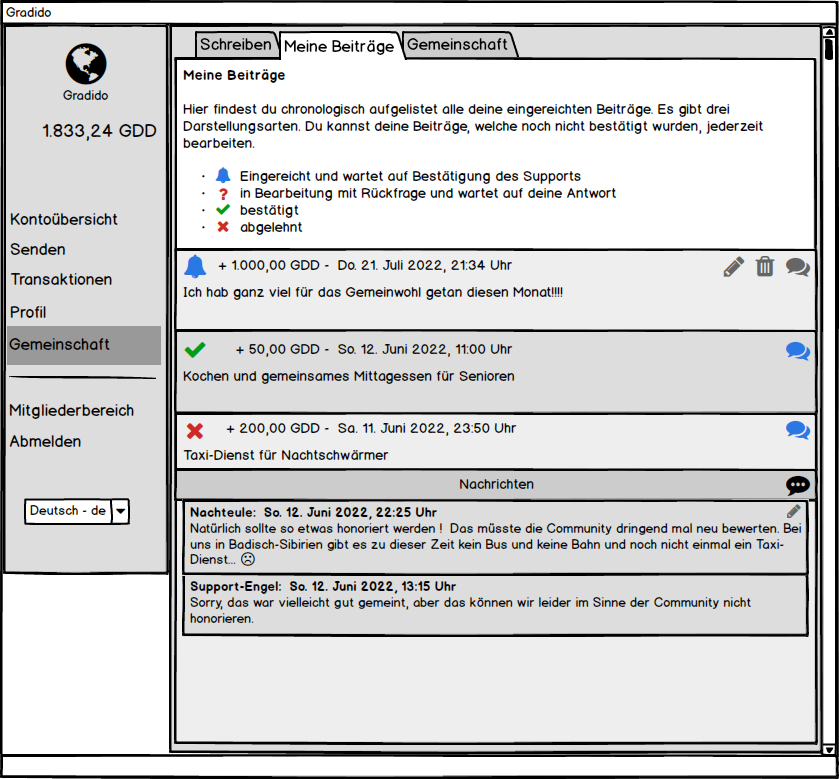
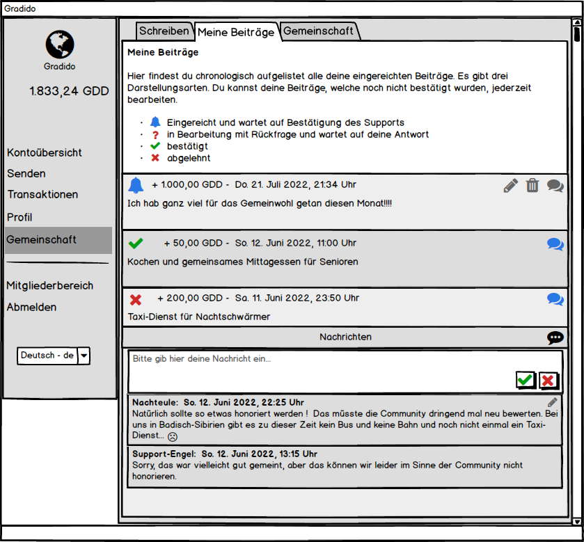

# Contribution Messaging

Die Idee des *Contribution Messagings* besteht darin, dass ein User an eine existierende Contribution eine von ihm erfasste Nachricht anhängen kann. Als Ursprungsmotivation dieses *Contribution Messagings* ist eigentlich die Kommunikation zwischen dem Support-Mitarbeiter und dem Ersteller der Contribution gedacht. Doch es sind auch Nachrichten anderer User in dieser Kommunikationkette denkbar, um beispielsweise Bemerkungen, Kritik und Anregungen zu erstellten Contributions zu hinterlassen. Dadurch soll das Miteinander innerhalb einer Community für die geleisteten Gemeinwohl-Aktivitäten in den Vordergrund gerückt werden.

## Hinweis

In diesem Dokument werden alle zu dem Thema besprochenen und angedachten Anforderungen, unabhängig in welcher Ausbaustufe diese umgesetzt werden, beschrieben. Für die weitere Entwicklung und zur Erstellung der Technischen Tickets werden die einzelnen Anforderungen mit einem Hinweis - Beispiel [AS-1] für Ausbaustufe 1- zur geplanten Ausbaustufe direkt angeben. Die Markierung [AS-x] deutet auf eine Anforderung in einer nächsten Stufe hin. Wobei die Priorisierung und damit noch nicht klar ist, in welcher Ausbaustufe diese Anforderung letztendlich wirklich umgesetzt wird.

## Allgemeine Anforderungen

### Contribution

* **[AS-1]** Eine Contribution bekommt zu den aktuell implementierten drei Status-Werten (eingereicht, bestätigt und abgelehnt) noch einen vierten Status (in Arbeit) hinzu

  * eingereicht (pending): Die Contribution wurde vom User bzw. vom Moderator neu erfasst und wartet auf Bearbeitung der Moderatoren
  * in Arbeit (inprogress): Die Contribution wurde von einem Moderator in Bearbeitung genommen, in dem er eine Rückfrage als Nachricht an den User erfasst hat und wartet auf Beantwortung vom User, dem die Contribution zugeordnet ist
  * bestätigt (confirmed): Die Contribution wurde von einem Moderator genehmigt und der Betrag ist dem User der Contribution schon gutgeschrieben. Dies ist eine Ende-Zustand auf den keine weitere Bearbeitung mehr folgt. **[AS-x]** Es kann selbst nach einer Bestätigung der Contribution noch eine neue Nachricht dazu erfasst werden.
  * abgelehnt (denied): die Contribution wurde vom Moderator abgelehnt und es hat keine Gutschrift des Betrages auf dem Konto des Users stattgefunden. Dies ist ein Ende-Zustand auf den keine weitere Bearbeitung mehr folgt. **[AS-x]** Es kann selbst nach einer Ablehnung der Contribution noch eine neue Nachricht dazu erfasst werden.
* **[AS-1]** Sobald ein Moderator eine Contribution zur Bearbeitung anzeigt, wird sofort die ModeratorId und/oder der neue Status in die Contribution gespeichert, um diese für andere Moderatoren zu sperren. Dies ist notwendig, um fälschlicherweise ein paralleles Bearbeiten einer Contribution durch mehrere Moderatoren zu verhindern.
* **[AS-1]** Bei der Bestätigung einer Contribution wird neben der Status-Änderung auf *confirmed* eine neue Nachricht erzeugt. Diese Nachricht enthält einen Bestätigungstext, der im Frontend als Standard-Bestätigungstext vorbelegt ist und vom Moderator für eine individuelle Bestätigung überschrieben werden kann. Das Speichern der Contribution-Bestätigung erfolgt nach dem die zugehörige Schöpfung als Transaktion erfolgreich gespeichert ist. Falls es beim Speichern der Gutschrift und/oder der Contribution inkl. Message zu einem Fehler kommt, darf weder die Contribution noch die Transaktion gespeichert werden, sondern es muss eine Fehlermeldung ohne Änderungen der Datanbankdaten erfolgen.
* **[AS-1]** Bei der Ablehnung einer Contribution wird neben der Status-Änderung auf *denied* eine neue Nachricht erzeugt. Diese Nachricht enthält einen Ablehnungtext, der im Frontend als Standard-Ablehnungstext vorbelegt ist und vom Moderator für eine individuelle Begründung überschrieben werden kann.
* **[AS-1]** Zu einer Contribution können nur der besitzende User und die Moderatoren eine Nachricht erfassen. **[AS-x]** Für evtl. Bemerkungen, Kritik und Anregungen kann ein beliebiger User über die *Gemeinschaft*-Anzeige auch Nachrichten zu Contributions anderer User erfassen.
* **[AS-1]** Eine Contribution kann vom User der Contribution oder einem Moderator gelöscht werden, egal ob an der Contribution schon Nachrichten zugeordnet sind oder nicht. Beim Löschen muss der User bzw. Moderator eine Begründung formulieren, die beim Löschen dann als Nachricht an die Contribution noch angehängt wird. Dies dient der besseren Nachvollziehbarkeit im Falle von nachträglichen Rückfragen bzw. Analysen.
* **[AS-1]** Eine Contribution zeigt in der Normal-Ansicht per farblichem Icon bzw. textuell, ob

  * noch keine Nachrichten existieren (graue Sprechblase)
  * mindestens eine Nachricht existiert (blaue Sprechblase)
  * **[AS-x]** Gesamtsanzahl der existierenden Nachrichten (z.B. Zahl im bzw. neben Sprechbalsen-Icon)
  * **[AS-x]** Anzahl der ungelesenen Nachrichten (z.B. Zahl/Zahl im bzw. neben Sprechblasen-Icon)
* **[AS-1]** Das Bearbeiten einer Contribution ist im Status *eingereicht* möglich. Solange noch keine Nachrichten anhängig sind, wird nach dem Bearbeiten keine weitere Aktion notwendig, es erfolgt noch keine Historisierung. Sobald aber schon mindestens eine Nachricht anhängig ist, muss eine Historisierung der Contribution-Bearbeitung erfolgen. Das bedeutet, dass beim Starten der Bearbeitung der original Contributiontext und -Betrag als Nachricht mit besonderer Kennzeichnung als Historisierungsnachricht (*Messages.createdAt = Contribution.createdAt*) erzeugt und angehängt wird. Der geänderte bzw. neue Inhalt der Contribution wird in der Contribution selbst gespeichert und das updatedAt und updatedBy der Contribution wird aktualisiert. Die Reihenfolge der Historisierung ergibt sich aus dem Zeitstempel an dem die Historisierungs-Nachricht erzeugt wurde.
* [AS-1] Folgende Status-Übergänge sind für eine Contribution möglich:

  

### Nachrichten

* **[AS-1]** Die Nachrichten zu einer Contribution werden als Detail-Ansicht der Contribution zeitlich absteigend - per `createdAt` - sortiert als einfache Liste angezeigt, das heißt die neueste Nachricht steht oben.
* **[AS-1]** Nur der User, dem die Contribution zugeordnet ist und alle Moderatoren können Nachrichten zu einer Contribution verfassen und bearbeiten. Alle anderen User haben nur Leserechte auf die Contributions und Nachrichten anderer User.
* **[AS-x]** Jeder beliebige User kann zu einer Contribution, egal in welchem Status diese sich befindet, eine Nachricht erstellen.
* **[AS-1]** In den Anzeigen der Contribution-Listen "*Meine Beiträge*" und "*Gemeinschaft*" kann jede enthaltene Contribution analog der Detail-Ansicht einer Transaktion aufgeklappt werden, um die schon angehängten Nachrichten anzuzeigen.
* **[AS-1]** Mit der Detail-Ansicht einer Contribution wird auch ein Button eingeblendet, über den die Erfassung einer neuen Nachricht gestartet wird.
* **[AS-1]** Mit der Anzeige einer Nachricht wird auch der Ersteller und der Erstellungszeitpunkt dieser Nachricht angezeigt.
* **[AS-1]** Analog zur Detailansicht einer Contribution in der Wallet wird auch eine Detailansicht der Contributions im Admin-Bereich eingebaut.
* **[AS-1]** Die Länge einer Nachricht wird auf maximal 2000 Zeichen begrenzt
* **[AS-1]** Die Nachrichten werden als einfach verkettete Liste an die Contribution angehängt. Es wird keine Untertützung von Nachrichten an Nachrichten geben
* **[AS-1]** Eine Nachricht unterscheidet sich im Typ, ob es eine vom User/Moderator manuell erstellte oder ob es eine vom System automatisierte Nachricht -z.B. Contribution-Versionierung, Nachricht über Confirmation, etc. - ist
* **[AS-1]** Ist die letzte, sprich jüngste Nachricht eine manuell erstellte Nachricht, kann diese vom Ersteller der Nachricht - `Messages.userId` - nachträglich bearbeitet werden. Neben dem geänderten Nachrichtentext wird der Zeitpunkt der Änderung im Feld `updatedAt `erfasst. Die Einsortierung in der Nachrichtenliste bleibt auch bei einer nachträglichen Änderung auf dem Feld `createdAt`.
* **[AS-x]** Eine existente Nachricht kann nur von einem Moderator gelöscht werden - Unterbindung von unliebsamen Troll-Inhalten. Dabei wird ein SoftDelete ausgeführt und das Attribut *deleted_at* und *deleted_by* mit dem Zeitpunkt des Löschens und mit der UserId des Moderators gesetzt.
* **[AS-x]** Ist die jüngste Nachricht der Liste eine DIALOG-Nachricht, dann kann diese vom User, der sie erstellt hat, nachträglich bearbeiten werden. In der Nachrichtenanzeige wird dazu ein Stift-Icon sichtbar, das die Anzeige der Nachricht in einen Bearbeitungsmodus versetzt, der den vorhandenen Text plus einen Abbruch- und einen Speichern-Button anzeigt. Mit Beenden des Bearbeitungsmodus per Speichern-Button wird der geänderte Text und der aktuelle Zeitpunkt in das *updated_at* gespeichert.

## Contribution Ansichten

### Contribution-Liste "MeineBeiträge" Ansicht

Die Contributions werden in den User-Ansichten "Meine Beiträge" und "Gemeinschaft", sowie im Admin-Interface als Listen angezeigt. Das nachfolgende Bild zeigt beispielhaft eine Contribution-List in der "Meine Beiträge"-Ansicht.

Die Liste der Contributions enthält vier Contributions, je eine in den vier verschiedenen Darstellungsarten "eingereicht", "in Bearbeitung", "bestätigt" und "abgelehnt". Die ersten beiden Contributions im Status "eingereicht" und "in Bearbeitung" können nachträglich noch bearbeitet oder gar gelöscht werden - zu erkennen an den Icons "Stift" und "Mülleimer". Diese Möglichkeit besteht bei den beiden anderen Contributions nicht mehr, da diese schon vom Support entsprechend bestätigt oder gar abgelehnt wurden.

Das Icon Sprechblase in der Farbe grau deutet darauf hin, dass es zu dieser Contribution noch keine gespeicherten Nachrichten gibt. Ist das Sprechblasen-Icon blau, dann existieren zu der Contribution schon gespeicherte Nachrichten. Ist zu der Farbe blau auch noch eine Zahl, wie bei der zweiten Contribution sichtbar, dann ist in der Nachrichtenliste dieser Contribution eine neue Nachricht enthalten, die noch nicht vom User zur Anzeige gebracht wurde. Ein Klick auf das Sprechblasen-Icon öffnet die Nachrichten-Ansicht der entsprechenden Contribution, wodurch ein Update aller neuen noch ungelesenen Nachrichten erfolgt, in dem der Zeitpunkt der Anzeige in das Attribut *presented_at* eingetragen wird. Gleichzeit wird auch dadurch die Zahl unterhalb des blauen Sprechblasen-Icons gelöscht analog der dritten und vierten Contribution.

## Contribution-Liste "Gemeinschaft" Ansicht

Im Unterschied zur Contributions-Listen Ansicht "Meine Beiträge" wird in der "Gemeinschaft"-Ansicht jeder Contribution zusätzlich der User, dem die Contribution zugeordnet ist, angezeigt.

Als User-Information kann der Vorname und Nachname oder sofern vorhanden auch der Alias angezeigt werden.

### Contribution-LifeCycle

#### Erfassung

Sobald auf der Seite "Schreiben" eine neue Contribution erfasst wurde, wird diese auf der Seite "Meine Beiträge" im Status "eingereicht" angzeigt, wie im nachfolgenden Bild mit den ersten beiden Contributions dargestellt. Bei der Erfassung der Contribution wird neben den fachlichen Attributen wie Memo und Betrag gleichzeitig das Feld `created_at` mit dem aktuellen Zeitpunkt und das Feld `user_id` bzw `moderator_id` mit der UserId des aktuell angemeldeten Users bzw des Support-Moderators eingetragen.

#### In Bearbeitung

Sobald ein Moderator im Admin-Interface eine Contribution im Status "*eingereicht*" zur Anzeige bringt, wird das Feld *inprogress_at* mit dem aktuellen Zeitpunkt und das Feld *inprogress_by* mit der UserId des Moderators gespeichert. Dadurch wird verhindert, dass ein paralleles Bearbeiten einer pending Contribution durch den Support stattfindet.

Falls der Moderator eine Rückfrage an den User richten möchte, zum Beispiel weil die Beschreibung der Aktivität nicht ganz klar ist, dann erfasst der Moderator einen Rückfragetext, der als Nachricht an die Contribution in die Tabelle `contribution_messages` geschrieben wird. Die Nachricht enthält neben dem Text im Feld `message `und dem Zeitpunkt im Feld `created_at`, die ModeratorID im Feld `user_id `und den Bezug zur Contribution im Feld `contribution_id`. Im Feld `type `wird das Enum 'DIALOG' eingetragen, um für die Anzeige in der Nachrichten-Liste das gewünschte Anzeigelayout gegenüber Nachrichten vom Typ 'HISTORY' zu verwenden.

Eine so erfasste Rückfrage vom Support kann der User durch das Icon "?" erkennen, auch steht unterhalb des nun blauen Sprechblasen-Icons die Anzahl der neuen ungelesenen Nachrichten. Mit Klick auf das Sprechblasen-Icon wird die Detailansicht der Contribution geöffnet und die angehängte(n) Nachricht(en) mit der Rückfrage sichtbar. Durch das Öffnen der Detailansicht und der Anzeige der Nachrichten werden in alle noch ungelesenen Nachrichten der aktuelle Zeitpunkt in das Attribut *presented_at* geschrieben und die Zahl unterhalb des Sprechblasen-Icons gelöscht.

Der User kann über das Stift-Icon die Contribution bearbeiten oder über das Mülleimer-Icon die Contribution löschen. Auch das Erfassen einer Nachricht an den Support wäre über das Sprechblasen-Icon mit den 3 Punkten denkbar. Das Besondere beim Speichern der bearbeiteten Contribution bzw. einer erfassten Nachrichten ist die implizite Umsetzung des Contribution-Status wieder zurück auf den Wert "*eingereicht*", damit der Support die Bearbeitung der Contribution wieder erkennen kann und übernimmt.

Nach der Bearbeitung der Contribution durch den User wird beim Speichern der ursprüngliche Inhalt der Contribution als Nachricht vom Type 'HISTORY' angehängt, der dann optisch sich auch von den anderen Dialog-Nachrichten unterscheidet - hier mit anderem Hintergrund und Schriftfarbe als eine 'DIALOG'-Nachricht. Egal von welchem Typ eine Nachricht ist - HISTORY oder DIALOG -, sie wird immer über das Attribut *created_at* einsortiert.

#### Bestätigen / Ablehnen

Sobald der Support wieder die Contribution im Status "*eingereicht*" zur weiteren Bearbeitung hat, kann der Moderator diese entweder "*bestätigen*" oder "*ablehnen*". Im Admin-Interface hat der Moderator dazu jeweils einen Button, über den er die weitere Verarbeitungslogik startet. Das Frontend öffnet dazu ein Dialog, in dem ein Standardtext für die Bestätigung bzw. für die Ablehnung vorbelegt ist. Dieser kann durch direktes Betätigen des "*Bestätigen*"-Button bzw. des "*Ablehnen*"-Buttons übernommen oder vor dem Betätigen der Buttons den vorgeschlagene Text durch eine individuelle Begründung überschrieben werden. Der Begründungstext wird in beiden Fällen als 'DIALOG'-Nachricht an die Contribution angehängt, wie im nächsten Bild sichtbar.

### Contribution-MessageList Ansicht und Bearbeitung

Mit Klicken auf das Sprechblasen-Icon kann die Nachrichten-Ansicht der Contribution geöffnet, wie im nachfolgenden Bild dargestellt und auch wieder geschlossen werden.

Bei geöffneter Nachrichten-Ansicht wird unterhalb der Contribution eine Kopfzeile "Nachrichten" und darunter die Liste der Nachrichten chronologisch absteigend nach ihrem `createdAt`-Datum sortiert angezeigt. Pro Nachricht ist der Absender, der Zeitstempel der Nachrichtenerstellung und der Nachrichtentext zu sehen. 

Eine einmal erstellte Nachricht kann vom User selbst zwar nicht mehr gelöscht, aber sie kann als jüngste Nachricht in der Nachrichtenliste vom Ersteller noch einmal bearbeitet werden, wie an dem sichtbaren Stift-Icon in der Nachricht zu erkennen ist. Mit Klick auf das Stift-Icon wechselt die Anzeige der Nachricht in den Bearbeitungsmodus (analog dem Erfassen einer neuen Nachricht wie im nächsten Kapitel), in dem der Text nun verändert werden kann und zwei angezeigte Buttons zum Speichern bzw zum Verwerfen der Änderungen. Sobald eine Nachricht nachträglich bearbeitet wurde, wird der Zeitpunkt der Bearbeitung zusätzlich mit dem Label "bearbeitet am: < Zeitpunkt >" hinter dem Creation-Zeitpunkt angezeigt.

Um der Gefahr von unliebsamen Inhalten z.B. durch Trolle zu begegenen, kann ein Moderator eine Nachricht löschen. Es wird dabei ein SoftDelete ausgeführt, wodurch in die Nachricht das Attribut *deleted_at* und *deleted_by* mit dem Zeitpunkt des Löschens und mit der UserId des Moderators gesetzt wird.

### Contribution-CreateMessage Ansicht

Man kann aber mit Klicken auf den Button rechts - Sprechblasen-Icon mit den Punkten - in der Nachrichten-Kopfzeile eine neue Nachricht erstellen, siehe dazu nächstes Bild.

Es wird mit Klicken auf das Sprechblasen-Icon mit den drei Punkten ein neues Nachrichten-Fenster direkt unterhalb der Nachrichten-Kopfzeile eingeblendet. Das Textfeld ist leer und enthält lediglich den eingeblendeten Hinweis-Text, der mit Beginn der Texteingabe sofort verschwindet. Über die beiden Buttons rechts unten im Nachrichten-Eingabefenster kann die eingegebene Nachricht gespeichert oder verworfen werden. Sobald die neue Nachricht gespeichert wurde, erscheint diese analog den schon vorhandenen Nachrichten mit dem gleichen Erscheinungsbild und ohne Speicher- oder Verwerfen-Button. Der User kann beliebig viele Nachrichten eingeben, es gibt hierzu keine Begrenzung bzw. Validierung.

## Contribution-Message Services

### searchContributions of User

Mit diesem Service werden alle Contributions aber keine Messages, die dem einen User zugeordnet sind gelesen und nach ihrem CreatedAt-Datum zeitlich absteigend sortiert. Es werden weitere evtl. transiente Informationen pro Contribution mit geliefert, um die entsprechenden Ausprägungen im Frontend ansteuern zu können:

* Status: eingereicht / in Bearbeitung / bestätigt / abgelehnt
* Messages vorhanden: ja / nein
* falls Messages vorhanden, wieviele davon sind ungelesen

### searchContributions for all

Mit diesem Service werden alle Contributions aber keine Messages, aller User gelesen und nach ihrem CreatedAt-Datum zeitlich absteigend sortiert. Es werden weitere evtl. transiente Informationen pro Contribution mit geliefert, um die entsprechenden Ausprägungen im Frontend ansteuern zu können:

* Status: eingereicht / in Bearbeitung / bestätigt / abgelehnt
* Messages vorhanden: ja / nein
* falls Messages vorhanden, wieviele davon sind ungelesen
* User-Info: Vorname, Nachname oder sofern vorhanden dann der Alias

### updateContribution

Über diesen Service kann eine Contribution nur verändert werden, wenn sie im Status "*eingereicht*" oder "*in Bearbeitung*" ist. Dies kann nur der Ersteller der Contribution selbst ausführen. Implizit wird dabei zur Historisierung eine 'HISTORY'-Nachricht mit dem ürsprünglichen Inhalt der Contribution erstellt. In der bearbeiteten Contribution wird neben den geänderten Attributen `Memo `und `Amount `das `created_at`-Datum auf den Zeitpunkt des Updates gesetzt.

### deleteContribution

Mit diesem Service kann eine Contribution im Status "*eingereicht*" bzw. "*in Bearbeitung*" und nur vom Ersteller selbst oder von einem Moderator gelöscht werden. Dabei wird nur ein SoftDelete durchgeführt, indem das `deleted_at`-Datum auf den aktuellen Zeitpunkt und das `deleted_by`-Attribut mit der UserId des Users/Moderators gesetzt wird.

### confirmContribution

Über diesen Service kann der Moderator im AdminInterface eine "*eingereichte*" bzw. eine "*in Bearbeitung*" Contribution bestätigen. Dabei wird implizit das Attribut "`confirmed_by`" auf die UserId des Moderators gesetzt und das Attribut "`confirmed_at`" auf den aktuellen Zeitpunkt. Zusätzlich wird eine Nachricht mit dem übergebenen Begründungstext der Confirmation an die Contribution angehängt.

### denyContribution

Über diesen Service kann der Moderator im AdminInterface eine "*eingereichte*" bzw. ein "*in Bearbeitung*" Contribution ablehnen. Dabei wird implizit das Attribut "`denied_by`" auf die UserId des Moderators, das Attribut "`denied_at`" auf den aktuellen Zeitpunkt gesetzt. Zusätzlich wird eine Nachricht mit dem übergebenen Begründungstext der Ablehnung an die Contribution angehängt.

### searchContributionMessages

Dieser Service liefert zu einer bestimmten Contribution alle gespeicherten Nachrichten chronologisch nach dem `CreatedAt`-Datum absteigend sortiert. Neben dem Nachrichtentext und dem CreatedAt-Datum wird auch der User, der die Nachricht erstellt hat, geliefert. Als User-Daten wird entweder der Vorname und Nachname oder falls vorhanden der Alias geliefert.

### createMessageForContribution

Über diesen Service kann zu einer bestimmten Contribution eine neue Nachricht gespeichert werden. Neben dem Nachrichten-Text wird die `contribution_id`, die `user_id `des Nachrichten Erstellers, der `type `der Nachricht und das `created_at`-Datum gespeichert.

### UpdatePresentedMessagesOfContribution

Mit diesem Service werden alle Nachrichten einer Contribution mit *presented_at* = null aktualisiert, in dem der aktuelle Zeitpunkt in das Attribut *presented_at* eingetragen wird.

## Datenbank Anpassungen

Das Class-Diagramm der beteiligten Tabellen gibt einen ersten Eindruck:

### Contributions Tabelle

Die Contribution-Tabelle benötigt für die Speicherung der verschiedenen Status-Constellationen folgende zusätzliche bzw. vorhandene Attribute:

inprogress_at:		**[neues Attribut]** speichert den Zeitpunkt, wann die Contribution durch den Support-Mitarbeiter *in Arbeit genommen* wurde

inprogress_by:		**[neues Attribut]** speichert die UserId des Moderators, der die Contribution *in Arbeit genommen* hat

confirmed_at:		[vorhandenes Attribut] speichert den Zeitpunkt, wann die Contribution durch den Support-Mitarbeiter *bestätigt* wurde

confirmed_by:		[vorhandenes Attribut] speichert die UserId des Moderators, der die Contribution *bestätigt* hat

denied_at:		[vorhandenes Attribut] speichert den Zeitpunkt, wann die Contribution *abgelehnt* wurde

denied_by:		[vorhandenes Attribut] speichert die UserId des Moderators, der die Contribution *abgelehnt* hat

deleted_at:		**[neues Attribut]** speichert den Zeitpunkt, wann die Contribution *gelöscht* wurde

deleted_by:		**[neues Attribut]** speichert die UserId des Moderators, der die Contribution *gelöscht* hat

### ContributionMessages Tabelle

Die ContributionMessages Tabelle ist gänzlich neu mit allen Attributen:

id:				technical primary key

contribution_id:	foreign key to contributions table the message belong to

user_id:			foreign key to user table the message was created by

message:			the message-text

created_at:		the point of the time the message entry was created

type:			Enum 'DIALOG' or 'HISTORY' to distingue between normal dialog message entries and messages for historisation of contribution

updated_at:		the point of time the messages was updated

presented_at:		the point of time the message was read for presenting in frontend
