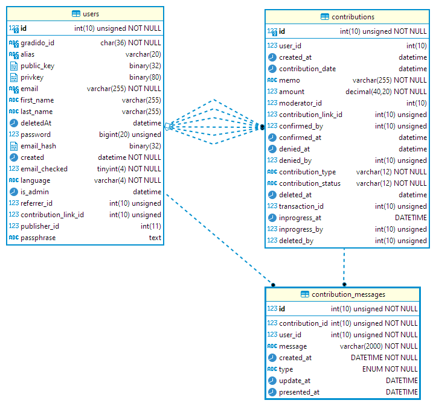

# Contribution Messaging

Die Idee des *Contribution Messagings* besteht darin, dass ein User an eine existierende Contribution eine von ihm erfasste Nachricht anhängen kann. Als Ursprungsmotivation dieses *Contribution Messagings* ist eigentlich die Kommunikation zwischen dem Support-Mitarbeiter und dem Ersteller der Contribution gedacht. Doch es sind auch Nachrichten anderer User in dieser Kommunikationkette denkbar, um beispielsweise Bemerkungen, Kritik und Anregungen zu erstellten Contributions zu hinterlassen. Dadurch soll das Miteinander innerhalb einer Community für die geleisteten Gemeinwohl-Aktivitäten in den Vordergrund gerückt werden.

## Allgemeine Anforderungen

* Die Nachrichten zu einer Contribution werden als Detail-Ansicht der Contribution zeitlich absteigend sortiert als Liste angezeigt, das heißt die neuste Nachricht steht oben.
* Jeder beliebige User kann zu einer Contribution, egal in welchem Status diese sich befindet, eine Nachricht erstellen.
* In den Anzeigen der Contribution-Listen "Meine Beiträge" und "Gemeinschaft" kann jede enthaltene Contribution analog der Detail-Ansicht einer Transaktion aufgeklappt werden, um die schon angehängten Nachrichten anzuzeigen.
* Mit der Detail-Ansicht einer Contribution wird auch ein Button eingeblendet über den die Erfassung einer neuen Nachricht gestartet wird.
* Mit der Anzeige einer Nachricht wird auch der Ersteller und der Erstellungszeitpunkt dieser Nachricht angezeigt.
* Analog zur Detailansicht einer Contribution in der Wallet wird auch eine Detailansicht der Contributions im Admin-Bereich eingebaut.
* Die Länge einer Nachricht wird auf maximal 2000 Zeichen begrenzt
* Die Nachrichten werden als einfach verkettete Liste an die Contribution angehängt. Es wird keine Untertützung von Nachrichten an Nachrichten geben

## Contribution Ansichten

### Contribution-Liste "MeineBeiträge" Ansicht

Die Contributions werden in den User-Ansichten "Meine Beiträge" und "Gemeinschaft", sowie im Admin-Interface als Listen angezeigt. Das nachfolgende Bild zeigt beispielhaft eine Contribution-List in der "Meine Beiträge"-Ansicht.

Die Liste der Contributions enthält drei Contributions, je eine in den drei verschiedenen Darstellungsarten "eingereicht", "bestätigt" und "abgelehnt". Die erste Contribution im Status "eingereicht" kann nachträglich noch bearbeitet oder gar gelöscht werden - zu erkennen an den Icons "Stift" und "Mülleimer". Diese Möglichkeit besteht bei den beiden anderen Contributions nicht mehr, da diese schon vom Support entsprechend bestätigt oder gar abgelehnt wurden.

Das Icon Sprechblase in der Farbe grau deutet darauf hin, dass es zu dieser Contribution noch keine gespeicherten Nachrichten gibt. Ist das Sprechblasen-Icon blau, dann existieren zu der Contribution schon gespeicherte Nachrichten. Ein Klick auf das Sprechblasen-Icon öffnet die Nachrichten-Ansicht der entsprechenden Contribution.

## Contribution-Liste "Gemeinschaft" Ansicht

Im Unterschied zur Contributions-Listen Ansicht "Meine Beiträge" wird in der "Gemeinschaft"-Ansicht jeder Contribution zusätzlich der User, dem die Contribution zugeordnet ist, angezeigt.

Als User-Information kann der Vorname und Nachname oder sofern vorhanden auch der Alias angezeigt werden.

### Contribution-MessageList Ansicht

Mit Klicken auf das Sprechblasen-Icon kann die Nachrichten-Ansicht der Contribution geöffnet, wie im nachfolgenden Bild dargestellt und auch wieder geschlossen werden.

Bei geöffneter Nachrichten-Ansicht wird unterhalb der Contribution eine Kopfzeile "Nachrichten" und darunter die Liste der Nachrichten chronologisch absteigend nach ihrem createdAt-Datum sortiert angezeigt. Pro Nachricht ist der Absender, der Zeitstempel der Nachrichtenerstellung und der Nachrichtentext zu sehen. Eine einmal erstellte Nachricht kann weder bearbeitet noch gelöscht werden.

### Contribution-CreateMessage Ansicht

Man kann aber mit Klicken auf den Button rechts - Sprechblasen-Icon mit den Punkten - in der Nachrichten-Kopfzeile eine neue Nachricht erstellen, siehe dazu nächstes Bild.

Es wird mit Klicken auf das Sprechblasen-Icon mit den Punkten ein neues Nachrichten-Fenster direkt unterhalb der Nachrichten-Kopfzeile eingeblendet. Das Textfeld ist leer und enthält lediglich den eingeblendeten Hinweis-Text, der mit Beginn der Texteingabe sofort verschwindet. Über die beiden Buttons rechts unten im Nachrichten-Eingabefenster kann die eingegebene Nachricht gespeichert oder verworfen werden. Sobald die neue Nachricht gespeichert wurde, erscheint diese analog den schon vorhandenen Nachrichten mit dem gleichen Erscheinungsbild und ohne Speicher- oder Verwerfen-Button. Der User kann beliebig viele Nachrichten eingeben, es gibt hierzu keine Begrenzung bzw. Validierung.

## Contribution-Message Services

### searchContributions of User

Mit diesem Service werden alle Contributions aber keine Messages, die dem einen User zugeordnet sind gelesen und nach ihrem CreatedAt-Datum zeitlich absteigend sortiert. Es werden weitere evtl. transiente Informationen der Contributions mit geliefert, um die entsprechenden Ausprägungen im Frontend ansteuern zu können:

* Status: eingereicht / bestätigt / abgelehnt
* Messages vorhanden: ja / nein

### searchContributions for all

Mit diesem Service werden alle Contributions aber keine Messages, aller User gelesen und nach ihrem CreatedAt-Datum zeitlich absteigend sortiert. Es werden weitere evtl. transiente Informationen der Contributions mit geliefert, um die entsprechenden Ausprägungen im Frontend ansteuern zu können:

* Status: eingereicht / bestätigt / abgelehnt
* Messages vorhanden: ja / nein
* User-Info: Vorname, Nachname oder sofern vorhanden dann der Alias

### updateContribution

Über diesen Service kann zu einer Contribution im Status "eingereicht" das Memo- und das Amount-Attribut verändert werden. Dies kann nur der Ersteller der Contribution selbst ausführen. Implizit wird dabei das createdAt-Datum auf den Zeitpunkt des Updates gesetzt, da wir keine Historie in der Datenbank über die Änderungen vorhalten.

### deleteContribution

Mit diesem Service kann eine Contribution im Status "eingereicht" und nur vom Ersteller selbst gelöscht werden. Dabei wird nur ein SoftDelete durchgeführt, indem das deletedAt-Datum auf den aktuellen Zeitpunkt gesetzt wird.

### confirmContribution

Über diesen Service kann der Moderator im AdminInterface eine "eingereichte" Contribution bestätigen. Dabei wird implizit das Attribut "confirmed_by" auf die UserId des Moderators gesetzt und das Attribut "confirmed_at" auf den aktuellen Zeitpunkt. Bei der Migrations-Variante-1 der Contribution-Tabelle wird implizit das Attribut "confirmed_state" auf TRUE gesetzt.

### denyContribution

Über diesen Service kann der Moderator im AdminInterface eine "eingereichte" Contribution ablehnen. Dabei wird bei der Migrations-Variante-1 implizit das Attribut "confirmed_by" auf die UserId des Moderators gesetzt, das Attribut "confirmed_at" auf den aktuellen Zeitpunkt und das Attribut "confirmed_state" auf FALSE gesetzt. Zusätzlich gibt der Moderator eine Begründung der Ablehnung ein, die in dem Attribut "denied_reason" gespeichert wird.

Bei der Migrations-Variante-2 wird bei einer Ablehnung das Attribut "denied_by" auf die UserId des Moderators gesetzt, das Attribut "denied_at" auf den aktuellen Zeitpunkt und in das Attribut "denied_reason" wird die Begründung der Ablehnung gespeichert. Die Attribute "confirmed_by", "confirmed_at" bleiben leer bzw auf null, das Attribut "confirm_state" existiert nicht.

### searchContributionMessages

Dieser Service liefert zu einer bestimmten Contribution alle gespeicherten Nachrichten chronologisch nach dem CreatedAt-Datum absteigend sortiert. Neben dem Nachrichtentext und dem CreatedAt-Datum wird auch der User, der die Nachricht erstellt hat, geliefert. Als User-Daten wird entweder der Vorname und Nachname oder falls vorhanden der Alias geliefert.

### createMessageForContribution

Über diesen Service kann zu einer bestimmten Contribution eine neue Nachricht gespeichert werden. Neben dem Nachrichten-Text wird der User, der die Nachricht erstellt und das CreatedAt-Datum gespeichert.

## Datenbank Anpassungen

Das Class-Diagramm der beteiligten Tabellen gibt einen ersten Eindruck:

### Contributions Tabelle

Die Contribution-Tabelle benötigt für die Confirmation ein zusätzliches Attribut, das das Ergebnis der Confirmation - bestätigt oder abgelehnt - speichert. 

#### Variante 1:

confirmed_state:	speichert das Ergebnis der Confirmation, das entweder true für bestätigt oder false für abgelehnt

denied_reason:	speichert die Begründung der Ablehnung, die der Moderator als Argumentation formuliert

#### Variante 2:

denied_at:		speichert den Zeitpunkt, wann die Ablehnung erfolgte

denied_by:		speichert die UserId des Moderators, der die Ablehnung durchgeführt hat

denied_reason:	speichert die Begründung der Ablehnung, die der Moderator als Argumentation formuliert

### ContributionMessages Tabelle

Die ContributionMessages Tabelle ist gänzlich neu mit allen Attributen.
