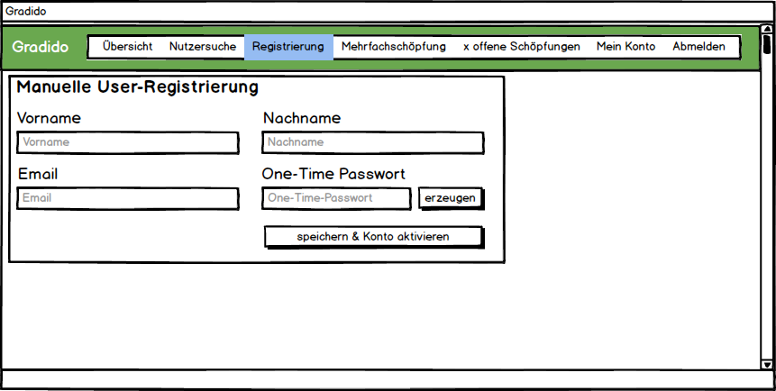

# Manuelle User-Registrierung

## Motivation

Bei einer Veranstaltung o.ä. sollen neue Mitglieder geworben werden. Dabei ist ungewiss, ob sie ein Endgerät dabei haben bzw. dieses korrekt bedienen können (QR-Code, E-Mail-Zugang etc.). Es soll nun ohne Einsatz zusätzlicher Technologien eine schnelle und unkomplizierte Möglichkeit geschaffen werden, dass ein Moderator im Admin-Interface zusätzliche Funktionen zur Unterstützung des User-Registrierungsprozesses erhält:

1. manuelle Aktivierung eines User-Accounts ohne Email-Bestätigung und setzen eines (vorläufigen) Passworts
2. vollständige User-Registrierung mit Daten-Erfassung, Account-Aktivierung und setzen eines (vorläufigen) Passworts

## 1. Unterstützung einer User-Registrierung

Ein neuer User hat schon selbständig mit seiner Registrierung bei Gradido begonnen, aber in dem Moment keinen Zugriff auf seine Emails. Somit kann er seine erhaltene Bestätigungs-Email mit dem Link zur Konto-Aktivierung nicht abrufen und die Registrierung nicht abschließen.

Für diesen Fall wird im Admin-Interface eine neue Funktionalität zur "manuellen Aktivierung eines User-Accounts" bereitgestellt. Diese "manuelle Aktivierung" durch den Admin soll den neuen User kurzfristig ermächtigen auf sein Konto zugreifen zu können. Das heißt, dieser Admin-Prozess muss

* das Konto des neuen Users als aktiviert kennzeichnen
* für den User ein (vorläufiges) Passwort generieren
* die Kennzeichnung beibehalten, dass die Email-Adresse des Users noch nicht bestätigt ist
* dem User ein Login-Prozess ermöglichen, in dem der User das (vorläufige) Passwort verwenden kann
* den User nach dem erfolgreichen Login mit dem (vorläufigen) Passwort direkt zur Eingabe eines eigenen Passwortes bringen

### 1.1 Starten des Registrierungsunterstützungs-Prozesses

#### Vorbedingungen

Nach dem der neue User für sich schon die Erfassung seiner persönlichen Daten im Registrierungsdialog durchgeführt und gespeichert hat, schickt die Anwendung dem User eine Confirmation-Email an seine angegebene Email-Adresse. Der User kommt aber aktuell nicht an seine Emails bzw. benötigt Unterstützung, wie er jetzt weiter machen soll, um sich anzumelden. Mit diesem Bedarf nach Unterstützung wendet der User sich an einen Moderator mit entsprechenden Admin-Rechten.

#### Manuelle Aktivierung und One-Time-Passwort

Der Admin navigiert in seinem angemeldeten Gradido-Account auf das Admin-Interface. Dort öffnet er den Dialog "Nutzersuche".

Neu in diesem Dialog sind nun die neuen Checkboxen "noch nicht aktiviertes Konto" und "unbestätigte Email-Adresse". Im Normalfall sind diese beiden Checkboxen nicht selektiert, so dass mit der üblichen Nutzersuche alle User wie bisher ermittelt werden können.

Um nun schneller einen neuen User mit "noch nicht aktiviertem Konto" und noch "unbestätigter Email-Adresse" für die Registrierungsunterstützung zu finden, kann der Admin die neuen Filter-Checkboxen selektieren.  Diese schränken die User-Suche zusätzlich zur üblichen Namens-Eingabe ein, dh. ohne Eingabe eines einschränkenden Namens werden alle User-Accounts gelistet, die ein "noch nicht aktiviertes Konto" und noch eine "unbestätigte Email-Adresse" haben.

Sobald der gewünschte User-Account in der Liste gefunden wurde, kann der Detail-Dialog zu diesem User per Klick geöffnet werden.

Der geöffnete Detail-Dialog zeigt einen neuen Reiter "Registrierung", in dem die Informationen über das User-Konto stehen: wann wurde es erzeugt und wie ist der Status der "Konto-Aktivierung" und der "Email-Bestätigung".

Der Admin kann nun entweder manuell ein One-Time-Passwort in das Eingabefeld eingeben oder über den "erzeugen"-Button eines kreieren lassen. Dieses wird dann über den Button "speichern & Konto aktivieren" in die Datenbank geschrieben, wobei damit gleichzeitig der Status des User-Kontos auf aktiviert gesetzt wird.

Der Admin kann nun das One-Time-Passwort dem User mitteilen, so dass dieser sich über den Login-Prozess in seinen Account ohne vorherige Email-Bestätigung anmelden kann. Der Login-Prozess mit einem One-Time-Passwort muss nach erfolgreicher Anmeldung den User sofort auf den Passwort-Ändern-Dialog führen, um den User direkt die Möglichkeit zu geben sein eigenes Passwort zu vergeben.

Mit Öffnen des Passwort-Ändern-Dialogs für einen User-Account mit One-Time-Passwort kann nicht mit Sicherheit davon ausgegangen werden, dass der User selbst der Datenschutzerklärung zugestimmt hat - dies könnte durch die Unterstützung der Moderators beim User untergegangen sein. Daher muss in diesem Fall in dem Dialog eine Checkbox zur Bestätigung der Datenschutzerklärung eingeblendet sein. Erst wenn der User sein neues Passwort gemäß den Passwort-Richtlinien gesetzt und den Datenschutzbestimmungen zugestimmt hat, wird der "Speichern"-Button enabled und die Daten können gespeichert werden.

#### One-Time-Passwort anzeigen oder ändern

Falls ein neuer User sein erhaltenes One-Time-Passwort noch nicht für einen Login verwendet hat und dieses erneut vom Admin erfragen möchte, dann kann der Administrator dieses erneut im Admin-Interface über die Nutzer-Suche anzeigen lassen. Dazu kann er die Filter-Checkbox "noch nicht aktiviertes Konto" deselektieren, aber die Checkbox "unbestätigte Email-Adresse" selektiert lassen. Dann bekommt er alle User deren Email-Bestätigung noch offen ist und nur User-Konten, die schon aktiviert sind.

Beim Öffnen der Userkonto-Details im Reiter "Registrierung" ist dann zu sehen, dass das "Konto schon aktiv", aber die "Email-Bestätigung noch offen" ist. Im Eingabefeld des One-Time-Passwortes ist das zuvor schon gespeicherte Passwort zu lesen, so dass der Admin dieses dem User erneut mitteilen kann. Der Admin kann aber auch über den "erzeugen"-Button oder manuell das vorhandene Passwort ändern. Über den "speichern"-Button, der aufgrund der vorherigen Konto-Aktivierung nun nicht mehr "speichern & Konto aktivieren" heißt, kann die Passwort-Änderung in die Datenbank geschrieben werden.

### 1.2 Starten einer manuellen Admin-User-Registrierung

Im Admin-Interface wird im Menü ein neuer Reiter "Registrierung" angezeigt. Mit Auswahl dieses Reiters kann der Moderator den Dialog zur "Manuellen User-Registrierung" öffnen.

Dabei kann der Moderator die Attribute Vorname, Nachname, Email-Adresse und ein One-Time-Passwort eingeben. Mit dem "speichern & Konto aktivieren"-Button wird im Backend zunächst eine Prüfung durchgeführt, ob die eingegebene Email-Adresse ggf. schon von einem anderen existierenden User verwendet wird. Sollte dies der Fall sein, dann wird eine entsprechend aussagekräftige Fehlermeldung ausgegeben und die zuvor eingegebenen Daten werden in dem "Manuelle User-Registrierung" erneut angezeigt. Sind alle Daten soweit valide, dann werden die eingegebenen Daten in der Datenbank gespeichert und der Konto-Status auf aktiviert gesetzt.

Es wird auch hier eine Email zur Emailadress-Bestätigung verschickt. Der Status "email_checked" bleibt auf false, weil der User seine Confirmation-Email zwar bekommen, aber noch nicht bestätigt hat oder eben nicht zeitnah bestätigen kann. Durch das One-Time-Passwort, das der Moderator dem User mitteilen kann, hat der User direkt die Möglichkeit sich über den Login-Prozess anzumelden, ohne vorher den Email-Bestätigungslink aktivieren zu müssen.

### 1.3 User-Login mit One-Time-Passwort

Sobald der User selbst oder durch den Moderator ein neues User-Konto angelegt und ein One-Time-Passwort vergeben ist, dann kann der User selbst sich über den üblichen Login-Prozess anmelden.

Die Anwendung erkennt, dass der Login über ein One-Time-Passwort erfolgte, so dass der User direkt nach dem erfolgreichen Login auf die Passwort-Ändern-Seite geführt wird.

Auf dieser Seite muss der User dann sein neues, nur ihm persönlich bekanntes Passwort eingeben und zur Kontrolle wiederholen. Da der User-Account über eine One-Time-Passwort Registrierung erstellt wurde, hatte der User sehr wahrscheinlich nicht die Gelegenheit der Datenschutzerklärung selbst zuzustimmen. Daher wird hier im Passwort-Ändern-Dialog dies nachgeholt, indem erst mit der Zustimmung zur Datenschutzerklärung der "Passwort ändern"-Button aktiviert wird.

## 2. Implementierung und Anpassungen

### 2.1 Datenbank

Für diese fachlichen Anforderungen müssen folgende Informationen neu in der Datenbank aufgenommen und gespeichert werden:

* Merkmal, dass für den User ein Konto vorhanden, aber dieses noch nicht aktiviert ist
* Merkmal, dass für den User ein Konto vorhanden und dieses schon aktiviert ist
* One-Time-Passwort, das von der Anwendung im Original angezeigt werden kann - unverschlüsselt oder ohne Interaktion zu entschlüsseln
* Merkmal, ob bzw. wann der User der Datenschutzerklärung zugestimmt hat

Es stellt sich die Frage, ob mit diesem UseCase gleich die schon sowieso geplante neue Tabelle `accounts `erstellt wird oder die obigen Merkmale erst einmal in die users-Tabelle einfließen?

**Empfehlung:** erstellen der `accounts`-Tabelle

In dieser `accounts`-Tabelle werden dann alle Account spezifischen Daten gespeichert und ein `accounts`-Eintrag ist über die Spalte `user_id` dem User in der `users`-Tabelle zugeordnet.

Ansonsten werden aber keine weiteren Datenbank-Migrationen, wie Zuordnung der Transaktionen oder Contributions zur `accounts`-Tabelle durchgeführt. Dies muss in einem separaten Issue migriert werden.

#### accounts-Tabelle

| Column            | Type             | Description                                                                                                                 |
| ----------------- | ---------------- | --------------------------------------------------------------------------------------------------------------------------- |
| id                | unsigned int(10) | technical unique key                                                                                                        |
| user_id           | unsigned int(10) | foreign key to users entry                                                                                                  |
| type              | enum             | account type: AGE (default), AGW, AUF                                                                                      |
| created_at        | datetime(3)      | the point of time the entry was created                                                                                     |
| activated         | tinyint(4)       | switch if account is active or inactive                                                                                     |
| creations_allowed | tinyint(4)       | switch if account allows to create gradidos or not; necessary for type AGW and AUF                                          |
| decay             | tinyint(4)       | switch if account supports decay or not; in case the GDT will be shiftet as a separate account type here in the application |
| balance           | decimal(40, 20)  | amount of gradidos at the updated_at point of time                                                                          |
| updated_at        | datetime(3)      | the point of time the entry was updated, especially important for the balance                                               |

Die letzten vier Spalten sind ersteinmal rein informativ, was ein `accounts`-Eintrag zukünftig enthalten wird und für diesen Usecase optional. Sie könnten auch auf ein zukünftiges Migrations-Issue verschoben werden.

#### users-tabelle

| Column                   | Type        | Description                                                                                             |
| ------------------------ | ----------- | ------------------------------------------------------------------------------------------------------- |
| privacy_policy_at        | datetime(3) | point of time the user agreed with the privacy policy - during registration or one-time-password change |
| password_encryption_type | enum        | defines the type of encrypting the password: 0 = one-time, 1 = email (default), 2 = gradidoID, ...      |

Um zu vermeiden, dass in Bezug auf das One-Time-Passwort und der anstehenden Migration der Passwort-Verschlüsselung ohne Email und stattdessen per GradidoID, es hier zu unnötigen Tabellen-Migrationen kommt, wird mit diesem Usecase die Spalte *password_encryption_type* eingeführt. Damit ist dann erkennbar, ob es sich bei dem gespeicherten Passwort um ein One-Time-Passwort handelt oder um ein anderweitig verschlüsseltes Passwort.

Sollte das Issue zur Migration der Passwort-Verschlüsselung schon vor diesem Usecase umgesetzt sein, dann existiert in der `users`-Tabelle schon die Spalte `passphrase_encryption_type`. Dann sollte diese in `password_encryption_type` umbenannt und dem Enum der Wert 0 für One-Time-Passwort hinzugefügt werden. Die Bezeichnung *passphrase_encryption_type* ist irreführend, da in der Tabelle eine Spalte `passphrase `existiert. Doch die Verschlüsselung wird auf die Spalte `password `und nicht auf `passphrase` angewendet.

#### Migration

Mit den zuvor beschriebenen Datenbankänderungen muss eine Datenbankmigration auf die bestehenden Daten durchgeführt werden. Nachdem die strukturellen Änderungen wie neue `accounts`-Tabelle anlegen und bestehende `users`-Tabelle ändern durchgeführt wurde, erfolgt nun die eigentliche Migration der Daten:

* erzeugen der neuen `accounts`-Tabelle wie oben beschrieben
* ändern der bestehenden `users`-Tabelle wie oben beschrieben mit folgenden Default-Initialisierungen
  * privacy_policy_at = created_at
  * passwort_encryption_type = Enum `PasswordEncryptionType.EMAIL` oder Wert=1
* Insert pro Eintrag aus der `users`-Tabelle jeweils einen Eintrag in die `accounts`-Tabelle mit folgenden Initialsisierungen:
  * `accounts.user_id` = `users.id`
  * `accounts.type` = Enum `AccountType.AGE`
  * `accounts.created_at` = `users.created_at`
  * `accounts.activated` = `users.emailContact.email_checked`
  * `accounts.creations_allowed` = TRUE (weil es ein account type = AGE ist)
  * `accounts.decay` = TRUE (weil es ein account type = AGE ist)
  * `accounts.balance` = null (dieses Attribut wird in separatem Issue "Update Account-Balance during writing a Transaction" bedient)
  * `account.updated_at` = null  (dieses Attribut wird in separatem Issue "Update Account-Balance during writing a Transaction" bedient)

### 2.2 Admin-Interface

#### searchUsers

Der Service *AdminResolver.searchUsers* muss die Filterkriterien "aktiviertes Konto" und "bestätigte Email" getrennt von einander unterstützen. Bisher gibt es in den *SearchUserFilters* das Filterkriterium "byActivated", doch dieses wird auf das Flag `email_checked` in der `user_contacts`-Tabelle angewendet. Das entspricht aber dann dem FilterKriterium "bestätigte Email".

Somit muss das schon existierende Fitlerkriterium "aktiviertes Konto" auf die Spalte "`activated`" in der `accounts`-Tabelle angewendet werden und ein zusätzliches Filterkriterium "bestätigte Email", das auf die Spalte `email_checked` in der `user_contacts`-Tabelle filtert.

Der ErgebnisTyp `SearchUsersResult `des Service *searchUsers* muss um die Informationen erweitert werden, die in dem oben aufgezeigten Detail-Dialog der *Nutzer-Suche* auf dem Reiter "Registrierung" zur Anzeige gebracht werden:

* Zeitpunkt der Konto-Erstellung (`accounts.created_at`)
* Status des Kontos (`accounts.activated`)
* Status der Email-Bestätigung (`user_contacts.email_checked`)
* falls `users.password_encryption_type` = 0, dann das One-Time-Passwort (`users.password`)

#### adminCreateUser

Im *AdminResolver* muss aus Berechtigungsgründen ein neuer Service *adminCreateUser* erstellt werden, da im *UserResolver* der Service *createUser* für jeden offen ist, ohne dass eine vorherige Authentifizierung per Login stattgefunden hat.

Dieser neue Service benötigt folgende Signatur als Eingabeparameter:

| Argument        | Type   | Bezeichnung                           |
| --------------- | ------ | ------------------------------------- |
| vorname         | String | der Vorname des neuen Users           |
| nachname        | String | der Nachname des neuen Users          |
| email           | String | die Email-Adresse des neuen Users     |
| oneTimePassword | String | das One-Time-Passwort des neuen Users |

 Der neue Service entspricht der internen Logik weitestgehend dem exitierenden Service `UserResolver.create`.

* prüfen ob Email schon existiert und wenn ja, dann an diese Email eine Info-Nachricht und Abruch mit Fehlermeldung
* neues User-Objekt initialisieren mit
  * GradidoID
  * Vorname
  * Nachname
  * One-Time-Passwort mit gleichzeitigem Setzen von `password_encryption_type` = Enum `PasswordEncryptionType.ONETIME`
* das neue User-Objekt speichern
* neues UserContact-Objekt initialisieren mit
  * Email
  * vorherige userID
* das neue UserContact-Objekt speichern
* die erhaltene ID des neuen UserContact-Eintrags in den vorher erzeugten User-Eintrag als emailContactID schreiben
* einen EventProtokoll-Eintrag schreiben vom Typ *EventAdminRegister*, der neu anzulegen ist und von `EventBasicUserId `abgeleitet wird, aber zusätzlich die *UserId* des Moderators in das Attribut `xUserId `einträgt.
* die Confirmation-Email zur Bestätigung der Email-Adresse verschicken
* alle fachlich sonst notwendigen Eventprotokolle schreiben

Alle logischen Schritte bzgl. einer PublisherID oder eines Redeem-Links bleiben hier in diesem Service aussen vor.

Als Rückgabe sind erst einmal keine weiteren fachlichen Daten geplant, ausser einem Boolean=TRUE für eine evtl. Erfolgsmeldung. Im Fehlerfall wird der Service mit einer Exception beendet.

#### adminUpdateUser

Im *AdminResolver* wird der neue Service *adminUpdateUser* eingeführt, um für einen schon existierenden User das One-Time-Passwort zu aktualisieren. Über die vorher durchgeführte Nutzer-Suche sind die aktuell gespeicherten Userdaten schon ermittelt worden. Damit ergibt sich als Signatur für diesen Service folgendes:

| Argument | Typ    | Beschreibung                                             |
| -------- | ------ | -------------------------------------------------------- |
| userId   | number | der technisch eindeutige Identifer des betroffenen Users |
| password | String | das geänderte One-Time-Passwort                         |

Dieser Service führt mit der übergebenen *userId* ein update auf dem *User* aus. Dazu wird bei der Aktualisierung das Kriterium `passwort_encryption_type` = Enum `PasswordEncryptionType.ONETIME` sichergestellt und das Attribut `password `mit dem übergebenen Parameter *password* sowie das Flag `activated `= TRUE gesetzt. Abschließend erfolgt das Schreiben eines EventProtokoll-Eintrags vom Typ *EventAdminPasswortChange*, der neu anzulegen ist und von `EventBasicUserId `abgeleitet wird, aber zusätzlich die *UserId* des Moderators in das Attribut `xUserId `einträgt.

Als Rückgabe sind erst einmal keine weiteren fachlichen Daten geplant, ausser einem Boolean=TRUE für eine evtl. Erfolgsmeldung. Im Fehlerfall wird der Service mit einer Exception beendet.

### 2.3 User-Interface

#### login

Im *UserResolver* muss der Service *login* angepasst werden, um eine Anmeldung per One-Time-Passwort zu erlauben.

Dabei wird zuerst per übergebener *email* der User aus der Datenbank ermittelt. Bevor die Prüfung auf das Flag `user.emailContact.email_checked` erfolgt, muss eine Prüfung auf das Attribut `user.password_encryption_type` durchgeführt werden. Ist die Passwort-Verschlüsselung dieses Users auf dem Wert `PasswordEncryptionType.ONETIME`, dann wird die Prüfung des Flags `user.emailContact.email_checked` übersprungen.

Durch den Wert des Attributs `user.password_encryption_type` wird die Passwort-Entschlüsselungsart und Prüfung gesteuert. Beim Wert `PasswordEncryptionType.ONETIME` ist das Passwort selbst für die Anwendung kein Geheimnis, da dieses durch einen Moderator und nicht geheim durch den User eingegeben wurde und jederzeit durch einen Moderator im Klartext wieder angezeigt werden kann.

Wenn zuvor es sich um ein Login per One-Time-Passwort handelte, dann erfolgt keine Überprüfung des EloPage-Status und Aktuallisierung der PublisherId.

Mit erfolgreicher Beendigung des Login-Service wird der User mit seinen aktuellen Attributwerten zurückgeliefert. Dabei ist nun im Frontend sicherzustellen, dass wenn im User das Attribut `user.password_encryption_type` den Wert `PasswordEncryptionType.ONETIME` hat, dass dann mit Verlassen des Login-Dialogs der Anwender direkt nur auf die Passwort-Ändern-Seite geführt wird. Dem Einstieg in den Passwort-Ändern-Dialog muss aus dem Login-Dialog die Information mitgeteilt werden, dass es sich hier um ein One-Time-Passwort Login handelte, damit der Passwort-Ändern-Dialog die entsprechenden Änderungen in Bezug auf diesen UseCase durchführen kann.

#### changePassword

um das *One-Time-Passwort* als optionales Argument erweitert werden. Sobald dieses Argument

## Brainstorming von Bernd

Damit wir ohne zusätzliche Technologie möglichst schnell und unkompliziert eine Lösung bekommen, dass wir neue User direkt vor Ort registrieren können, schlage ich folgende zwei Funktionen im Admin-Bereich vor:

1. Manuell bestätigen und (vorläufiges) Passwort setzen
2. Neuen User registrieren

### Usecase

Bei einer Veranstaltung o.ä. sollen neue Mitglieder geworben werden. Dabei ist ungewiss, ob sie ein Endgerät dabei haben bzw. dieses korrekt bedienen können (QR-Code, E-Mail-Zugang etc.)

#### Lösung:

Bei der Veranstaltung ist ein Moderator vor Ort, oder der Veranstalter bekommt vorübergehend Moderatoren-Rechte.

Der Moderator hat auf einem Browser sein Gradido-Konto (Admin-Interface) laufen. Auf einem anderen Browser (oder einem anderen Gerät) können sich ggf. User einloggen.

##### Variante 1:

Der Interessent registriert sich über Link/QR-Code, hat aber keinen Zugang zu seinen E-Mails. Der Moderator bestätigt ihn und gibt ihm ein vorläufiges Passwort (oder lässt den User im Backend  selbst ein Passwort eintippen).

##### Variante 2:

Der Moderator registriert den Interessenten und gibt ihm ein vorläufiges Passwort (oder lässt den User  im Backend  selbst ein Passwort eintippen).

Das vorläufige Passwort kann so lange vom Moderator geändert werden, bis der User über die Mail sein Passwort neu gesetzt hat.  Dadurch wird erreicht, dass der Moderator den User so lange unterstützen kann (z.B. wenn er sein PW vergessen hat), bis er Mail-Zugang hat und sein Passwort selbst setzen kann.

##### Weitere Anwendungsfälle:

Wenn eine (zukünftige) Community beschließt, dass neue Mitglieder nur durch persönliche Einladung aufgenommen werden. Für diesen Fall müsste dann noch die User-Registrierung abgeschaltet werden können.
