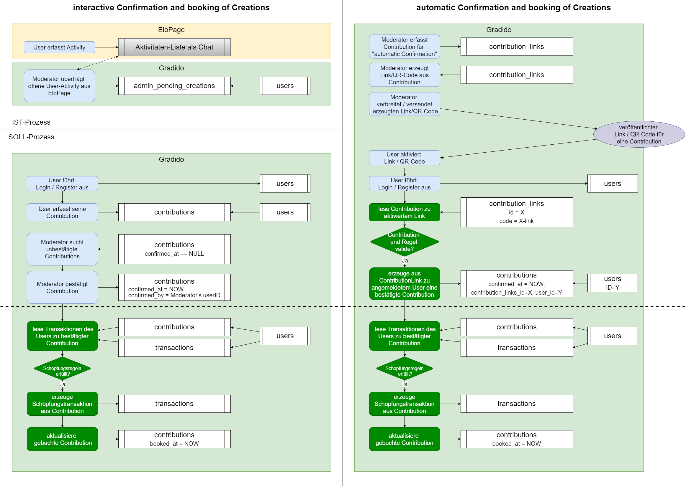
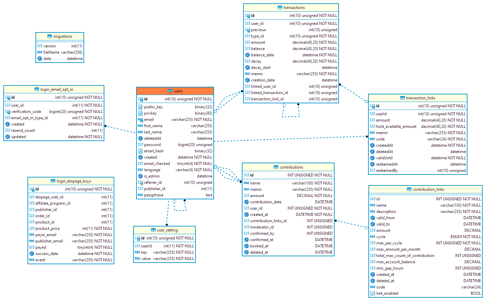

# GDD-Creation per Link/QR-Code

Die Idee besteht darin, dass ein Administrator eine Contributions mit all seinen Attributen und Regeln im System erfasst. Dabei kann er unter anderem festlegen, ob für diese ein Link oder ein QR-Code generiert und über andere Medien wie Email oder Messenger versendet werden kann. Der Empfänger kann diesen Link bzw QR-Code dann über die Gradido-Anwendung einlösen und bekommt dann den Betrag der Contribution als Schöpfung auf seinem Konto gutgeschrieben.

## Logischer Ablauf

Der logische Ablauf für das Szenario "Activity-Confirmation and booking of Creations " wird in der nachfolgenden Grafik dargestellt. Dabei wird links das Szenario der "interactive Confirmation and booking of Creations" und rechts "automatic Confirmation and booking of Creations" dargestellt. Ziel dieser Grafik ist neben der logischen Ablaufsübersicht auch die Gemeinsamkeiten und Unterschiede der beiden Szenarien herauszuarbeiten.

Das Szenario der *interaktiven Aktivitäten-Bestätigung* ist derzeit noch in den zwei Systemen EloPage und Gradido enthalten - markiert als IST-Prozess - und wird zukünftig dann nur noch innerhalb Gradido ablaufen - markiert als SOLL-Prozess. Mit der Ablösung von EloPage und der vollständigen Migration nach Gradido erfolgt  gleichzeitig eine Migration der Datenbank-Tabelle "admin_pending-creations" nach "PendingActivies". Unterhalb der gestrichelten Linie sind die beiden Szenarien dann in der Ablauflogik vollständig gleich.

## Dialoge

Für die Erfassung, Suche und Anzeige der Contributions und deren Gliederung in Kategorien wird es dazu im Admin-Bereich zusätzliche Funktionen und Dialoge geben.

### Übersicht - Dialog

In der Admin-Übersicht wird es zusätzliche Navigations- bzw. Menüpunkte geben, über die der Admin die gewünschte Funktionalität und die zugehörigen Dialoge öffnen kann.

### Contribution erfassen - Dialog

Bei der Erfassung einer Contribution wird die Kategorie, ein Name, eine Beschreibung der Contribution und der Betrag eingegeben.

Der Gültigkeitsstart wird als Default mit dem aktuellen Erfassungszeitpunkt vorbelegt, wobei das Gültigkeitsende leer bleibt und damit als endlos gültig definiert wird. Mit Eingabe eines Start- und/oder Endezeitpunktes kann aber ein konkreter Gültigkeitszeitraum erfasst werden.

Wie häufig ein User für diese Contribution eine Schöpfung gutgeschrieben bekommen kann, wird über die Auswahl eines Zyklus - stündlich, 2-stündlich, 4-stündlich, etc. - und innerhalb dieses Zyklus eine Anzahl an Wiederholungen definiert. Voreinstellung sind 1x täglich.

Ob die Contribution über einen versendeten Link bzw. QR-Code geschöpft werden kann, wird mittels der Auswahl "Versenden möglich als" bestimmt.

Für die Schöpfung der Contribution können weitere Regeln definiert werden:

* Gesamt - max. Anzahl Schöpfungen:   bestimmt die maximale Anzahl der möglichen Schöpfungen über alle User dieser Community. Sobald diese Anzahl an Schöpfungen erreicht ist, werden alle weiteren eingehenden Schöpfungsanfragen für diese Contribution -egal ob per Links, per QR-Code oder User-Online-Erfassung mit einer entsprechend aussagekräftigen Fehlermeldung abgelehnt.
* pro User
  * max schöpfbarer Betrag pro Monat:   mit diesem definierbaren Betrag kann vordefiniert werden, wieviel Gradido ein User innerhalb eines Abrechnungsmonats maximal durch diese Contribution schöpfen kann. Ist diese Summer erreicht werden weiter eingehende Schöpfungsanfragen - egal ob per Link, per QR-Code oder online - mit einer entsprechend aussagekräftigen Fehlermeldung abgelehnt.
  * max. Kontostand vor Schöpfung:   mit diesem definierbaren Betrag kann festgelegt werden, dass bevor für diese Contribution eine Schöpfung für den user erfolgt, eine Prüfung auf den aktuellen Kontostand erfolgt. Sobald der Kontostand höher als der vorgegebene Betrag ist, wird die eingehende Schöpfungsanfrage, ob per Link, per QR-Code oder online, mit einer entsprechend aussagekräftigen Fehlermeldung abgelehnt.
  * min. Abstand zw. erneuter Schöpfung:   es kann ein zeitlicher Abstand in Stunden definiert werden, der angibt wieviel Stunden seit der letzten erfolgten Schöpfung vergehen müssen, bevor eine erneute Schöpfungsanfrage, ob per Link, per QR-Code oder online angenommen und durchgeführt werden darf. Ist bei einer erneuten Schöpfungsanfrage der zeitliche Abstand noch nicht erreicht, dann wird mit einer entsprechend aussagekräftigen Fehlermeldung abgebrochen.

## Datenbank-Modell

### Ausgangsmodell

Das nachfolgende Bild zeigt das Datenmodell vor der Einführung und Migration auf Contributions.

### Datenbank-Änderungen

#### neue Tabellen

##### Contributions - Table

| Name                        | Typ          | Nullable |    Default    | Kommentar                                                                                                                              |
| --------------------------- | ------------ | :------: | :------------: | -------------------------------------------------------------------------------------------------------------------------------------- |
| ID                          | INT UNSIGNED | NOT NULL | auto increment | PrimaryKey                                                                                                                             |
| Name                        | varchar(100) | NOT NULL |               | unique Name                                                                                                                            |
| Description                 | varchar(255) |         |               |                                                                                                                                        |
| ContributionCategoryID      | INT UNSIGNED |         |               |                                                                                                                                        |
| ValidFrom                   | DATETIME     | NOT NULL |      NOW      |                                                                                                                                        |
| ValidTo                     | DATETIME     |         |      NULL      |                                                                                                                                        |
| Amount                      | DECIMAL      | NOT NULL |               |                                                                                                                                        |
| Cycle                       | ENUM         | NOT NULL |      ONCE      | ONCE, HOUR, 2HOUR, 4HOUR, 8HOUR, HALFDAY, DAY, 2DAYS, 3DAYS, 4DAYS, 5DAYS, 6DAYS, WEEK, 2WEEKS, MONTH, 2MONTH, QUARTER, HALFYEAR, YEAR |
| MaxPerCycle                 | INT UNSIGNED | NOT NULL |       1       |                                                                                                                                        |
| AbelToSend                  | ENUM         | NOT NULL |       NO       | NO, LINK, QRCODE                                                                                                                       |
| MaxAmountPerMonth           | DECIMAL      |         |      NULL      |                                                                                                                                        |
| TotalMaxCountOfContribution | INT UNSIGNED |         |      NULL      |                                                                                                                                        |
| MaxAccountBalance           | DECIMAL      |         |      NULL      |                                                                                                                                        |
| MinGapHours                 | INT UNSIGNED |         |      NULL      |                                                                                                                                        |
| CreatedAt                   | DATETIME     |         |      NOW      |                                                                                                                                        |
| Deleted                     | BOOL         | NOT NULL |     FALSE     |                                                                                                                                        |
| Link                        | varchar(24)  |         |      NULL      |                                                                                                                                        |
| LinkEnabled                 | BOOL         |         |      NULL      |                                                                                                                                        |

##### PendingActivities -Table

| Name           | Typ          | Nullable | Default        | Kommentar                                                                        |
| -------------- | ------------ | -------- | -------------- | -------------------------------------------------------------------------------- |
| ID             | INT UNSIGNED | NOT NULL | auto increment | PrimaryKey                                                                       |
| Name           | varchar(100) | NOT NULL |                | short Naming of activity                                                         |
| Memo           | varchar(255) | NOT NULL |                | full and detailed description of activities                                      |
| Amount         | DECIMAL      | NOT NULL |                | the amount of GDD for this activity                                              |
| ActivityDate   | DATETIME     |          | NULL           | the date, when the activity was done                                             |
| UserID         | INT UNSIGNED | NOT NULL |                | the user, who wants to get GDD for his activity                                  |
| CapturedAt     | DATETIME     | NOT NULL | NOW            | the date, when this entry was captured and stored in database                    |
| ContributionID | INT UNSIGNED |          | NULL           | contribution, on which this activity base on                                     |
| ModeratorID    | INT UNSIGNED |          | NULL           | userID of Moderator/Admin, who confirms the activity                             |
| ConfirmedAt    | DATETIME     |          | NULL           | date, when moderator has confirmed the activity                                  |
| BookedAt       | DATETIME     |          | NULL           | date, when the system has booked the amount of the activity on the users account |

#### zu migrierende Tabellen

##### Tabelle admin_pending-creations

Diese Tabelle wird im Rahmen dieses UseCase migriert in die neue Tabelle PendingActivies...

| Quell-Spalte | Migration | Ziel-Spalte    | Beschreibung                                               |
| ------------ | --------- | -------------- | ---------------------------------------------------------- |
| id           | keine     | id             | auto inkrement des PK                                      |
| userId       | copy      | UserID         |                                                            |
| created      | copy      | CapturedAt     |                                                            |
| date         | copy      | ActivityDate   |                                                            |
| memo         | copy      | Memo           |                                                            |
| amount       | copy      | Amount         |                                                            |
| moderator    | copy      | ModeratorID    |                                                            |
|              |           | Name           | neu mit Contributions                                      |
|              |           | ContributionID | neu mit Contributions                                      |
|              |           | ConfirmedAt    | neu mit Erfassung der Contributions von Elopage in Gradido |
|              |           | BookedAt       | neu mit Erfassung der Contributions von Elopage in Gradido |

...und kann nach Übernahme der Daten in die neue Tabelle gelöscht werden.

### Zielmodell

CREATE TABLE gradido_community.Contributions (
Id INT UNSIGNED auto_increment NOT NULL,
Name varchar(100) NOT NULL,
Description varchar(255) NOT NULL,
ValidFrom DATETIME DEFAULT NOW NOT NULL,
ValidTo DATETIME DEFAULT null NULL,
Amount DECIMAL NOT NULL,
Cycle ENUM DEFAULT ONCE NOT NULL COMMENT 'ONCE, HOUR, 4HOUR, 8HOUR, HALFDAY, DAY, WEEK, 2WEEKS, MONTH, QUARTER, HALFYEAR, YEAR',
MaxPerCycle INT UNSIGNED DEFAULT 1 NOT NULL,
AbelToSend ENUM DEFAULT NO NOT NULL COMMENT 'NO, LINK, QRCODE',
MaxAmountPerMonth DECIMAL DEFAULT null NULL,
TotalMaxCountOfContribution INT UNSIGNED DEFAULT null NULL,
MaxAccountBalance DECIMAL DEFAULT null NULL,
MinGapHours INT UNSIGNED DEFAULT null NULL,
CreatedAt DATETIME DEFAULT NOW NULL,
Deleted BOOL DEFAULT FALSE NOT NULL,
Link varchar(24) DEFAULT null NULL,
LinkEnabled BOOL DEFAULT null NULL,
CONSTRAINT Contributions_PK PRIMARY KEY (Id)
)
ENGINE=InnoDB
DEFAULT CHARSET=utf8mb4
COLLATE=utf8mb4_unicode_ci;

CREATE TABLE gradido_community.PendingActivities (
Id INT UNSIGNED auto_increment NOT NULL,
Name varchar(100) NOT NULL,
Memo varchar(255) NULL,
Amount DECIMAL NULL,
AcitivtyDate DATETIME NULL,
UserID INT UNSIGNED NOT NULL,
CreatedAt DATETIME DEFAULT NOW NULL,
ContributionID INT UNSIGNED NULL,
ModeratorID INT UNSIGNED NULL COMMENT 'userID of moderator',
ConfirmedAt DATETIME NULL,
BookedAt DATETIME NULL,
CONSTRAINT CreationActivities_PK PRIMARY KEY (Id),
CONSTRAINT PendingActivities_FK FOREIGN KEY (UserID) REFERENCES gradido_community.users(id),
CONSTRAINT PendingActivities_FK_1 FOREIGN KEY (ContributionID) REFERENCES gradido_community.Contributions(Id),
CONSTRAINT PendingActivities_FK_2 FOREIGN KEY (ModeratorID) REFERENCES gradido_community.users(id)
)
ENGINE=InnoDB
DEFAULT CHARSET=utf8mb4
COLLATE=utf8mb4_unicode_ci;
