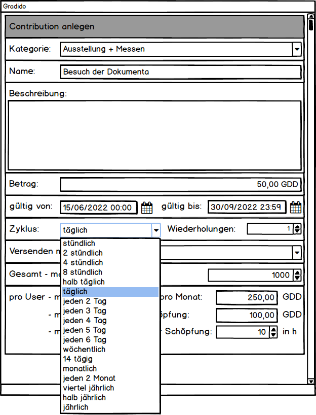
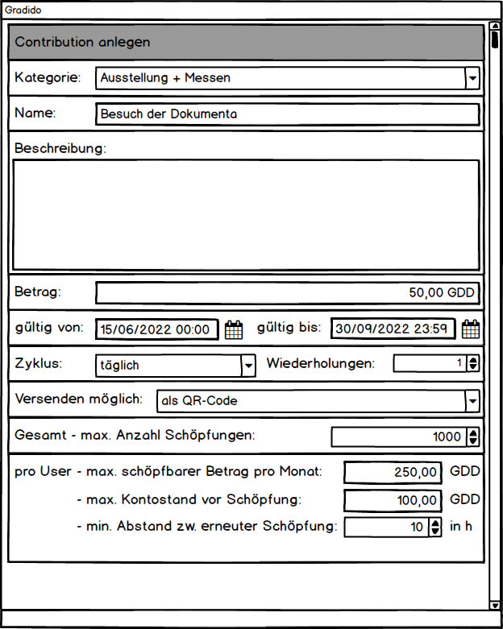

# GDD-Creation per Link/QR-Code

Die Idee besteht darin, dass ein Administrator eine Contribution mit all seinen Attributen und Regeln im System erfasst. Dabei kann er unter anderem festlegen, ob für diese ein Link oder ein QR-Code generiert und über andere Medien wie Email oder Messenger versendet werden kann. Der Empfänger kann diesen Link bzw QR-Code dann über die Gradido-Anwendung einlösen und bekommt dann den Betrag der Contribution als Schöpfung auf seinem Konto gutgeschrieben.

## Logischer Ablauf

Der logische Ablauf für das Szenario "Activity-Confirmation and booking of Creations " wird in der nachfolgenden Grafik dargestellt. Dabei wird links das Szenario der "interactive Confirmation and booking of Creations" und rechts "automatic Confirmation and booking of Creations" dargestellt. Ziel dieser Grafik ist neben der logischen Ablaufsübersicht auch die Gemeinsamkeiten und Unterschiede der beiden Szenarien herauszuarbeiten.

Das Szenario der *interaktiven Aktivitäten-Bestätigung* ist derzeit noch in den zwei Systemen EloPage und Gradido enthalten - markiert als IST-Prozess - und wird zukünftig dann nur noch innerhalb Gradido ablaufen - markiert als SOLL-Prozess. Mit der Ablösung von EloPage und der vollständigen Migration nach Gradido erfolgt  gleichzeitig eine Migration der Datenbank-Tabelle "admin_pending-creations" nach "Contributions". Unterhalb der gestrichelten Linie sind die beiden Szenarien dann in der Ablauflogik vollständig gleich.

## Dialoge

Für die Erfassung, Suche und Anzeige der Contributions und deren Gliederung in Kategorien wird es dazu im Admin-Bereich zusätzliche Funktionen und Dialoge geben.

### Übersicht - Dialog

In der Admin-Übersicht wird es zusätzliche Navigations- bzw. Menüpunkte geben, über die der Admin die gewünschte Funktionalität und die zugehörigen Dialoge öffnen kann.

### Contribution erfassen - Dialog

Bei der Erfassung einer Contribution wird die Kategorie, ein Name, eine Beschreibung der Contribution und der Betrag eingegeben.

Der Gültigkeitsstart wird als Default mit dem aktuellen Erfassungszeitpunkt vorbelegt, wobei das Gültigkeitsende leer bleibt und damit als endlos gültig definiert wird. Mit Eingabe eines Start- und/oder Endezeitpunktes kann aber ein konkreter Gültigkeitszeitraum erfasst werden.

Wie häufig ein User für diese Contribution eine Schöpfung gutgeschrieben bekommen kann, wird über die Auswahl eines Zyklus - stündlich, 2-stündlich, 4-stündlich, etc. - und innerhalb dieses Zyklus eine Anzahl an Wiederholungen definiert. Voreinstellung sind 1x täglich.

Ob die Contribution über einen versendeten Link bzw. QR-Code geschöpft werden kann, wird mittels der Auswahl "Versenden möglich als" bestimmt.

Für die Schöpfung der Contribution können weitere Regeln definiert werden:

* Gesamt - max. Anzahl Schöpfungen:   bestimmt die maximale Anzahl der möglichen Schöpfungen über alle User dieser Community. Sobald diese Anzahl an Schöpfungen erreicht ist, werden alle weiteren eingehenden Schöpfungsanfragen für diese Contribution -egal ob per Links, per QR-Code oder User-Online-Erfassung mit einer entsprechend aussagekräftigen Fehlermeldung abgelehnt.
* pro User
  * max schöpfbarer Betrag pro Monat:   mit diesem definierbaren Betrag kann vordefiniert werden, wieviel Gradido ein User innerhalb eines Abrechnungsmonats maximal durch diese Contribution schöpfen kann. Ist diese Summer erreicht werden weiter eingehende Schöpfungsanfragen - egal ob per Link, per QR-Code oder online - mit einer entsprechend aussagekräftigen Fehlermeldung abgelehnt.
  * max. Kontostand vor Schöpfung:   mit diesem definierbaren Betrag kann festgelegt werden, dass bevor für diese Contribution eine Schöpfung für den user erfolgt, eine Prüfung auf den aktuellen Kontostand erfolgt. Sobald der Kontostand höher als der vorgegebene Betrag ist, wird die eingehende Schöpfungsanfrage, ob per Link, per QR-Code oder online, mit einer entsprechend aussagekräftigen Fehlermeldung abgelehnt.
  * min. Abstand zw. erneuter Schöpfung:   es kann ein zeitlicher Abstand in Stunden definiert werden, der angibt wieviel Stunden seit der letzten erfolgten Schöpfung vergehen müssen, bevor eine erneute Schöpfungsanfrage, ob per Link, per QR-Code oder online angenommen und durchgeführt werden darf. Ist bei einer erneuten Schöpfungsanfrage der zeitliche Abstand noch nicht erreicht, dann wird mit einer entsprechend aussagekräftigen Fehlermeldung abgebrochen.

### Ausbaustufe-1:

Die Ausbaustufe-1 wird gezielt auf die Anforderungen der "Dokumenta" im Juni 2022 abgestimmt. 

#### Contribution-Erfassungsdialog (Adminbereich)

Es werden folgende Anforderungen an den Erfassungsdialog einer Contribution gestellt:

| Attribut                | Beschreibung                                                                                                                                                                                                                                    |
| ----------------------- | ----------------------------------------------------------------------------------------------------------------------------------------------------------------------------------------------------------------------------------------------- |
| Name                    | Name der Contribution als Bezeichnung, nach dem später auch eine Suche erfolgen kann                                                                                                                                                           |
| Beschreibung            | Beschreibung der Contribution, die mit der Schöpfung als Memo in die Transaktion übernommen wird                                                                                                                                              |
| Betrag                  | der Betrag, der mit Einlösen der Contribution geschöpft wird                                                                                                                                                                                  |
| GültigVon              | - das Datum, ab wann die Contribution gültig und damit einlösbar ist - es wird die Uhrzeit 00:00:00 angenommen                                                                                                                           |
| GültigBis              | - das Datum, wie lange die Contribution gültig und damit einlösbar ist - es wird die Uhrzeit 23:59:59 angenommen                                                                                                                         |
| Zyklus                  | - Angabe wie häufig eine Contribution gutgeschrieben werden kann - als Auswahlliste (Combobox) geplant, aber für diese Ausbaustufe nur mit dem Wert "kein Wiederholungszyklus" vorbelegt                                                 |
| Wiederholungen          | - Anzahl an Wiederholungen pro Zyklus - für diese Ausbaustufe wird der Wert "1" vorbelegt -> somit gilt 1 x pro User                                                                                                                      |
| VersendenMöglich       | - hier wird "als Link / QR-Code" voreingestellt                                                                                                                                                                                                 |
| alle weiteren Attribute | - entfallen für diese Ausbaustufe - die GUI-Komponenten können optional schon im Dialog eingebaut und angezeigt werden - diese GUI-Komponenten müssen wenn sichtbar disabled sein und dürfen damit keine Eingaben entgegen nehmen |

#### Ablauflogik

Für die Ausbaustufe-1 wird gemäß der Beschreibung aus dem Kapitel "Logischer Ablauf" nur die "automatic Confirmation and booking of Creations" umgesetzt. Die interaktive Variante - sprich Ablösung des EloPage Prozesses - mit "interactive Confirmation and booking of Creations" bleibt für eine spätere Ausbaustufe aussen vor.

Das Regelwerk in der Businesslogik wird gemäß der reduzierten Contribution-Attribute aus dem Erfassungsdialog, den vordefinierten Initialwerten und der daraus resultierenden Variantenvielfalt vereinfacht.

#### Kriterien "Dokumenta"

* Es soll eine "Dokumenta"-Contribution im Admin-Bereich erfassbar sein und in der Datenbank als ContributionLink gespeichert werden.
* Es wird für die Gesamtlaufzeit der "Dokumenta" genau ein Contribution benötigt
* Die "Dokumenta"-Contribution kann von einem User maximal 1x aktiviert werden
* Ein User kann mit diesem Link nur die Menge an GDDs schöpfen, die in der Contribution als "Betrag" festgelegt ist
* Die "Dokumenta"-Contribution kann als Link / QR-Code erzeugt, angezeigt und in die Zwischenablage kopiert werden
* Jeder beliebige User kann den Link / QR-Code aktivieren
* der Link führt auf eine Gradido-Seite, wo der User sich anmelden oder registrieren kann
* mit erfolgreichem Login bzw. Registrierung wird der automatische Bestätigungs- und Schöpfungsprozess getriggert
* es erfolgt eine Überprüfung der definierten Contribution-Regeln für den angemeldeten User:
  * Gültigkeit: liegt die Aktivierung im Gültigkeitszeitraum der Contribution
  * Zyklus und WIederholungen: bei einem Zyklus-Wert = "kein Zyklus" und einem Wiederholungswert = 1 darf der User den Betrag dieser Contribution nur einmal insgesamt schöpfen
  * max. schöpfbarer Gradido-Betrag pro Monat: wenn der Betrag der Contribution plus der Betrag, den der User in diesem Monat schon geschöpft hat den maximal schöpfbaren Betrag pro Monat von 1000 GDD übersteigt, dann wird die Schöpfung dieser Contribution abgelehnt
* mit erfolgreich durchlaufenen Regelprüfungen wird ein "besätigter" aber "noch nicht gebuchten" Eintrag in der "Contributions"-Tabelle erzeugt
* ein "bestätigter" aber "noch nicht gebuchter" "Contributions"-Eintrag stößt eine Schöpfungstransaktion für den User an
* es erfolgt eine übliche Schöpfungstransaktion nach der Bestätigung der Contribution
* die Schöpfungstransaktion schreibt den Betrag der Contribution dem Kontostand des Users gut

## Datenbank-Modell

### Ausgangsmodell

Das nachfolgende Bild zeigt das Datenmodell vor der Einführung und Migration auf Contributions.

### Datenbank-Änderungen

Die Datenbank wird in ihrer vollständigen Ausprägung trotz Ausbaustufe-1 wie folgt beschrieben umgesetzt.

#### neue Tabellen

##### contribution_links - Tabelle

| Name                            | Typ          | Nullable |    Default    | Kommentar                                                                                                                              |
| ------------------------------- | ------------ | :------: | :------------: | -------------------------------------------------------------------------------------------------------------------------------------- |
| id                              | INT UNSIGNED | NOT NULL | auto increment | PrimaryKey                                                                                                                             |
| name                            | varchar(100) | NOT NULL |               | unique Name                                                                                                                            |
| description                     | varchar(255) |         |               |                                                                                                                                        |
| valid_from                      | DATETIME     | NOT NULL |      NOW      |                                                                                                                                        |
| valid_to                        | DATETIME     |         |      NULL      |                                                                                                                                        |
| amount                          | DECIMAL      | NOT NULL |               |                                                                                                                                        |
| cycle                           | ENUM         | NOT NULL |      ONCE      | ONCE, HOUR, 2HOUR, 4HOUR, 8HOUR, HALFDAY, DAY, 2DAYS, 3DAYS, 4DAYS, 5DAYS, 6DAYS, WEEK, 2WEEKS, MONTH, 2MONTH, QUARTER, HALFYEAR, YEAR |
| max_per_cycle                   | INT UNSIGNED | NOT NULL |       1       |                                                                                                                                        |
| max_amount_per_month            | DECIMAL      |         |      NULL      |                                                                                                                                        |
| total_max_count_of_contribution | INT UNSIGNED |         |      NULL      |                                                                                                                                        |
| max_account_balance             | DECIMAL      |         |      NULL      |                                                                                                                                        |
| min_gap_hours                   | INT UNSIGNED |         |      NULL      |                                                                                                                                        |
| created_at                      | DATETIME     |         |      NOW      |                                                                                                                                        |
| deleted_at                      | DATETIMEBOOL |         |      NULL      |                                                                                                                                        |
| code                            | varchar(24)  |         |      NULL      |                                                                                                                                        |
| link_enabled                    | BOOL         |         |      NULL      |                                                                                                                                        |

##### contributions -Tabelle

| Name                  | Typ          | Nullable | Default        | Kommentar                                                                        |
| --------------------- | ------------ | -------- | -------------- | -------------------------------------------------------------------------------- |
| id                    | INT UNSIGNED | NOT NULL | auto increment | PrimaryKey                                                                       |
| name                  | varchar(100) | NOT NULL |                | short Naming of activity                                                         |
| memo                  | varchar(255) | NOT NULL |                | full and detailed description of activities                                      |
| amount                | DECIMAL      | NOT NULL |                | the amount of GDD for this activity                                              |
| contribution_date     | DATETIME     |          | NULL           | the date/month, when the contribution was realized by the user                   |
| user_id               | INT UNSIGNED | NOT NULL |                | the user, who wants to get GDD for his activity                                  |
| created_at            | DATETIME     | NOT NULL | NOW            | the date, when this entry was captured and stored in database                    |
| contribution_links_id | INT UNSIGNED |          | NULL           | contribution, on which this activity base on                                     |
| moderator_id          | INT UNSIGNED |          | NULL           | userID of Moderator/Admin, who captured the contribution                         |
| confirmed_by          | INT UNSIGNED |          | NULL           | userID of Moderator/Admin, who confirms the contribution                         |
| confirmed_at          | DATETIME     |          | NULL           | date, when moderator has confirmed the contribution                              |
| booked_at             | DATETIME     |          | NULL           | date, when the system has booked the amount of the activity on the users account |
| deleted_at            | DATETIME     |          | NULL           | soft delete                                                                      |

#### zu migrierende Tabellen

##### Tabelle admin_pending_creations

Diese Tabelle wird im Rahmen dieses UseCase migriert in die neue Tabelle contributions...

| Quell-Spalte | Migration | Ziel-Spalte           | Beschreibung                                               |
| ------------ | --------- | --------------------- | ---------------------------------------------------------- |
| id           | keine     | id                    | auto inkrement des PK                                      |
| user_id      | copy      | user_id               |                                                            |
| created      | copy      | created_at            |                                                            |
| date         | copy      | activity_date         |                                                            |
| memo         | copy      | memo                  |                                                            |
| amount       | copy      | amount                |                                                            |
| moderator    | copy      | moderator_id          |                                                            |
|              |           | name                  | neu mit ContributionsLinks                                 |
|              |           | contribution_links_id | neu mit ContributionsLinks                                 |
|              |           | confirmed_at          | neu mit Erfassung der Contributions von Elopage in Gradido |
|              |           | confirmed_by          | neu mit Erfassung der Contributions von Elopage in Gradido |
|              |           | booked_at             | neu mit Erfassung der Contributions von Elopage in Gradido |

...und kann nach Übernahme der Daten in die neue Tabelle gelöscht werden oder es erfolgen die Änderungen sofort auf der Ursprungstabelle.

### Zielmodell

