# UseCase: Send Users Gradido

In diesem Dokument sollen die Anforderungen für den Usecase "Send Users Gradido" zusammengetragen und weiter konzipiert werden.

## Motivation

Die Motivation für diesen Usecase ist die Möglichkeit für den Gradido-User zu schaffen jedem Menschen weltweit Gradido zu senden. Dies soll per E-Mail, als persönliche Nachricht, per Gutschein oder bei persönlichen Treffen als direkter Austausch funktionieren.

Damit kann Gradido mit weitreichendem Potential weiterempfohlen werden, sorgt dadurch für eine expotentielle Verbreitung und löst gar eine "Welle der Dankbarkeit" aus.

Für einen "neuen User" besteht damit die einfache Möglichkeit sich direkt zu registrieren und sofort Gradidos zu empfangen.

Für bereits "existierende User" wird eine neue Variante des Logins mit direkter Gradido Gutschrift geschaffen.

## Perspektive des Senders

In diesem Kapitel werden alle Aspekte aus Sicht des Senders beschrieben. Es werden dabei die Oberflächen- und Bedienungs-Anforderungen, die logischen und finanzkalkulatorischen Schritte des Geldabgangs, sowie die Aufbereitung und Zusammensetzung des zu generierenden Ausgabe-Produktes und schließlich die möglichen Varianten, wie das *Senden von Gradidos* an den Empfänger übermittelt werden kann.

### Starten des Gradido Sende-Prozess

Der User öffnet in seinem Gradido-Konto die Anzeige zum Senden von Gradidos:

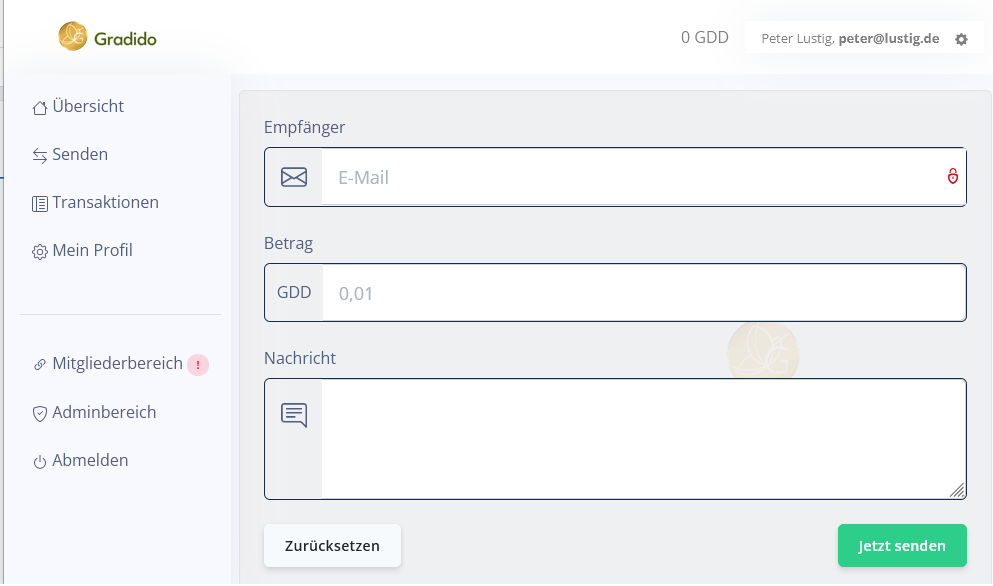

Vorausgesetzt der User hat auf seinem GDD-Konto ein Guhaben, dann kann er (bisher) einem ihm bzw. dem System bekannten anderen User einen beliebigen Betrag innerhalb seines Verfügungsrahmens direkt *synchron* senden.

Mit diesem Usecase soll es zukünftig möglich sein neben dem direkten *synchronen Senden* von Gradidos auch einen neuen Weg zum *asynchronen Senden* zu eröffnen.

#### Übertragungswege

**Bisher**

* **synchrones Senden** : direkt im Dialog erfolgt über den "Jetzt senden"-Button innerhalb des Systems die direkte Übertragung des Geldbetrages an den zuvor definierten und bekannten Empfänger, der ebenfalls schon ein Gradido-Konto haben muss.

**Neu**

* **asynchrones Senden** : beim asynchronen Senden werden die Daten der Transaktion (Sender, Betrag und ggf. Verwendungszweck) in ein Ausgabe-Medium kodiert, das dann asynchron vom User über ein anderes Transportmedium ausserhalb der Gradido-Anwendung an den Empfänger übertragen wird. Der Empfänger wird nicht schon wie üblich beim Erfassen der Transaktionsdaten bestimmt, sondern dies erfolgt in einem nachgelagerten Schritt des Übertragungsprozesses zum Beispiel in einem Messenger o.ä. in Eigenverantwortung des Users.
  * **Ausgabe-Medium als Link** : die Kodierung der Transaktionsdaten in einen Link eröffnen dem User eine Vielzahl an möglichen Übertragungswege. Der Link kann in Emails, Messages und für ihn sonstige verfügbare Medien kopiert werden, wo er dann in Eigenverantwortung aus seinen persönlichen Kontakten den Empfänger bestimmt.
  * **Ausgabe-Medium als QR-Code** : die Kodierung der Transaktionsdaten in einen QR-Code ist lediglich die Formatierung in Bildformat statt wie der Link in Text-Format. Der User kann auch den QR-Code in Emails, Messages und für ihn sonstige verfügbare Medien kopieren und übertragen. Letztendlich muss der Empfänger ein optischen QR-Scan mit einem ihm verfügbarem Medium wie beispielsweise Handy-, Tablet- oder PC-Kamera durchführen, um den Inhalt des Codes lesen zu können und um daraus wieder den eigentlichen Prozess der Weiterverarbeitung zu starten.

#### Auswahl des Übertragungsweges

Es stellt sich nun die Frage der User-Experience, ob schon bei der Navigation über den Senden-Menüeintrag z.B. per Untermenü-Punkte die Auswahl der verschiedenen Übertragungswege stattfinden oder ob der bisherige Senden-Dialog entsprechend geändert bzw. erweitert werden soll?

**Menü-Auswahl**

Wenn die Auswahl des Übertragungsweges ob synchron,  asynchron per Link oder asynchron per QR-Code schon über das Menü stattfinden soll, dann hat das aber auch die Konsequenz, dass für die asynchrone Übertragung ein eigener neuer Erfassungsdialog erstellt werden muss.

**Dialogänderung**

Wenn die Auswahl des Übertragungsweges im existierenden Senden-Dialog stattfinden soll, dann muss der existierende Senden-Dialog entsprechend angepasst und in der Logik überarbeitet werden. Die nachfolgende Skizze zeigt einen möglichen Entwurf:

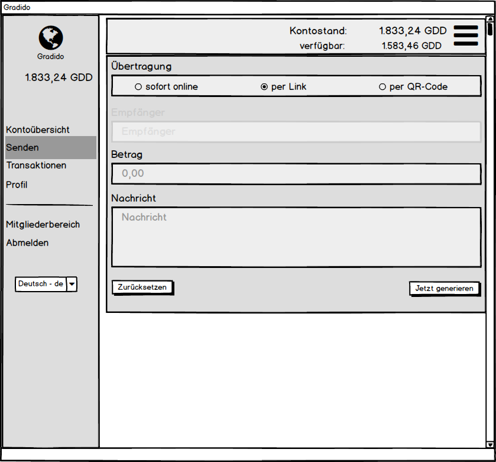

Die Idee zeigt die Auswahl der Übertragungart als Radio-Buttons für "sofort online" - entspricht der bisherigen Art - "per Link" und "per QR-Code". Sobald eine der beiden neuen Arten ausgewählt ist, wird das Empfänger-Feld ausgeblendet und der Text des Sende-Buttons von "Jetzt senden" auf "Jetzt generieren" geändert.

Bei bzw. nach der Eingabe des Betrages für eine asynchrone Transaktion muss eine Validierung gegenüber dem Kontostand oder genauer gesagt gegenüber dem noch verfügbaren Betrag durchgeführt werden. Denn eine asynchrone Transaktion unterliegt finanzkalkulatorisch einem anderen Regelwerk als eine synchrone Tranaktion. Die Details des Regelwerks sind im nachfolgenden Kapitel beschrieben. Wenn die Validierung des Betrages für eine asynchrone Transaktion fehlschlägt, muss der "Jetzt generieren"-Button deaktiviert und eine aussagekräftige Fehlermeldung dem User angezeigt werden. Hier eine mögliche Formulierung als Vorschlag:

```
"Der Betrag X für die Überweisung als Link, inklusive einer einkalkulierten Vergänglichkeitsreserve von Y, wird durch den aktuellen Verfügungsrahmen Z bei Kontostand N nicht gedeckt! "
```

Sobald der eingegebene Betrag für eine asynchrone Transaktion valide ist, wird der "Jetzt generieren"-Button wieder aktiviert.

Mit drücken des "Jetzt generieren"-Buttons erfolgt die Generierung des Links bzw des QR-Codes aus den erfassten Transaktionsdaten. Der fertig erzeugte Link bzw. QR-Code wird in einem Popup-Fenster zur Anzeige gebracht. Für eine Transaktion als Link kann ein vorkonfigurierter bzw. für den User administrierbarer Meldungstext zusammen mit dem Link angezeigt werden. Der Inhalt des Popup-Fensters - Meldungstext inkl. Link oder QR-Code - kann der User entweder manuell herauskopieren und für den Versand in ein anderes Übertragungsmedium wie Email, Messenger, etc. einfügen, für einen QR-Code-Scan vom Empfänger abfotographieren lassen oder für evtl. spätere Aktionen in einer Datei lokal speichern.

### Finanzkalkulatorische Logik

Für die verschiedenen Übertragungswege gibt es unterschiedliche finanzkalkulatorische Regeln und Logiken zu beachten.

#### sofort online

Bei der bisherigen Übertragungsart gibt es nur die Regel, dass der eingegebene Betrag kleiner gleich dem aktuellen Kontostand sein muss. Da die Übertragung im Prinzip sofort stattfindet, muss hier keine zusätzliche Berücksichtigung der Vergänglichkeit in den Transaktionsbetrag eingerechnet werden.

#### per Link / per QR-Code

Bei der neuen Übertragungsart kommt es aber zu einem ggf. längeren Zeitfenster von max 14 Tagen - per Konfiguration fest voreingestellt - bis die Transaktion beim Empfänger gebucht und somit beim Sender valutiert wird. Das bedeutet mit der Generierung des Links/QR-Codes wird aus dem zu sendenden Betrag die Vergänglichkeit für die konfigurierte maximale Gültigkeitsdauer des Links/QR-Codes berechnet. Dieser Vergänglichkeitsbetrag wird zusammen mit dem zusendenden Betrag als Summe auf dem Konto des Senders als "vorgebucht" markiert. Damit bleibt der Kontostand des Senders erst einmal unverändert, aber sein Verfügungsrahmen, der ihm noch für andere Transaktionen zur Verfügung steht, muss um den "vorgebuchten" Betrag reduziert und als Verfügbarkeits-Betrag zusätzlich unterhalb des Kontostandes korrigiert angezeigt werden. Damit wird sichergestellt, dass wenn der Empfänger die Transaktion wirklich erst nach 14 Tagen verbucht, dass nach dieser Zeit auch noch genügend Gradidos auf dem Senderkonto zur Verfügung stehen. Das nachfolgende Bild verdeutlicht diesen Sachverhalt:

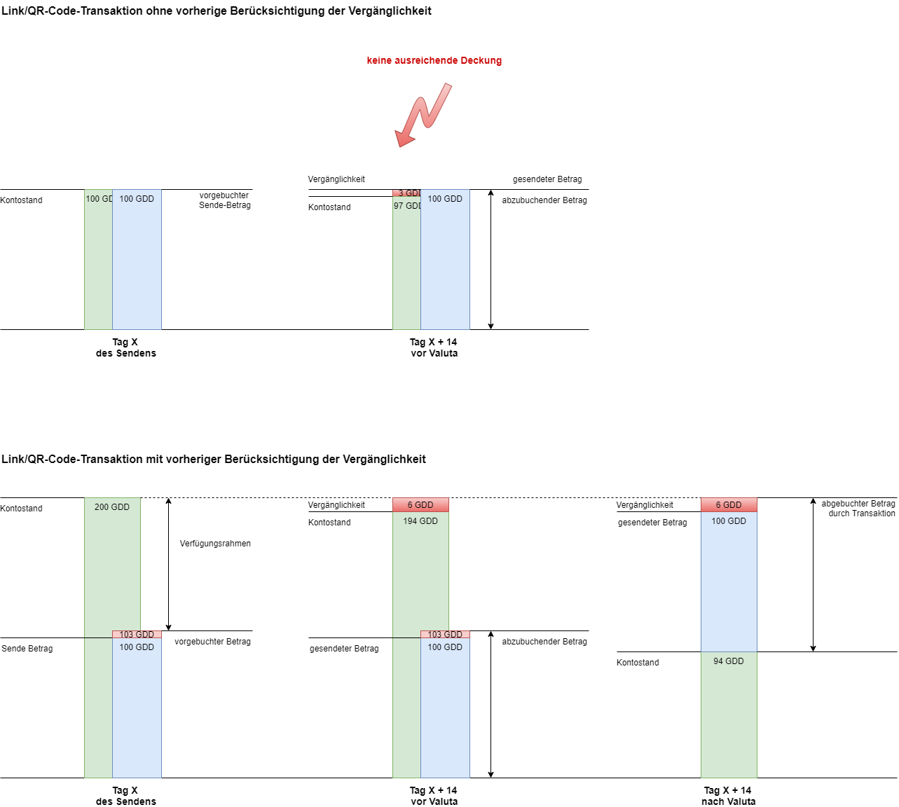

Diese Berücksichtigung der Vergänglichkeit muss also auch schon bei der Erfassung einer asynchronen Transaktion im Sende-Dialog mit einfließen und sollte bei der Eingabe des Betrages, aber spätestens vor dem Aktivieren des "Jetzt generieren"-Buttons durch eine Validierung sichergestellt werden.

#### Regelwerk

Folgendes Regelwerk gilt es bei der Validierung auszuführen und zu überprüfen:

* Dx = Decay des eingegebenen Betrags X für den konfigurierten MaxAsyncExpiration t (default = 14 Tage)
* Vo = offener Verfügungsrahmen aus Kontostand K minus Summe aller vorgebuchten Beträge Vb
* Prüfung auf: Vo > X + Dx

#### Kontoverwaltung

Auch auf die Kontoverwaltung hat die Einführung einer asynchronen Transaktion gewisse Auswirkungen. So muss für die Anzeige der Tranaktionsübersicht eine Möglichkeit für den User geschaffen werden seine *gebuchten* sowie seine *vorgebuchten* Transaktionen, aber auch die evtl. abgelaufenen Transaktionen auflisten zu können. Der existierende Dialog der Transaktionsübersicht

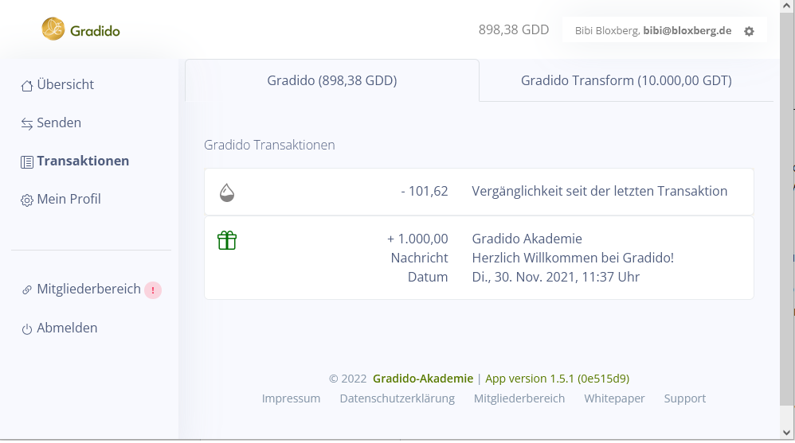

zeigt für das Gradido-Konto des Users die Liste der getätigten Transaktionen für GDD im linken Reiter und für GDT im rechten Reiter. 

##### Dialog gebuchte Transaktionen

Wie oben beschrieben wird mit Einführung von *asynchronen* Transaktionen es notwendig, eine evtl. mögliche Liste von offenen, sprich *vorgebuchten* Transaktionen für den User übersichtlich anzuzeigen. Zudem kommt hinzu, dass der User die Information über seinen noch zur Verfügung stehenden Verfügungsrahmen aus dem aktuellen Kontostand abzüglich aller *vorgebuchten* Beträge benötigt. Das folgende Bild zeigt einen Entwurf für den Transaktionsübersicht-Dialog:

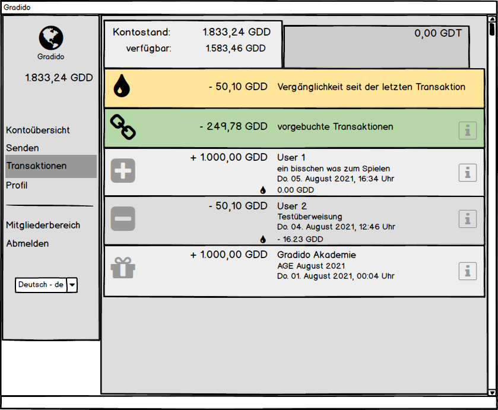

Der aktuelle Kontostand wird dabei weiterhin ganz oben und direkt darunter der freie Verfügungsrahmen zusätzlich angezeigt. Dieser kann, wie in den vorherigen Kapiteln beschrieben, durch vorhandene *vorgebuchte* Transaktionen geringer sein als der eigentliche Kontostand. 

##### Dialog vorgebuchte Transaktionen

Unterhalb der Anzeige von Kontostand und Verfügbarkeitsrahmen ist eine Combobox sichtbar, über die der User auswählen kann, ob die darunter liegende Transaktionsliste die schon *gebuchten* Transaktionen, die *vorgebuchten* und somit noch offenen Transaktionen oder die abgelaufenen und gar nicht valutierten Transaktionen anzeigen soll. Im nachfolgenden Bild ist die Liste der *vorgebuchten* Transaktionen zu sehen, die per Combo-Box ausgewählt wurde:

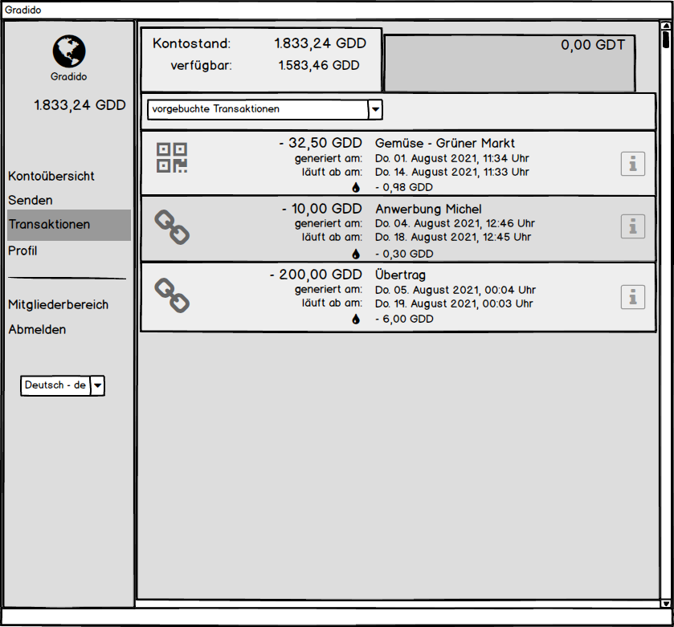

Die Liste der angezeigten Transaktionen ist nach ihrem Generierungszeitpunkt sortiert. Das Icon links deutet an, ob die *vorgebuchte* Transaktion als *Link* oder als *QR-Code* generiert wurde. Dann erscheint der Betrag, die Transaktionsnachricht, der Generierungs- und der Ablaufzeitpunkt sowie die *vorgebuchte* Vergänglichkeit, die bis zum Ablaufzeitpunkt anfallen würde. Über alle *vorgebuchten* Transaktionen ergibt die jeweilige Summe von Betrag plus Vergänglichkeitsbetrag die Gesamtsumme, die vom Kontostand abgezogen und als verfügbarer Betrag angezeigt wird.

##### Dialog abgelaufene Transaktionen

Für den Fall, dass evtl. ein gesendeter Link bzw. QR-Code nicht rechtzeitig eingelöst und valuliert wurde, hat der User die Möglichkeit über die Combobox die Auswahl "abgelaufene Transaktionen" zu treffen und diese dann für evtl. Rückfragen vom verspäteten Empfänger angezeigt zu bekommen:

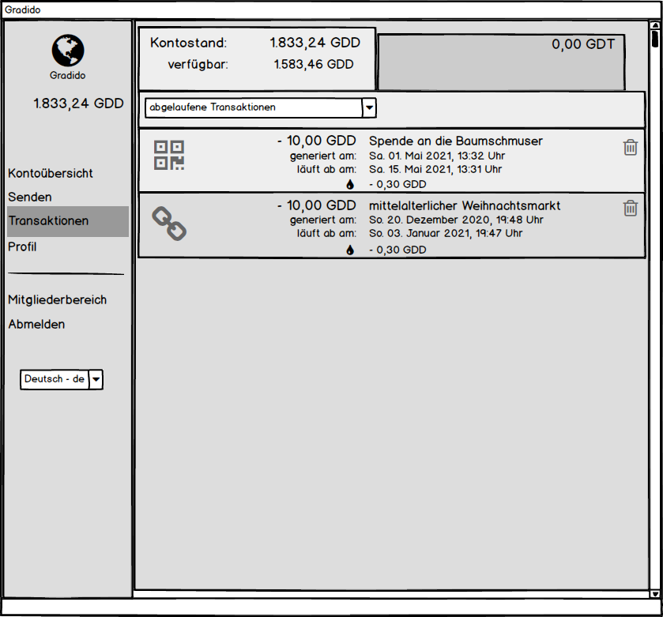

Die Liste der *abgelaufenen* Transaktionen ist absteigend nach dem Zeitpunkt der Generierung sortiert. Die Beträge und Vergänglichkeiten dieser *abgelaufenen* Transaktionen haben keine Auswirkungen auf den Verfügbarkeitsrahmen noch auf den Kontostand. Die betraglichen Reservierungen auf dem Konto wurden mit Überschreiten des Ablaufzeitpunktes beim verschieben aus der vergebuchten Transaktions-Liste in die abgelaufene Transaktions-Liste korriegiert. Der User soll in dieser Liste die Möglichkeit haben einzelne *abgelaufene* Transaktionen über das Lösch-Icon gänzlich zu löschen, da diese keinerlei buchhalterische Relevanz mehr haben.


#### ToDo:

Die weiteren technischen Anforderungen, die sich aus der beschriebenen Anzeige und Verarbeitung von *gebuchten,* *vorgebuchten* und *abgelaufenen* Transaktionen für das Backend und die Persistenz ergeben, werden im noch zu erstellenden *Technischen Konzept* zu diesem UseCase beschrieben.

### Generierung des Links/QR-Codes

#### **ToDo**:

PartnerID beachten?

Für die Generierung des Links und des QR-Codes werden folgende Daten benötigt:

* Gradido-Id des Senders: diese definiert sich gemäß dem Pattern:  `<communityname>`/`<useralias>` und ist im Detail [hier](.\Benutzerverwaltung.md#Gradido-Id) beschrieben.
* Betrag : die Summe, die der Sender dem Empfänger übertragen möchte
* Secret : ein Key, der zur Ausführung der asynchronen Transaktion die *ungebuchten* Transaktionsdaten beim Sender identifiziert und kryptographisch sicherstellt, dass die ursprünglich gesendeten Daten nicht verfälscht sind.
* Verwendungszweck : Nachricht, die den Zweck der Transaktion beschreibt
* Ablaufzeitpunkt : der Zeitpunkt an dem der Link bzw. QR-Code ungültig wird

Aus diesen Daten wird ein Link nach folgendem Pattern erzeugt:

https://`<communityname>`/send/`<token>`

Das Token wird so generiert, dass es alle fachlich notwendigen Daten beinhaltet, um beim Empfänger evtl. Überprüfungen auf fachliche Korrektheit von Betrag, Nachricht oder Gültigkeitsablaufdatum durchführen zu können. Zusätzlich muss das Token die technischen und fachlichen Daten enthalten, dass die bei der Ausführung der Transaktion ablaufenden Prozesse korrekt initiiert und gesteuert werden können. Die Details für die Anforderungen beim Empfang des Tokens werden weiter unten im Kapitel *Perspektive des Empfängers* beschrieben.

Für die Übertragung per QR-Code wird der zuvor erzeugte Link in ein QR-Code konvertiert. Dabei sind ggf. weitere Konfigurationsdaten wie QR-Code Größe, Korrektur-Level für das QR-Code Scannen und Encoding o.ä. notwendig.

#### ToDo:

Die technischen Details zum Linkformat bzw. QR-Code werden im noch zu erstellenden *Technischen Konzept* näher beschrieben.

### Ausgabe des Links/QR-Codes

Nachdem der Link bzw. QR-Code generiert ist, muss eine Ausgabe für den User erfolgen. Damit der User den Link bzw. den QR-Code über ein beliebiges Medium wie Email, Messenger, etc. an einen Empfänger verschicken kann, wird dieser in einem Popup-Fenster zur Anzeige gebracht. Von dort aus kann er den Inhalt manuell kopieren, abfotographieren. Die folgenden Bilder zeigen wie eine Ausgabe des Übertragungslinks

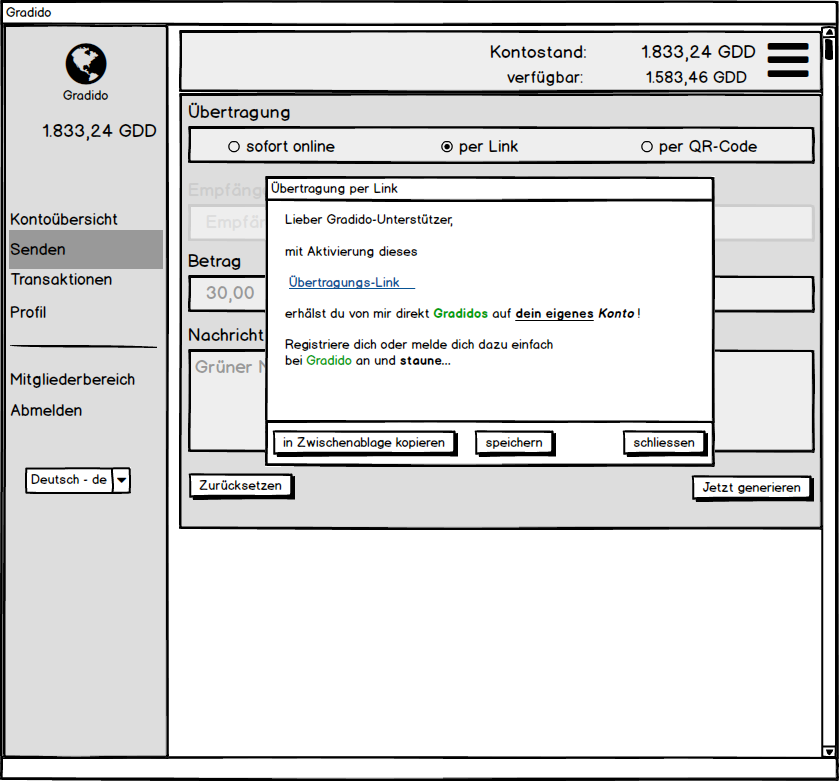

bzw. des QR-Codes aussehen könnte.

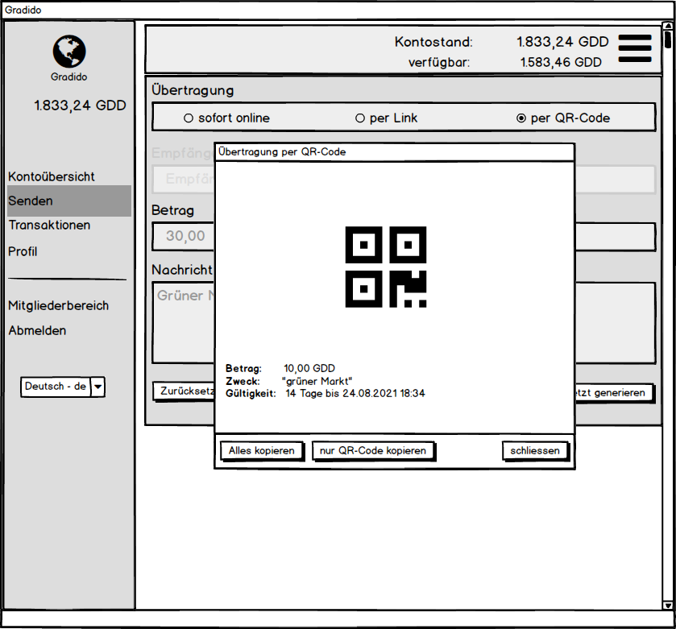

Für die Anzeige des QR-Codes soll auch die Möglichkeit der Vergrösserung auf Fenster bzw. Bildschirmgrösse geschaffen werden - z.B. durch ein DoppelKlick auf den Code - um ein direktes Abfotographieren ohne sichtbare andere Details zu ermöglichen.

Der Button "in Zwischenablage kopieren" übernimmt den angezeigten Inhalt des Fensters (Nachricht mit Link bzw QR-Code) in die Zwischenablage, sodass dieser einfach in ein anderes Medium wie Email oder Messenger-Nachricht übertragen werden kann.

Mit dem "speichern"-Button soll eine Möglichkeit geschaffen werden, den Fensterinhalt als Datei zu speichern, um die generierte Nachricht mit Link /QR-Code zeitlich versetzt in ein anderes Medium wie Email oder Messenger-Nachricht zu übertragen. Es stellt sich die Frage, ob für eine zeitlich versetzte Verarbeitung eines Links / QR-Codes statt dem Speichern die erneute Ausgabe aus der vorgebuchten Transaktionsliste besser wäre? Da beide Varianten eine gute Lösung darstellen, wird diese Entscheidung auf später verschoben.

## Perspektive des Empfängers

In diesem Kapitel werden alle Aspekte aus Sicht des Empfängers beschrieben. Es werden dabei die Empfangs- und Aktivierungsmöglichkeiten sowie die Interpretation der erhaltenen Daten, die unterschiedlichen Szenarien, die der User durch eine Aktivierung durchlaufen kann und die logischen und finanzkalkulatorischen Schritte des Geldeingangs beschrieben.

### Aktivierung und Validierung des Links

Sobald der Empfänger den QR-Code erhalten, gescannt und zu dem Übertragungslink zurück konvertiert bzw. den Übertragungslink erhalten hat, startet mit der Aktivierung des Übertragungslink der eigentliche Valutierungsprozess des gesendeten Gradido-Betrages.

Der Link führt den User mit einem Request direkt an den Community-Server des Senders. Dieser startet die Dekodierung des im Link enthaltenen Tokens. Als erstes wird geprüft, ob das im Token enthaltene Ablaufdatum noch nicht überschritten ist. Falls dies der Fall sein sollte, dann wird dem User eine Fehlermeldung mit Detailinformationen angezeigt, wie zum Beispiel:

```
Leider ist die Gültigkeit des am <Erzeugungszeitpunkt> erzeugten Links am <Ablaufzeitpunkt> abgelaufen. Zur Klärung von Details und weiteren Fragen wenden sie sich bitte an den Absender, von dem sie diesen Link erhalten haben.
```

Es wird mit Absicht keine Detailinformationen des Absenders in der Fehlermeldung preisgegeben, da nicht bekannt bzw. sichergestellt ist, ob der User, der den Link aktiviert auch der ist, der den Link ursprünglich vom Sender erhalten hat.

Im Falle eines noch gültigen Tokens wird im zweiten Schritt der im Token enthaltene Key verwendet, um die zu diesem Key gespeicherte *vorgebuchte* Transaktion zu lesen. Falls diese nicht mehr als offene Transaktion existiert, sprich evtl. schon vorher durch eine Aktivierung valutiert wurde, wird dem User eine Fehlermeldung angezeigt mit detaillierten Informationen wie:

```
Die zu diesem Link gehörende Transaktion <Betrag, Nachricht, Erzeugungszeitpunkt> ist nicht mehr gültig oder wurde am <Valutierungsdatum> schon eingelöst. Zur Klärung weiterer Fragen wenden sie sich bitte an den Absender, von dem sie diesen Übertrangsungslinks bzw. QR-Codes erhalten haben.
```

Konnten die Daten der *vorgebuchten* Transaktion zu diesem Key gelesen werden, erfolgt vor dem Starten des eigentlichen Valutierungsprozesses eine inhaltliche Prüfung, ob die Link-Daten zu den gelesenen Daten auch passen, um sicherzugehen, dass keine Manipulationen im Link stattgefunden haben.

#### ToDo:

Wie diese Überprüfung technisch umgesetzt wird, bleibt hier im Detail offen und wird im *Technischen Konzept* näher beschrieben.

Ein mögliche Variante wäre, dass beim Generieren des Links eine Checksumme über den fachlichen Inhalt erzeugt wird, die zusammen mit dem Key in der Datenbank gespeichert ist. Die Checksumme muss zu den fachlichen Daten im Link und in den gelesenen Daten passen, ansonsten gibt es eine Fehlermeldung.

### Start der Valutierung

Mit erfolgreicher *Validierung des Links* wird der User jetzt auf eine Seite geleitet, auf der er zwischen einem Login oder einer Registrierung auswählen kann. Sobald zukünftig Communities unterstützt werden, muss auf dieser Login- bzw. Registrierungsseite auch die Auswahl einer Community möglich sein. Der Login- bzw. Registrierungsprozess unterscheidet sich im Zusammenhang einer Valutierung von den Standard-Login- bzw. -Registrierungsprozessen dahin gehend, dass sie im Anschluss nach der erfolgreichen Anmeldung des Users direkt mit dem Valutierungsprozess weiter fortfahren. Dies muss auch gewährleistet sein, wenn sich der Empfänger bei einer anderen Community als der Sender-Community angemeldet hat. Dies zieht zusätzliche Kommunikationsschritte zwischen den beiden Community-Servern nach sich, da erst mit dem Login bzw. der Registrierung die eigentliche *Empfänger-ID* (Gradido-ID des Empfängers) bekannt und für den *Valutierungsprozess* als Eingabeparameter notwendig ist. Für die Absicherung der Kommunikation zwischen den beiden Communities muss die lokale Community dem Aufruf der Login-Validierungs- bzw. Register-Validierungs-Seite auf der entfernten Community ein *Security-Key* mit übergeben werden, der von der entfernten Community in dem darauf folgenden *disburse*-Request wieder zurückgeliefert und zur Authenifizierung und Zuordnung zu dem ursprünglichen *send*-Request verwendet wird.

Um diese einzelnen Schritte nocheinmal zu verdeutlichen stellt das nachfolgende Bild dies schemenhaft dar:

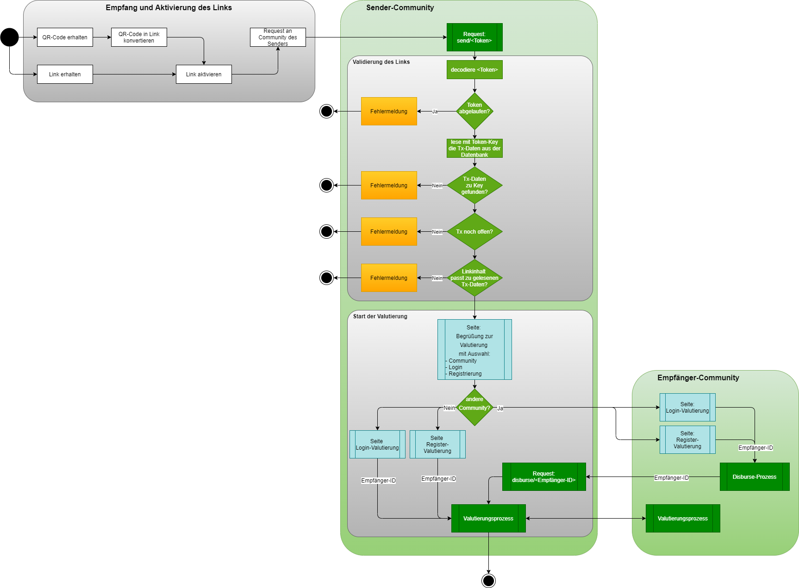

### Valutierungsprozess

Der eigentliche Valutierungsprozess wird entweder direkt nach dem Login bzw. der Registrierung des Empfängers auf der gleichen Community des Senders oder durch den eingehenden *disburse*-Request von der entfernten Community, an der sich der Empfänger angemeldet bzw. registriert hat, aufgerufen. Bei beiden Varianten ist die *Empfänger-ID* der massgebliche Eingabeparameter neben den sonstigen Daten die aus dem anfänglichen *send*-Request inkl. Token herrühren.

#### Eingabeparameter

Als Eingabeparemeter für den Valutierungsprozess sind folgende Werte vorgesehen:

* Sender-ID : die Gradido-ID des Senders
* Empfänger-ID : die Gradido-ID des Empfängers
* die zuvor geprüften Daten aus dem *send*-Request:
  * Betrag : der Betrag, der mit der vorgebuchten Transaktion ausgezahlt werden soll
  * Nachricht : der Verwendungszweck der Transaktion
  * Ablaufzeitpunkt : der Zeitpunkt bis wann die vorgebuchte Transaktion spätestens valutiert werden kann
  * Key : der Primärschlüssel der vorgebuchten Transaktion für einen Direktzugriff auf die schon gespeicherten Daten

#### Ablauflogik

Mit Start des Valutierungsprozesses werden im ersten Schritt die Eingangsparameter überprüft, ob alle notwendigen Daten übergeben wurden und bei fehlenden Daten wird der Prozess mit einer Fehlermeldung abgebrochen. Mit der Sender-ID und dem Key aus den Transaktionsdaten wird die vorgebuchte Transaktion erneut aus der Datenbank gelesen. Es erfolgt zur Sicherheit eine erneute Überbrüfung, ob die vorgebuchte Transaktion noch existiert und auch noch nicht abgelaufen ist. Dies basiert auf der Möglichkeit, dass der Login- bzw. der Registrierungsprozess, vor allem in einer fernen Community eine gewisse Zeit in Anspruch nehmen kann und dadurch evtl. die Gültigkeit doch noch überschritten werden könnte. Würde dies nicht geschehen, könnte im WorstCase der in der vorgebuchten Transaktion einkalkulierte Vergänglichkeitsbetrag nicht ausreichen und würde dann bei entsprechend niedrigem Kontostand bei einer Valutierung der *vorgebuchten* Transaktion zu einem negativen Kontostand führen. Dies ist finanzkalkulatorisch für ein Gradido-Konto nicht erlaubt und muss generell vermieden werden.

Sind diese Prüfungen erfolgreich absolviert, erfolgt die Valutierung der *vorgebuchten* Transaktion. Dabei wird aus den Daten der *vorgebuchten* Transaktion ein Datenobjekt *Abbuchungstransaktion* erzeugt. Es wird die Vergänglichkeit seit der letzten Transaktion auf dem aktuellen Kontostand ermittelt, dann der Betrag der *vorgebuchten* Transaktion und die ermittelte Vergänglichkeit vom Kontostand abgezogen. Alle weiteren Detaildaten, insbesonderen für die spätere Transaktionsdetailanzeige - Details siehe weiter unten, werden in das *Abbuchungstransaktion*-Objekt geschrieben und dieses dann in den schon existierenden Abbuchungsprozess gegeben. Der existierende Abbuchungsprozess vollzieht dann die Übertragung der Daten an das Empfängerkonto - auch Community übergreifend - und löst dort eine Eingangsbuchung aus. Da in einer *vorgebuchten* Transaktion neben dem eigentlichen zu transferierenden Betrag eine ausreichend große Summe für Vergänglichkeit auf dem Konto geblockt wurde, kann die Ablauflogik für eine ganz normale Abbuchung durchlaufen werden.

Es kommt aber zusätzlich zur normalen Abbuchung noch die *Valutiert-Markierung* der *vorgebuchten* Transaktion und ggf. die *Abgelaufen-Markierung* von schon abgelaufenen *vorgebuchten* Transaktionen im Nachgang hinzu. Das bedeutet, dass mit erfolgreicher Valutierung einer *vorgebuchten* Transaktion diese als *valutiert* markiert wird, so dass diese nicht mehr in der Liste der *vorgebuchten* Transaktionen im Dialog erscheint. Der User kann über die Detailanzeige der valutierenden Abbuchungstransaktion die Details der *vorgebuchten* Transaktion im nachhinein noch einsehen, um die Ursprünge der Transaktion buchhalterisch vollständig nachzuvollziehen. 

Das nachfolgende Bild zeigt den logische Ablauf des Valutierungsprozesses:

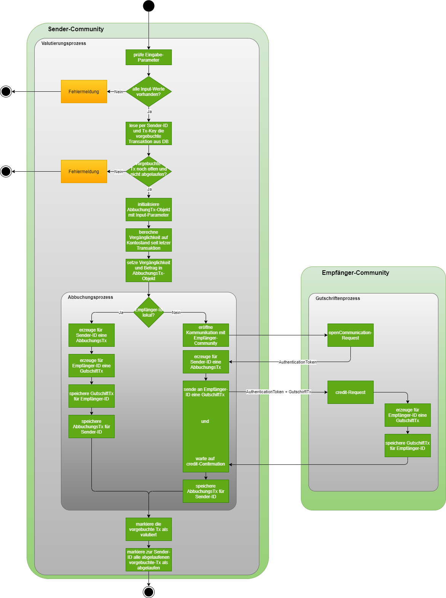

#### Dialog Transaktions-Details

Nachdem über den Valutierungsprozess die vorgebuchte Transaktion valutiert und damit abgeschlossen ist, kann der User diese Transaktion in seiner Liste der *gebuchten* Transaktionen sich anzeigen lassen. Dabei wird bei einer Transaktion, die aus einer *vorgebuchten* Transaktion resultiert, das Icon für ein Link oder ein QR-Code angezeigt, je nach dem welche Generierung dabei eingesetzt wurde. Über den "i"-Button können auch hier die Details der Transaktion aufgeblendet werden. Unterhalb der Transaktions-Nachricht sind bei dieser Transaktionsart der Generieungszeitpunkt und der Valutierungszeitpunkt angezeigt. Alle anderen Details bleiben unverändert.

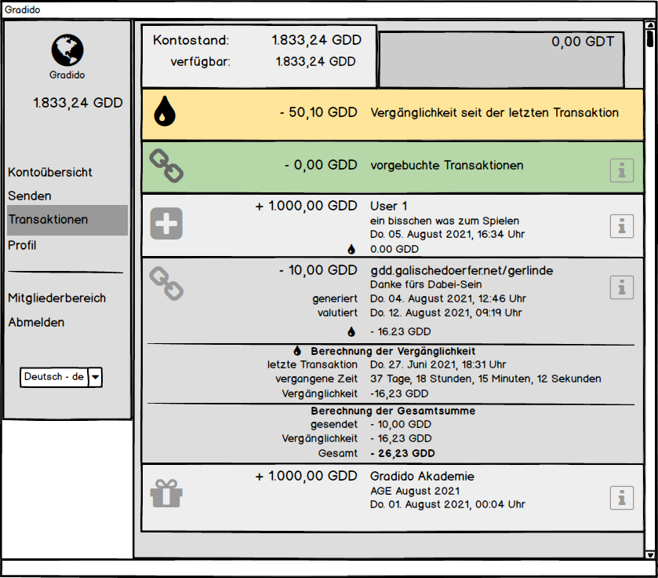


## Brainstorming

Kopie aus dem Original-Dokument von Bernd:

[https://docs.google.com/document/d/1XrcsHVyZuAm2bBWtG6uzXSPvdxV7XPM7pGcF-O8j0Hs/edit?usp=sharing](https://docs.google.com/document/d/1XrcsHVyZuAm2bBWtG6uzXSPvdxV7XPM7pGcF-O8j0Hs/edit?usp=sharing "https://docs.google.com/document/d/1XrcsHVyZuAm2bBWtG6uzXSPvdxV7XPM7pGcF-O8j0Hs/edit?usp=sharing")

Transaktions-Link und QR-Code

Gradido senden an jeden (zunächst mit einer Community)

#### Anwendungen

* Weiterempfehlen, exponentielle Verbreitung
* “Welle der Dankbarkeit”
* jedem Menschen weltweit Gradido senden
* per E-Mail, persönliche Nachricht, Gutschein, physisches Treffen
* Gradido-Id des Empfängers muss nicht bekannt sein
* Wer noch kein Konto hat, kann sich einfach registrieren und sofort GDD empfangen
* Wer bereits ein Konto hat, loggt sich  ein um die GDD gutzuschreiben

#### Link-Format

[https://community.com/send/1234567890](https://community.com/send/1234567890)

oder für offline-Übertragung per QR-Code:

[https://community.com/send/1234567890/user/betrag](https://community.com/send/1234567890/user/betrag)

Offline können z.B. Markt-Händler die QR-Codes einscannen und in einer Tabelle speichern, die später online automatisch abgearbeitet wird.

Vorschlag: Gültigkeit 14 Tage fest eingestellt.Die Gültigkeitsdauer würde ich in einer Variablen ablegen, falls wir sie später doch noch einstellbar machen wollen.

#### Gradido senden / Betrag blockieren

* Der zu sendende Betrag wird blockiert, d.h. vom verfügbaren Betrag abgezogen.
* Einstellung des Betrag-Limits im User-Bereich mit Verzug der Gültigkeit  von zB. 1Tag bei Umstellung
* Zusätzlich wird ein “Vergänglichkeitspuffer” von 3% (ungefähre Vergänglichkeit für 14 Tage, genau 2,63*) des zu sendenden Betrags blockiert, der sicherstellt, dass immer genug auf dem Konto ist, um den Betrag zu transferieren.
* Der Kontostand bleibt dabei erhalten. Da sich die Vergänglichkeit auf den Kontostand bezieht, braucht sie bei den blockierten Beträgen nicht berücksichtigt zu werden.
* Die entsprechenden Links / QR-Codes werden erstellt und in der Software zur Verfügung gestellt

*Vergänglichkeit für 14 Tage = 2,63%, siehe Zeile 87-112 in folgender Kalkulation:

[https://docs.google.com/spreadsheets/d/1y5tw9QJWOg_D-AykWpXMPAwc2WGjmrivnIP2aJ_m14k/edit#gid=0](https://docs.google.com/spreadsheets/d/1y5tw9QJWOg_D-AykWpXMPAwc2WGjmrivnIP2aJ_m14k/edit#gid=0)

#### Gradido empfangen

* Empfänger klickt auf den Link / fotografiert QR-Code
* Wenn Empfänger noch kein Gradido-Konto hat, kann er sich jetzt möglichst einfach registrieren.
* Wenn der Empfänger bereits ein Konto hat, loggt er sich ein und erhält den Betrag gutgeschrieben
* Händler empfängt/scanned QR-Code, dieser wird ohne login kurz entschlüsselt, um den Betrag zu prüfen und die Daten werden temporär lokal gespeichert um dann später nach Login verarbeitet zu werden

### Detail-Beschreibungen

E-Mails aus der Software heraus an unbekannte Empfänger zu verschicken ist problematisch. Was ist, wenn die Adresse nicht stimmt oder die Mail aus anderen Gründen nicht ankommt? Um Antwort-Mails auszuwerten bräuchten wir einen Mail-Server.Wir sollten den Versand des Links in die Verantwortung des Users geben.

#### Textvorschlag auf der Seite “Gradido senden”

Empfänger: Gradido-Id oder Name (wenn es noch keine Gradido-Id gibt: E-Mail oder Name)

Wenn keine Id bzw. valide E-Mail eingegeben wurden bzw. nicht eindeutig zugeordnet werden konnte:

Meldung:
Möchtest du die Transaktion per Link oder QR-Code ausführen?

Buttons: Abbrechen, Link, QR-Code

Bei Klick auf Link:

Ein Transaktionslink mit Begleittext wurde in die Zwischenablage kopiert. Du kannst ihn nun in eine E-Mail oder persönliche Nachricht einfügen.

Bei Klick auf QR-Code wird ein QR-Code erzeugt, der den Link erhält und von einem anderen Gerät abgescannt werden kann.
