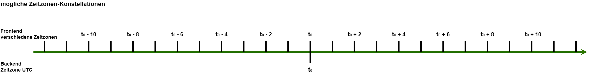

# Zeitzonen

Die Gradido-Anwendung läuft im Backend in der Zeitzone UTC und im Frontend in der jeweiligen lokalen Zeitzone, in der der User sich anmeldet. Dadurch kann es zu zeitlichen Diskrepanzen kommen, die innerhalb der Anwendungslogik aufgelöst bzw. entsprechend behandelt werden müssen. In den folgenden Kapiteln werden die verschiedenen zeitlichen Konstellationen dargestellt und für die verschiedenen fachlichen Prozesse die daraus resultierenden Problemlösungen beschrieben.

## Beispiel 1

Ein User meldet sich in einer Zeitzone t0 - 4 an. Das bedeutet der User liegt 4 Stunden gegenüber der Backend-Zeit zurück.

Konkret hat der User die Zeit 31.08.2022 21:00:00 auf dem Server ist aber die Zeit bei 01.09.2022 01:00:00

Für die Erstellung einer Contribution hat der User noch folgende Gültigkeitsmonate und Beträge zur Wahl:

    Juni 2022: 500 GDD |  Juli 2022: 200 GDD |  August 2022: 1000 GDD

**aber das Backend liefert nur die Beträge, die eigentlich so korrekt wären!!!!!**

    **Juli 2022: 200 GDD |  August 2022: 1000 GDD |  September 2022: 1000 GDD** 

Er möchte für den Juni 2022 eine Contribution mit 500 GDD erfassen. **Wird ihm der Juni noch als Schöpfungsmonat angezeigt?** 

Falls ja, dann wählt er dabei im FE im Kalender den 30.06.2022. Dann liefert das FE folgende Contribution-Daten an das Backend:

* Gültigkeitsdatum:	30.06.2022 00:00:00
* Memo: text
* Betrag: 500 GDD
* **Zeitzone:	wird eine Zeitzone des User aus dem Context geliefert? Das fehlt: entweder über eine Zeit vom FE zum BE und ermitteln Offset im BE**

Im Backend wird dieses dann interpretiert und verarbeitet mit:

* **Belegung des Schöpfungsmonate-Arrays: [ 6, 7, 8] oder [7, 8, 9] da auf dem Server ja schon der 01.09.2022 ist?**
* Gültigkeitsdatum:	**30.06.2022 00:00:00 oder 01.07.2022 04:00:00 ?**
* Memo: text
* Betrag 500 GDD
* created_at:	01.07.2022 04:00:00

**Frage: wird die Contribution dem Juni (6) oder dem Juli (7) zugeordnet?**

1. falls Juni zugeordnet kann die Contribution mit 500 GDD eingelöst werden
2. falls Juli zugeordnet muss die Contribution mit 500 GDD abgelehnt werden, da möglicher Schöpfungsbetrag überschritten

## Beispiel 2

Ein User meldet sich in einer Zeitzone t0 + 1 an. Das bedeutet der User liegt 1 Stunde gegenüber der Backend-Zeit voraus.

Konkret hat der User die Zeit 01.09.2022 00:20:00 auf dem Server ist aber die Zeit bei 31.08.2022 23:20:00

Für die Erstellung einer Contribution hat der User noch folgende Gültigkeitsmonate und Beträge zur Wahl:

    Juli 2022: 200 GDD |  August 2022: 1000 GDD |  September 2022: 1000 GDD

**oder wird ihm**

**
    Juni 2022: 500 GDD |  Juli 2022: 200 GDD |  August 2022: 1000 GDD**

**angezeigt, da auf dem BE noch der 31.08.2022 ist?**

Er möchte für den September 2022 eine Contribution mit 500 GDD erfassen und wählt dabei im FE im Kalender den 01.09.2022. Dann liefert das FE folgende Contribution-Daten an das Backend:

* Gültigkeitsdatum:	01.09.2022 00:00:00 (siehe Logauszüge der Fehleranalyse im Ticket #2179)
* Memo: text
* Betrag: 500 GDD
* **Zeitzone:	wird eine Zeitzone des User aus dem Context geliefert?**

Im Backend wird dieses dann interpretiert und verarbeitet mit:

* Belegung des Schöpfungsmonate-Arrays: [ 6, 7, 8] **wie kann der User dann aber vorher September 2022 für die Schöpfung auswählen?**
* Gültigkeitsdatum:	01.09.2022 00:00:00
* Memo: text
* Betrag 500 GDD
* created_at:	31.08.2022 23:20:00

Es kommt zu einem **Fehler im Backend**, da im Schöpfungsmonate-Array kein September (9) vorhanden ist, da auf dem Server noch der 31.08.2022 und damit das Array nur die Monate Juni, Juli, August und nicht September beinhaltet.

## Erkenntnisse:

* die dem User angezeigten Schöpfungsmonate errechnen sich aus der lokalen User-Zeit und nicht aus der Backend-Zeit
  * das Backend muss somit für Ermittlung der möglichen Schöpfungsmonate und deren noch freien Schöpfungssummen den UserTimeOffset berücksichten
* der gewählte Schöpfungsmonat muss 1:1 vom Frontend in das Backend übertragen werden
* es darf kein Mapping in die Backend-Zeit erfolgen
  * sondern es muss der jeweilige UserTimeOffset mitgespeichert werden
* die Logik im BE muss den übertragenen bzw. ermittelten Offset der FE-Zeit entsprechend berücksichten und nicht die Backendzeit in der Logik anwenden
  * im BE darf es kein einfaches now = new Date() geben
  * im BE muss stattdessen ein userNow = new Date() + UserTimeOffset verwendet werden
* ein CreatedAt / UpdatedAt / DeletedAt / ConfirmedAt wird wie bisher in BE-Zeit gespeichert
  * **NEIN nicht notwendig:** plus in einer jeweils neuen Spalte CreatedOffset / UpdatedOffset / DeletedOffset / ConfirmedOffset der dabei gültige UserTimeOffset
* im FE wird immer im Request-Header der aktuelle Zeitpunkt mit Zeitzone geschrieben
* 

## Entscheidung

* in den HTTP-Request-Header wird generell der aktuelle Timestamp des Clients eingetragen, sodass die aktuelle Uhrzeit des Users ohne weitere Signatur-Änderungen in jedem Aufruf am Backend ankommt. Moritz erstellt Ticket
* es wird eine Analyse aller Backend-Aufrufe gemacht, die die Auswertung der User-Time und dessen evtl. Timezone-Differenz in der Logik des Backend-Aufrufs benötigt.
* diese Backend-Methoden müssen fachlich so überarbeitet werden, dass immer aus dem Timezone-Offset die korrekte fachliche Logik als Ergebnis heraus kommt. In der Datenbank wird aber immer die UTC-Zeit gespeichert.
* Es werden keine zusätzlichen Datanbank-Attribute zur Speicherung des User-TimeOffsets benötigt.

## Analyse der Backend-Aufrufe

Es werden alle Resolver und ihre Methoden sowie im Resolver exportierte Attribute/Methoden untersucht. 

Mit + gekennzeichnet sind diese, die mit dem UserTimeOffset interagieren und überarbeitet werden müssen.

Mit - gekennzeichnet sind diese, die keiner weiteren Aktion bedürfen.

### AdminResolver

#### + adminCreateContribution

Hier wird der User zur übergebenen Email inklusive der Summen über die letzten drei Schöpfungsmonate aus seinen vorhandenen Contributions, egal ob bestätigt oder noch offen ermittelt.

Hier muss der User-TimeOffset berücksichtigt werden, um die korrekten drei Schöpfungsmonate und dann daraus die korrekten Beträge der Contributions zu ermitteln.

Zusätzlich wird als Parameter ein *creationDate* vom User mitgeliefert, das dem User-TimeOffset unterliegt. Auch dieses muss entsprechend beachtet und beim internen Aufruf von *validateContribution()* und der Initialisierung der Contribution berücksichtigt werden.

#### - adminCreateContributionMessage

nothing to do

#### + adminCreateContributions

Hier wird eine Liste von übergebenen Contributions über den internen Aufruf von *adminCreateContribution()* verarbeitet. Da dort eine Berücksichtigung des User-TimeOffsets notwendig ist, muss hier die UserTime entsprechen im Context weitergereicht werden.

#### - adminDeleteContribution

nothing to do

#### + adminUpdateContribution

analog adminCreateContribution() muss hier der User-TimeOffset berücksichtigt werden.

#### + confirmContribution

Hier wird intern *getUserCreation()* und *validateContribution()* aufgerufen, daher analog adminCreateContribution()

#### + createContributionLink

Hier werden zwar ein *ValidFrom* und ein *ValidTo* Datum übergeben, doch dürften diese keiner Beachtung eines User-TimezoneOffsets unterliegen. Trotzdem bitte noch einmal verifizieren.

#### - creationTransactionList

nothing to do

#### - deleteContributionLink

Es wird zwar der *deletedAt*-Zeitpunkt als Rückgabewert geliefert, doch m.E. dürft hier keine Berücksichtigung des User-TimezoneOffsets notwendig sein.

#### - deleteUser

Es wird zwar der *deletedAt*-Zeitpunkt als Rückgabewert geliefert, doch m.E. dürft hier keine Berücksichtigung des User-TimezoneOffsets notwendig sein.

#### - listContributionLinks

nothing to do

#### + listTransactionLinksAdmin

Hier wird die BE-Zeit für die Suche nach ValidUntil verwendet. Dies sollte nocheinmal verifiziert werden.

#### + listUnconfirmedContributions

Hier wird intern *getUserCreations()* aufgerufen für die Summen der drei Schöpfungsmonate, somit ist der User-TimezoneOffset zu berücksichtigen.

#### + searchUsers

Hier wird intern *getUserCreations()* aufgerufen für die Summen der drei Schöpfungsmonate, somit ist der User-TimezoneOffset zu berücksichtigen.

#### - sendActivationEmail

analog *UserResolver.checkOptInCode*

#### - setUserRole

nothing to do

#### - unDeleteUser

nothing to do

#### + updateContributionLink

Hier werden zwar ein *ValidFrom* und ein *ValidTo* Datum übergeben, doch dürften diese keiner Beachtung eines User-TimezoneOffsets unterliegen. Trotzdem bitte noch einmal verifizieren.

### BalanceResolver

#### + balance

Hier wird der aktuelle Zeitpunkt des BE verwendet, um den Decay und die Summen der Kontostände zu ermitteln. Dies müsste eigentlich von dem User-TimezoneOffset unabhängig sein. Sollte aber noch einmal dahingehend verifiziert werden.

### CommunityResolver

#### - communities

nothing to do

#### - getCommunityInfo

nothing to do

### ContributionMessageResolver

#### - createContributionMessage

nothing to do

#### - listContributionMessages

nothing to do

### ContributionResolver

#### + createContribution

Hier wird der User inklusive der Summen über die letzten drei Schöpfungsmonate aus seinen vorhandenen Contributions, egal ob bestätigt oder noch offen ermittelt.

Hier muss der User-TimeOffset berücksichtigt werden, um die korrekten drei Schöpfungsmonate und dann daraus die korrekten Beträge der Contributions zu ermitteln.

Zusätzlich wird als Parameter ein *creationDate* vom User mitgeliefert, das dem User-TimeOffset unterliegt. Auch dieses muss entsprechend beachtet und beim internen Aufruf von *validateContribution()* und der Initialisierung der Contribution berücksichtigt werden.

#### - deleteContribution

nothing to do

#### - listAllContributions

nothing to do

#### - listContributions

nothing to do

#### + updateContribution

Hier werden die Contributions des Users inklusive der Summen über die letzten drei Schöpfungsmonate aus seinen vorhandenen Contributions, egal ob bestätigt oder noch offen ermittelt.

Hier muss der User-TimeOffset berücksichtigt werden, um die korrekten drei Schöpfungsmonate und dann daraus die korrekten Beträge der Contributions zu ermitteln.

Zusätzlich wird als Parameter ein *creationDate* vom User mitgeliefert, das dem User-TimeOffset unterliegt. Auch dieses muss entsprechend beachtet und beim internen Aufruf von *validateContribution()* und dem Update der Contribution berücksichtigt werden.

### GdtResolver

#### - existPid

nothing to do

#### - gdtBalance

nothing to do

#### - listGDTEntries

nothing to do

### KlicktippResolver

nothing to do

### StatisticsResolver

#### + communityStatistics

Hier werden die Daten zum aktuellen BE-Zeitpunkt ermittelt und dem User angezeigt. Aber der User hat ggf. einen anderen TimeOffset. Daher die Frage, ob die Ermittlung der Statistik-Daten mit dem User-TimeOffset stattfinden muss.

### TransactionLinkResolver

#### - transactionLinkCode

nothing to do

#### - transactionLinkExpireDate

nothing to do

#### - createTransactionLink

nothing to do

#### - deleteTransactionLink

nothing to do

#### - listTransactionLinks

nothing to do

#### - queryTransactionLink

nothing to do

#### - redeemTransactionLink

nothing to do

### TransactionResolver

#### - executeTransaction

nothing to do

#### - sendCoins

nothing to do

#### + transactionList

Hier wird der aktuelle BE-Zeitpunkt verwendet, um die Summen der vorhandenen Transactions bis zu diesem Zeitpunkt zu ermitteln. Nach ersten Einschätzungen dürfte es hier nichts zu tun geben. Aber es sollte noch einmal geprüft werden.

### UserResolver

#### - activationLink

nothing to do

#### - checkOptInCode

Hier wird der übergebene OptIn-Code geprüft, ob schon wieder eine erneute Email gesendet werden kann. Die Zeiten werden auf reiner BE-Zeit verglichen, von daher gibt es hier nichts zu tun.

#### - createUser

nothing to do

#### -  forgotPassword

In dieser Methode wird am Ende in der Methode *sendResetPasswordEmailMailer()* die Zeit berechnet, wie lange der OptIn-Code im Link gültig ist, default 1440 min oder 24 h.

Es ist keine User-TimeOffset zu berücksichten, da der OptInCode direkt als Parameter im Aufruf von queryOptIn verwendet und dann dort mit der BE-Time verglichen wird.

#### - hasElopage

nothing to do

#### - login

nothing to do

#### - logout

nothing to do

#### - queryOptIn

Hier wird der OptIn-Code aus der *sendResetPasswordEmailMailer()* als Parameter geliefert. Da dessen Gültigkeit zuvor in forgotPassword mit der BE-Zeit gesetzt wurde, benögt man hier keine Berücksichtigung des User-TimeOffsets.

#### - searchAdminUsers

nothing to do

#### - setPassword

nothing to do, analog *queryOptIn*

#### - printTimeDuration

nothing to do

#### - updateUserInfos

nothing to do

#### + verifyLogin

Hier wird der User inklusive der Summen über die letzten drei Schöpfungsmonate aus seinen vorhandenen Contribtutions, egal ob bestätigt oder noch offen ermittelt.

Hier muss der User-TimeOffset berücksichtigt werden, um die korrekten drei Schöpfungsmonate und dann daraus die korrekten Beträge der Contributions zu ermitteln.
