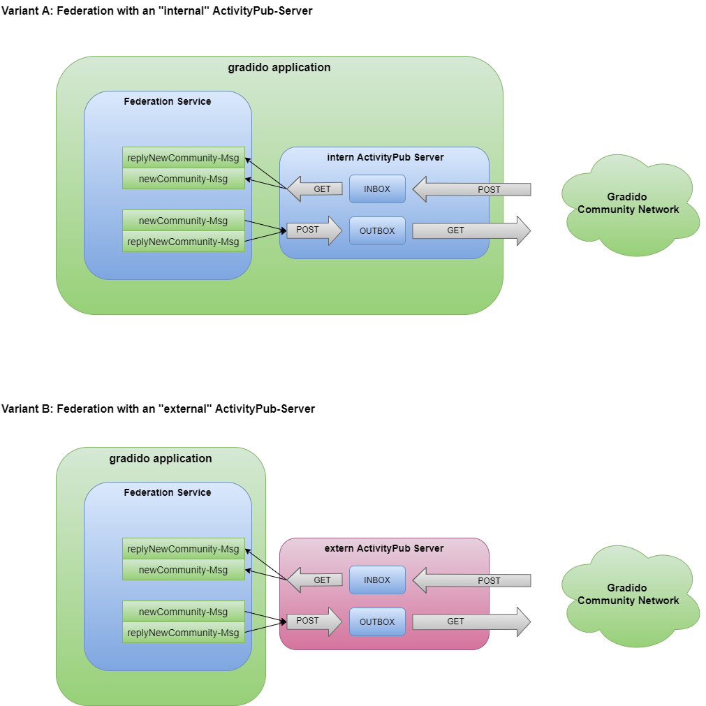

# Federation

This document contains the concept and technical details for the *federation* of gradido communities. The first idea of federation was to base on the [ActivityPub specification](https://www.w3.org/TR/activitypub/ " ") and extend it for the gradido requirements.

But meanwhile the usage of a DHT like HyperSwarm promises more coverage of the gradido requirements out of the box. More details about HyperSwarm can be found here [@hyperswarm/dht](https://github.com/hyperswarm/dht).

## ActivityPub (deprecated)

The activity pub defines a server-to-server federation protocol to share information between decentralized instances and will be the main komponent for the gradido community federation.

At first we asume a *gradido community* as an *ActivityPub user*. A user is represented by "*actors*" via the users's accounts on servers. User's accounts on different servers corrsponds to different actors, which means community accounts on different servers corrsponds to different communities.

Every community (actor) has an:

* inbox: to get messages from the world
* outbox: to send messages to others

and are simple endpoints or just URLs, which are described in the *ActivityStream* of each *ActivityPub community*.

### Open Decision:

It has to be decided, if the Federation will work with an internal or with external ActivityPub-Server, as shown in the picture below:

The Variant A with an internal server contains the benefit to be as independent as possible from third party service providers and will not cause additional hosting costs. But this solution will cause the additional efforts of impementing an ActivityPub-Server in the gradido application and the responsibility for this component.

The Varaint B with an external server contains the benefit to reduce the implementation efforts and the responsibility for an own ActivitPub-Server. But it will cause an additional dependency to a third party service provider and the growing hosting costs.

## HyperSwarm

The decision to switch from ActivityPub to HyperSwarm base on the arguments, that the *hyperswarm/dht* library will satify the most federation requirements out of the box. It is now to design the business requirements of the [gradido community communication](../BusinessRequirements/CommunityVerwaltung.md#UC-createCommunity) in a technical conception.

At first the following diagramm shows the pure logical handshake between an existing community-A and a new created community-B and the data exchange for buildup an authenticated relationship.
