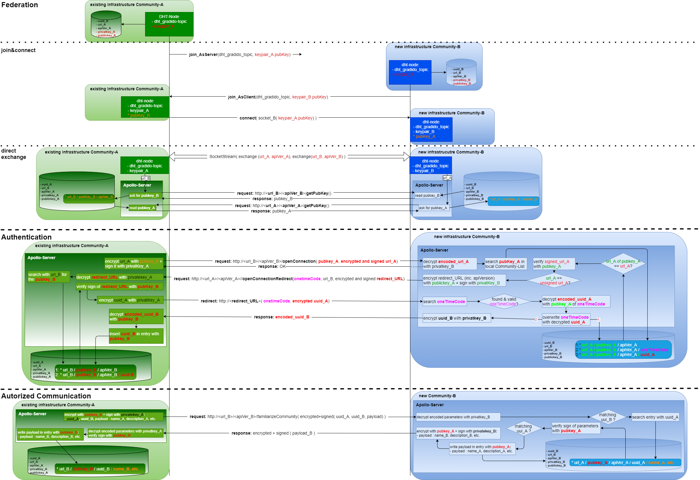

# Federation

This document contains the concept and technical details for the *federation* of gradido communities. The first idea of federation was to base on the [ActivityPub specification](https://www.w3.org/TR/activitypub/ " ") and extend it for the gradido requirements.

But meanwhile the usage of a DHT like HyperSwarm promises more coverage of the gradido requirements out of the box. More details about HyperSwarm can be found here [@hyperswarm/dht](https://github.com/hyperswarm/dht).

## HyperSwarm

The decision to switch from ActivityPub to HyperSwarm base on the arguments, that the *hyperswarm/dht* library will satify the most federation requirements out of the box. It is now to design the business requirements of the [gradido community communication](../BusinessRequirements/CommunityVerwaltung.md#UC-createCommunity) in a technical conception.

The challenge for the decentralized communities of gradido will be *how to become a new community aquainted with an existing community* ?

To enable such a relationship between an existing community and a new community several stages has to run through:

1. Federation
   * join&connect
   * direct exchange
2. Authentication
3. Autorized Communication

### Overview of Federation-Handshake

At first the following diagramm gives an overview of the three stages and shows the handshake between an existing community-A and a new created community-B including the data exchange for buildup such a federated, authenticated and autorized relationship.



### Technical Architecture

The previous described handshake will be done by several technical modules of the gradido system. The following picture gives an overview about the modules and how the communicate with each other.


As soon as a Gradido Community is up and running the DHT-Modul first write the home-community-entries in the database and starts with the federation per HyperSwarm. Each community, which is configured to listen on the GRADIDO_HUB of the DHT will be part of the Gradido-Net-Federation. That means each DHT-Modul of each community will receive the publicKey of all connected communities. The DHT-Modul will open for each received publicKey a communication-socket with the associated community DHT-Modul, to exchange api-version info and hosted urls for later direct communication between both communities. The exchanged api-version info and urls will be written in the own database.

The up and running Backend-Modul contains a validation logic to verify the community entries from the own DHT-Modul. For each announced but unverified community-entry the GraphQL-Client is used to invoke a getPublicKey-Request. Depending on the containing api-version the matching GraphQL-Client is used and the getPublicKey-Request will be send to the given URL.

As soon as the FederationModul of the associated community received the getPublicKey-request the own publicKey is read from database and send back in the response.

The GraphQL-Client will read the publicKey of the other community from the returned response data and compare it with the data of the community-entry, which caused the getPublicKey-Request. If they match the community-entry will be updated be inserting the current timestamp in the verifiedAt-field of this community-entry.

This federation and verification logic will work the whole time and can be monitored by observing the communities-table changes. The Admin-UI will contain a Page to have a look on the current state of the communities table content.

### Prerequisits

Before starting in describing the details of the federation handshake, some prerequisits have to be defined.

#### Database

With the federation additional data tables/entities have to be created.

##### Community-Entity

Create the new *Community* table to store attributes of the own community. This table is used more like a frame for own community data in the future like the list of federated foreign communities, own users, own futher accounts like AUF- and  Welfare-account and the profile data of the own community:

| Attributes  | Type   | Description                                                                                                                                                |
| ----------- | ------ | ---------------------------------------------------------------------------------------------------------------------------------------------------------- |
| id          | int    | technical unique key of this entity                                                                                                                        |
| uuid        | string | unique key for a community, which will never changed as long as the community exists                                                                       |
| name        | string | name of the community shown on UI e.g for selection of a community                                                                                         |
| description | string | description of the community shown on UI to present more community details                                                                                 |
| ...         |        | for the near future additional attributes like profile-info, trading-level, set-of-rights,... will follow with the next level of Multi-Community Readyness |

##### CommunityFederation-Entity

Create the new *CommunityFederation* table to store at this point of time only the attributes used by the federation handshake:

| Attributes       | Type      | Description                                                                                            |
| ---------------- | --------- | ------------------------------------------------------------------------------------------------------ |
| id               | int       | technical unique key of this entity                                                                    |
| uuid             | string    | unique key for a community, which will never changed as long as the community exists                   |
| foreign          | boolean   | flag to mark the entry as a foreign or own community entry                                             |
| createdAt        | timestamp | the timestamp the community entry was created                                                          |
| privateKey       | string    | the private key of the community for asynchron encryption (only set for the own community)             |
| pubKey           | string    | the public key of the community for asynchron encryption                                               |
| pubKeyVerifiedAt | timestamp | the timestamp the pubkey of this foreign community is verified (for the own community its always null) |
| authenticatedAt  | timestamp | the timestamp of the last successfull authentication with this foreign community                       |
|                  |           | for the near future additional attributes will follow with the next level of Multi-Community Readyness |

##### CommunityApiVersion-Entity

Create the new *CommunityApiVersion* table to support several urls and apiversion of one community at once. It references the table *CommunityFederation* with the foreignkey *communityFederationID* (naming pattern foreignkea = `<referred entityname>ID`) for a 1:n relationship

| Attributes            | Type      | Description                                                                                                        |
| --------------------- | --------- | ------------------------------------------------------------------------------------------------------------------ |
| id                    | int       | technical unique key of this entity                                                                                |
| communityFederationID | int       | the technical foreign key to the community entity                                                                  |
| url                   | string    | the URL the community will provide its services, could be changed during lifetime of the community                 |
| apiversion            | string    | the API version the community will provide its services, will increase with each release                           |
| validFrom             | timestamp | the timestamp as of the url and api are provided by the community                                                  |
| verifiedAt            | timestamp | the timestamp the url and apiversion of this foreign community is verified (for the own community its always null) |

#### Configuration

The preparation of a community infrastructure needs some application-outside configuration, which will be read during the start phase of the gradido components. The configuration will be defined in a file based manner like key-value-pairs as properties or in a structured way like xml or json files.

| Key                                             | Value                                 | Default-Value         | Description                                                                                       |
| ----------------------------------------------- | :------------------------------------ | --------------------- | ------------------------------------------------------------------------------------------------- |
| stage.name                                      | dev<br />stage1<br />stage2<br />prod | dev                   | defines the name of the stage this instance will serve                                            |
| stage.host                                      |                                       |                       | the name of the host or ip this instance will run                                                 |
| stage.mode                                      | test<br />prod                        | test                  | the running mode this instance will work                                                          |
| federation.communityname                        |                                       | Gradido-Akademie      | the name of this community                                                                        |
| federation.apiversion                           | `<versionNr>`                       | current 1.7           | defines the current api version this instance will provide its services                           |
| federation.apiversion.`<versionNr>.`url       |                                       | <br />gdd.gradido.net | <br />defines the url on which this instance of a community will provide its services             |
| federation.apiversion.`<versionNr>.`validFrom |                                       |                       | defines the timestamp the apiversion is or will be valid                                          |
| federation.dhtnode.topic                        |                                       | dht_gradido_topic     | defines the name of the federation topic, which is used to join and connect as federation-channel |
| federation.dhtnode.host                         |                                       |                       | defines the host where the DHT-Node is hosted, if outside apollo                                  |
| federation.dhtnode.port                         |                                       |                       | defines the port on which the DHT-node will provide its services, if outside apollo               |

#### 1st Start of a community

The first time a new community infrastructure on a server is started, the start-phase has to check and prepair the own community database for federation. That means the application has to read the configuration and check against the database, if all current configured data is propagated in the database especially in the *CommunityXXX* entities.

* check if the*Community* table is empty or if an exisiting community entry is not equals the configured values, then update as follows:

  * community.id = next sequence value
  * community.uuid = generated UUID (version 4)
  * community.name = Configuration.federation.communityname
  * community.description = null
* prepare the *CommunityFederation* table

  * communityFederation.id = next sequence value
  * communityFederation.uuid = community.uuid
  * communityFederation.foreign = FALSE
  * communityFederation.createdAt = NOW
  * communityFederation.privateKey = null
  * communityFederation.pubKey = null
  * communityFederation.pubKeyVerifiedAt = null
  * communityFederation.authenticatedAt = null
* prepare the *CommunityApiVersion* table with all configured apiversions:

  * communityApiVersion.id = next sequence value
  * communityApiVersion.communityFederationID = communityFederation.id
  * communityApiVersion.url = Configuration.federation.apiversion.`<versionNr>`.url
  * communityApiVersion.apiversion = Configuration.federation.apiversion
  * communityApiVersion.validFrom = Configuration.federation.apiversion.`<versionNr>`.validFrom
  * communityApiVersion.verifiedAt = null

### Stage1 - Federation

For the 1st stage the *hyperswarm dht library*  will be used. It supports an easy way to connect a new community with other existing communities. As shown in the picture above the *hyperswarm dht library* will be part of the component *DHT-Node*  separated from the *apollo server* component. The background for this separation is to keep off the federation activity from the business processes or to enable component specific scaling in the future. In consequence for the inter-component communication between *DHT-Node*, *apollo server* and other components like *database* the interface and security has to be defined during development on using technical standards.

For the first federation release the *DHT-Node* will be part of the *apollo server*, but internally designed and implemented as a logical saparated component.

#### Sequence join&connect

1. In the own database of community_A the entites *Community*, *CommunityFederation* and *CommunityApiVersion* are initialized
2. When starting the *DHT-Node* of community_A it search per *apollo-ORM* for the own community entry and check on existing keypair *CommunityFederation.pubKey* and *CommunityFederation.privateKey* in the database. If they not exist, the *DHT-Node* generates the keypair *pubkey* and *privatekey* and writes them per *apollo-ORM* in the database
3. For joining with the correct channel of *hyperswarm dht* a topic has to be used. The *DHT-Node* reads the configured value of the property *federation.dhtnode.topic*.
4. with the *CommunityFederation.pubKey* and the *federation.dhtnode.topic* the *DHT-Node* joins the *hyperswarm dht* and listen for other *DHT-nodes* on the topic.
5. As soon as a the *hyperswarm dht* notifies an additional node in the topic, the *DHT-node* reads the *pubKey* of this additional node and search it per *apollo-ORM* in the *CommunityFederation* table by filtering with *CommunityFederation.foreign* = TRUE
6. if an entry with the C*ommunityFederation.pubKey* of the foreign node still exists and the *CommunityFederation.pubKeyVerifiedAt* is not NULL both the *DHT-node* and the foreign node had pass through the federation process before. Nevertheless the following steps and stages have to be processed for updating e.g the api versions or other meanwhile changed date.
7. if an entry with the *CommunityFederation.pubKey* of the additional node can't be found, the *DHT-Node* starts with the next step *direct exchange* of the federation handshake anyway.

#### Sequence direct exchange

1. if the *CommunityFederation.pubKey* of the additional node does not exists in the *CommunityFederation* table the *DHT-node* starts a *direct exchange* with this foreign node to gets the data the first time, otherwise to update previous exchanged data.
2. the *DHT-node* opens a direct connection per *hyperswarm* with the additional node and exchange respectively the *url* and *apiversion* between each other.
   1. to support the future feature that one community can provide several urls and apiversion at once the exchanged data should be in a format, which can represent structured information, like JSON (or simply CSV - feel free how to implement, but be aware about security aspects to avoid possible attacks during parsing the exchanged data and the used parsers for it)

      ```
      { 
         "API": 
         { 
            "url"       : "comB.com", 
            "version"   : "1.0", 
            "validFrom" : "2022.01.01" 
         }
         "API" :
         { 
            "url"       : "comB.com", 
            "version"   : "1.1", 
            "validFrom" : "2022.04.15" 
         }
         "API" :
         { 
            "url"       : "comB.de", 
            "version"   : "2.0", 
            "validFrom" : "2022.06.01" 
         }
      }
      ```
   2. the *DHT-Node*  writes per *apollo-ORM* the received and parsed data from the foreign node in the database

      1. For the future an optimization step will be introduced here to avoid possible attacks of a foreign node by polute our database with mass of data.

         1. before the *apollo-ORM* writes the data in the database, the *apollo-graphQL* invokes for all received urls and apiversions at the foreign node the request https.//`<url>/<apiversion>/getPubKey()`.
         2. Normally the foreign node will response in a very short time with its publicKey, because there will be nothing to en- or decrypt or other complex processing steps.
         3. if such a request runs in a timeout anyhow, the previous exchanged data with the foreign node will be almost certainly a fake and can be refused without storing in database. Break the further federation processing steps and stages and return back to stage1 join&connect.
         4. if the response is in time the received publicKey must be equals with the pubKey of the foreign node the *DHT-Node* gets from *hyperswarm dht* per topic during the join&connect stage before
         5. if both keys are the same, the writing of the exchanged data per *apollo-ORM* can go on.
         6. if both keys will not match the exchanged data during the direct connection will be almost certainly a fake and can be refused without storing in database. Break the further federation processing steps and stages and return back to stage1 join&connect.
      2. the *apollo-ORM* inserts / updates or deletes the received data as follow

         * insert/update in the *CommunityFederation* table for this foreign node:

           | Column                               | insert               | update              |
           | ------------------------------------ | -------------------- | :------------------ |
           | communityFederation.id               | next sequence value  | keep existing value |
           | communityFederation.uuid             | null                 | keep existing value |
           | communityFederation.foreign          | TRUE                 | keep existing value |
           | communityFederation.createdAt        | NOW                  | keep existing value |
           | communityFederation.privateKey       | null                 | keep existing value |
           | communityFederation.pubKey           | exchangedData.pubKey | keep existing value |
           | communityFederation.pubKeyVerifiedAt | null                 | keep existing value |
           | communityFederation.authenticatedAt  | null                 | keep existing value |
         * for each exchangedData API

           if API not exists in database then insert in the *CommunityApiVersion* table:

           | Column                                    | insert                      |
           | ----------------------------------------- | --------------------------- |
           | communityApiVersion.id                    | next sequence value         |
           | communityApiVersion.communityFederationID | communityFederation.id      |
           | communityApiVersion.url                   | exchangedData.API.url       |
           | communityApiVersion.apiversion            | exchangedData.API.version   |
           | communityApiVersion.validFrom             | exchangedData.API.validFrom |
           | communityApiVersion.verifiedAt            | null                        |

           if API exists in database but was not part of the last data exchange, then delete it from the *CommunityApiVersion* table

           if API exists in database and was part of the last data exchange, then update it in the *CommunityApiVersion* table

           | Column                                    | update                      |
           | ----------------------------------------- | --------------------------- |
           | communityApiVersion.id                    | keep existing value         |
           | communityApiVersion.communityFederationID | keep existing value         |
           | communityApiVersion.url                   | keep existing value         |
           | communityApiVersion.apiversion            | keep existing value         |
           | communityApiVersion.validFrom             | exchangedData.API.validFrom |
           | communityApiVersion.verifiedAt            | keep existing value         |
   3. After all received data is stored successfully, the *DHT-Node* starts the *stage2 - Authentication* of the federation handshake

### Stage2 - Authentication

The 2nd stage of federation is called *authentication*, because during the 1st stage the *hyperswarm dht* only ensures the knowledge that one node is the owner of its keypairs *pubKey* and *privateKey*. The exchanged data between two nodes during the *direct exchange* on the *hyperswarm dht channel* must be verified, means ensure if the proclaimed *url(s)* and *apiversion(s)* of a node is the correct address to reach the same node outside the hyperswarm infrastructure.

As mentioned before the *DHT-node* invokes the *authentication* stage on *apollo server* *graphQL* with the previous stored data of the foreign node.

#### Sequence - view of existing Community

1. the authentication stage starts by reading for the *foreignNode* from the previous federation step all necessary data
   1. select with the *foreignNode.pubKey* from the tables *CommunityFederation* and *CommunityApiVersion* where *CommunityApiVersion.validFrom* <= NOW and *CommunityApiVersion.verifiedAt* = null
   2. the resultSet will be a list of data with the following attributes
      * foreignNode.pubKey
      * foreignNode.url
      * foreignNode.apiVersion
2. read the own keypair and uuid by `select uuid, privateKey, pubKey from CommunityFederation cf where cf.foreign = FALSE`
3. for each entry of the resultSet from step 1 do
   1. encryptedURL = encrypting the *foreignNode.url* and *foreignNode.apiVersion* with the *foreignNode.pubKey*
   2. signedAndEncryptedURL = sign the result of the encryption with the own *privateKey*
   3. invoke the request `https://<foreignNode.url>/<foreignNode.apiVersion>/openConnection(own.pubKey, signedAndEncryptedURL )`
   4. the foreign node will response immediately with an empty response OK, otherwise break the authentication stage with an error
4. the foreign node will process the request on its side - see [description below](#Sequence - view of new Community) - and invokes a redirect request base on the previous exchanged data during stage1 - Federation. This could be more than one redirect request depending on the amount of supported urls and apiversions we propagate to the foreignNode before.
   1. if the other community will not react with an `openConnectionRedirect`-request, ther will be an error like missmatching data and the further federation processing will end and go back to join&connect.
5. for each received request `https://<own.url>/<own.apiVersion>/openConnectionRedirect(onetimecode, foreignNode.url, encryptedRedirectURL )` do
   1. with the given parameter the following steps will be done
      1. search for the *foreignNode.pubKey* by `select cf.pubKey from CommunityApiVersion cav, CommunityFederation cf where cav.url = foreignNode.url and cav.communityFederationID = cf.id`
      2. decrypt with the `own.privateKey` the received `encryptedRedirectURL` parameter, which contains a full qualified url inc. apiversion and route
      3. verify signature of `encryptedRedirectURL` with the previous found *foreignNode.pubKey* from the own database
      4. if the decryption and signature verification are successful then encrypt the *own.uuid* with the *own.privateKey* to *encryptedOwnUUID*
      5. invoke the redirect request with https://`<redirect.URL>(onetimecode, encryptedOwnUUID)`  and
      6. wait for the response with the `encryptedForeignUUID`
      7. decrypt the `encrpytedForeignUUID` with the *foreignNode.pubKey*
      8. write the encrypted *foreignNode.UUID* in the database by updating the CommunityFederation table per `update CommunityFederation cf set values (cf.uuid = foreignNode.UUID, cf.pubKeyVerifiedAt = NOW) where cf.pubKey = foreignNode.pubkey`

After all redirect requests are process, all relevant authentication data of the new community are well know here and stored in the database.

#### Sequence - view of new Community

This chapter contains the description of the Authentication Stage on the new community side as the request `openConnection(pubKey, signedAndEncryptedURL)`

As soon the *openConnection* request is invoked:

1. decrypted the 2nd `parameter.signedAndEncryptedURL` with the own *privatKey*
2. with the 1st parameter *pubKey* search in the own database `select uuid, url, pubKey from CommunityFederation cf where cf.foreign = TRUE and cf.pubKey = parameter.pubKey`
3. check if the decrypted `parameter.signedAndEncryptedURL` is equals the selected url from the previous selected CommunityFederationEntry
   1. if not then break the further processing of this request by only writing an error-log event. There will be no answer to the invoker community, because this community will only go on with a `openConnectionRedirect`-request from this community.
   2. if yes then verify the signature of `parameter.signedAndEncryptedURL` with the `cf.pubKey` read in step 2 before

### Stage3 - Autorized Business Communication

ongoing

# Review von Ulf

## Communication concept

The communication happens in 4 stages.

- Stage1: Federation
- Stage2: Direct-Connection
- Stage3: GraphQL-Verification
- Stage4: GraphQL-Content

### Stage1 - Federation

Using the hyperswarm dht library we can find eachother easily and exchange a pubKey and data of which we know that the other side owns the private key of.

```
ComA ---- announce ----> DHT
ComB <--- listen ------- DHT
```

Each peer will know the `pubKey` of the other participants. Furthermore a direct connection is possible.

```
ComB ---- connect -----> ComA
ComB ---- data --------> ComA
```

### Stage2 - Direct-Connection

The hyperswarm dht library offers a secure channel based on the exchanged `pubKey` so we do not need to verify things.

The Idea is now to exchange the GraphQL Endpoints and their corresponding versions API versions in form of json

```
{
    "API": {
        "1.0": "https://comB.com/api/1.0/",
        "1.1": "https://comB.com/api/1.1/",
        "2.4": "https://comB.de/api/2.4/"
    }
}
```

### Stage3 - GraphQL-Verification

The task of Stage3 is to verify that the collected data through the two Federation Stages are correct, since we did not verify yet that the proclaimed URL is actually the guy we talked to in the federation. Furthermore the sender must be verified to ensure the queried community does not reveal things to a third party not authorized.

```
ComA ----- verify -----> ComB
ComA <---- authorize --- ComB
```

Assuming this Dataset on ComA after a federation (leaving out multiple API endpoints to simplify things):

```
| PubKey | API-Endpoint  | PubKey Verified On |  
|--------|---------------|--------------------|
| PubA*  | ComA.com/api/ | NULL               |
| PubB   | ComB.com/api/ | NULL               |
| PubC   | ComB.com/api/ | NULL               |

* = self
```

using the GraphQL Endpoint to query things:

```
ComA ---- getPubKey ---> ComB.com
ComA <--- PubB --------- ComB.com

ComA UPDATE database SET pubKeyVerifiedOn = now WHERE API-Endpoint=queryURL AND PubKey=QueryResult 
```

resulting in:

```
| PubKey | API-Endpoint  | PubKey Verified On | 
|--------|---------------|--------------------|
| PubA*  | ComA.com/api/ | 1.1.1970           |
| PubB   | ComB.com/api/ | NOW                |
| PubC   | ComB.com/api/ | NULL               |
```

Furthermore we use the Header to transport a proof of who the caller is when calling and when answering:

```
ComA ---- getPubKey, sign({pubA, crypt(timeToken,pubB)},privA) --> ComB.com
ComB: is pubA known to me?
ComB: is the signature correct?
ComB: can I decrypt payload?
ComB: is timeToken <= 10sec?
ComA <----- PubB, sign({timeToken}, privB) ----------------------- ComB.com 
ComA: is timeToken correct?
ComA: is signature correct?
```

This process we call authentication and can result in several errors:

1. Your pubKey was not known to me
2. Your signature is incorrect
3. I cannot decrypt your payload
4. Token Timeout (recoverable)
5. Result token was incorrect
6. Result signature was incorrect

```
| PubKey | API-Endpoint  | PubKey Verified On |  AuthenticationLastSuccess |
|--------|---------------|--------------------|----------------------------|
| PubA*  | ComA.com/api/ | 1.1.1970           | 1.1.1970                   |
| PubB   | ComB.com/api/ | NOW                | NOW                        |
| PubC   | ComB.com/api/ | NULL               | NULL                       |
```

The next process is the authorization. This happens on every call on the receiver site to determine which call is allowed for the other side.

```
ComA ---- getPubKey, sign({pubA, crypt(timeToken,pubB)},privA) --> ComB.com
ComB: did I verify pubA? SELECT PubKeyVerifiedOn FROm database WHERE PubKey = pubA
ComB: is pubA allowed to query this?
```
