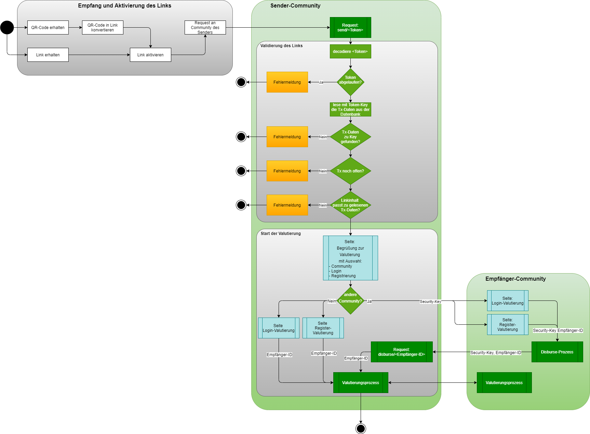
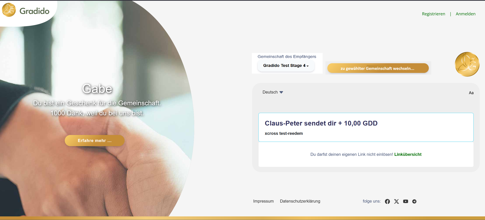
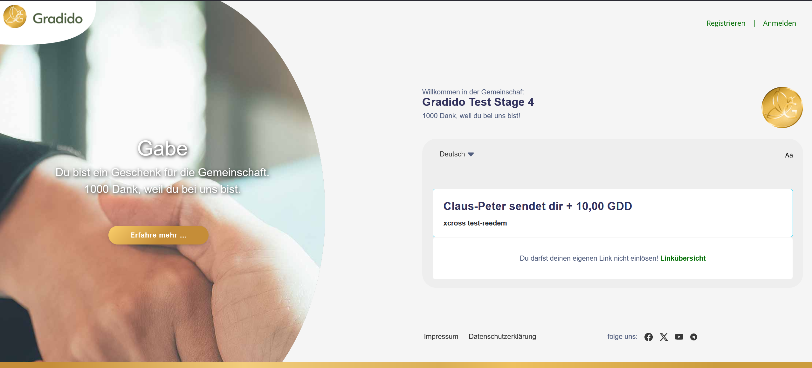

# UseCase: Cross Community Transactions per Link

With the feature X-Com-Transactions to send an amount of gradidos to an user of a foreign community the requirement to support this X-Com gradido transfer per link will become more significance.

The focus of this document is to describe the technical aspects from the recipient point of view. To get information about this topic from the sender point of view please take a look in the document [UseCase Send Users Gradido](https://github.com/gradido/gradido/blob/master/docu/Concepts/BusinessRequirements/UC_Send_Users_Gradido.md).

## Disbursement process

The following picture gives a first impression how the disbursement process will be started by activation of a redeem-link:



### Redeem-Link Validation

After a user has created a `redeem-Link` to send an other user an amount of gradidos the recipient of this link can activate it during the next 14 days after creation day. The redeem-link is build with several technical details following the pattern: `community-url of sender-community`/redeem/`code`

example: `https://gdd.gradido.net`/redeem/`3a5839be29f1`

In consequence of these technical details the transaction-link is created, the recipient will be routed on activation to the community of the sender.

With receiving a redeem-link request the payload of this link will be validated:

* If the code of this link exists in database
* If the associated transaction is still open and
* If the expiration time of the code is not exceeded

Only if all validation checks are successful the community will start the _disbursement process_ with the 1st step to select the recipient's community.

#### Community-Selection on sender-side

In consequence the first shown page for the recipient-user must offer a community-selection to yield the decision for the recipient community.

The first page the user will see on activating the redeem-link looks like quite the following page:



To support a cross community redeem-link activation this page is extended with the possibility to select a _receiver-community_. An UI-component will present a list of all known, verified and authenticated communities the sender's home-community is connected over the federation. Per default the _sender-community_ is selected, the _register-_ and _login_-links are visible and the shown button to switch to the selected community is hidden.

Only if the user select a foreign community out of the community-list the _switch-community_-button is visible and both _register-_ and _login_-links are hidden. This force the user to first switch to the _receiver-community_ before he could login or register himself.

The backend offers for the initialization of the community-selection-list the graphql query:

```
CommunityResolver.authenticatedCommunities :Promise Community[] 
```

returning only Community-Entities with a defined `uuid` and a given `authenticatedAt` Date by the following type definition:

```
Community {
  id: number
  foreign: boolean
  name: string
  description: string
  url: string
  creationDate: Date
  uuid: string
  authenticatedAt: Date
  gmsApiKey: string
}
```

With the selection of a community-entry from this list the dialog evaluats the _foreign_-flag of the selected community and shows or hide the _community-switch-button_ and the _login-_ and _register_-links as described above.

If the user doesn't change the default _sender_-community, the system goes on with the local login or registration page for a local `redeem-link activation`.

In case of the recipient community will be a foreign community, the system has to prepare a request with a _Disbursement-JWT-Token_ as parameter to invoke on the foreign community the _disbursement process_ by following the pattern: `community-url of receiver-community`/redeem/`<Disbursement-JWT-Token`

#### Disbursement JWT-Token

This _Disbursement-JWT-Token_ contains all necessary information to start a _disbursement process_ on the foreign community. The payload of this token contains:

* type of JWT-Token - here `redeem-activation`
* the community-uuid of the sender-community
* the gradidoID of the sender
* the original code of the redeem-link
* the alias if exists or the firstname of the sender
* the amount of gradidos the sender will send
* and the memo

#### Disbursement-Process on receiver-side

On receiving a redeem-link request with a `<Disbursement-JWT-Token>` the receiving community will show the following page with content from the `<Disbursement-JWT-Token>`.



There exists no additional community-selection component, as it is shown on the sender-community before - see chapter  _Community-Selection on sender-side_ above.

After the user finished the login or registration on the _receiver-community_ successfully, the _receiver-gradidoID_ for the disbursement transaction is known. To process the _disbursement process_ the backend offers the graphql query:

```
TransactionLinkResolver.disburse { jwt-token } :Promise boolean 
```

with the _disbursement-jwt-token_ as parameter and returns `true` in case of successful invocation, otherwise `false`.

The backend of the _receiver-community_ will prepare the parameters for a _disbures_-request invocation against the _sender-community_-backend-api. The following values and attributes are necessary to transfer back to sender for dibursement:

- endpoint url of sender-community, necessary for _disburse-request-invocation_
- receiver-community uuid, part of the jwt-token
- receiver gradidoID, part of the jwt-token
- original redeem-code, part of the jwt-token

#### Disburse-Request on sender-side

The backend of the _sender-community_ offers a _disburse_-api endpoint to process the _disbursement-process_ of the _receiver-community_. On receiving the _disburse-request_ on the sender-community the given jwt-token is decoded to get the readable attributes. At first the _redeem-code_ is evaluated with the following rules:

* If the _redeem-code_ exists in database
* If the associated transaction is still open and
* If the expiration time of the _redeem-code_ is not exceeded

Only if all validation checks are successful the community will go on with the valutation-step of the _disbursement process_.

#### Valutierungsprozess

The details about the _valutation-process-step_ are described in the document  [UseCase Send-Users-Gradido](../BusinessRequirements/UC_Send_Users_Gradido.md) in chapter _Valutierungsprozess_.
