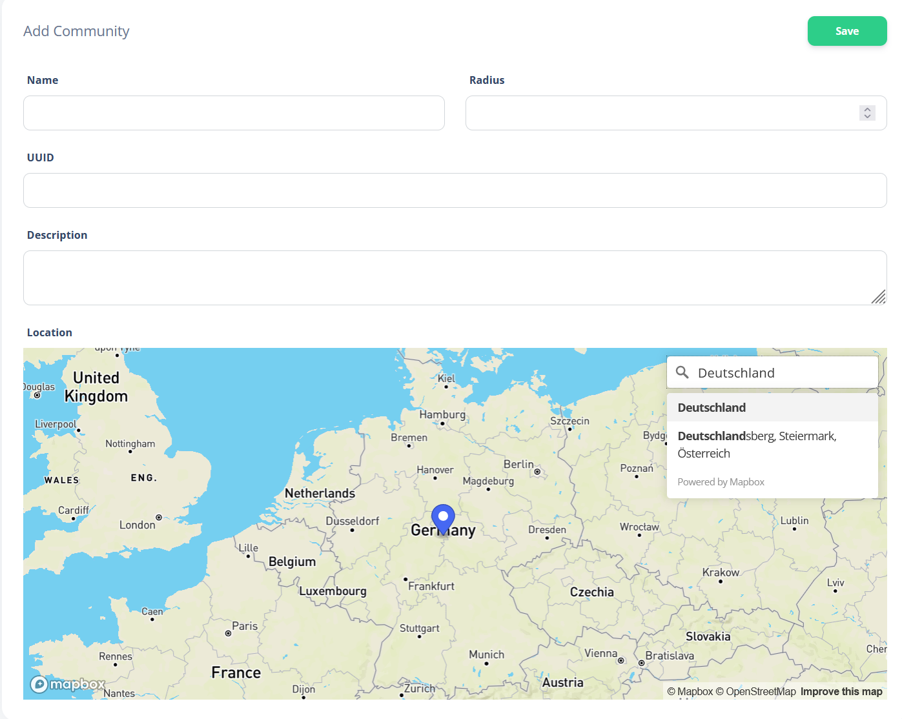
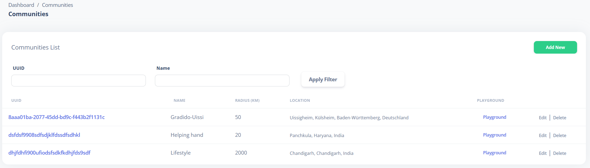
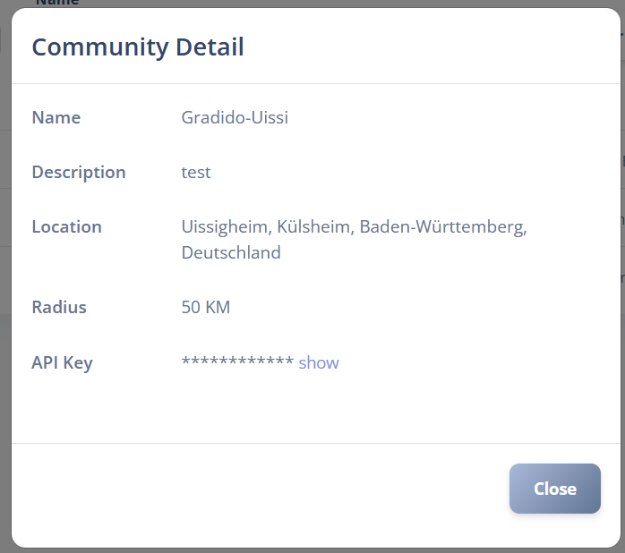
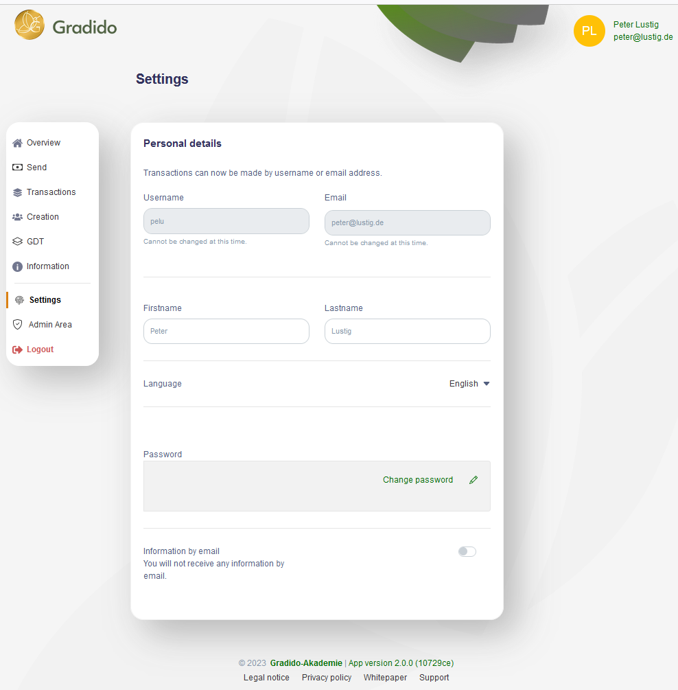
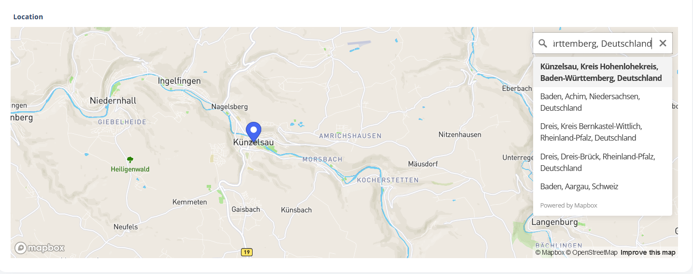

# UseCase: searching users with GradidoMappingSystem (GMS)

This document describe how the gradido application will publish userdata to the GMS. The motivation is to offer in the gradido application a kind of _user searching_ feature. A user should be able to find other users of his own community and users of other communities. The found communities and users are presented grafically on a map by surounding the community-location with a circle and all belonging users of the community inside this circle. At the beginning the shown user location inside the community-circle is randomized till the user captures his personal location and defines his personal publishing grants.

To support this _user searching_ feature the gradido application must be prepared and extended on several layers, which is described in the following chapters.

## Business oriented usecase descriptions

### Publishing existing users

Introducing the _GMS user search_ in the existing gradido application it is necessary to publish data of the still existing users to the GMS.

The first step to start with this migration is to define in the GMS dashboard a community by capturing the community name, radius and description, transfering the existing community UUID from the gradido system and entering the location in the map-view of the GMS-community dialog as shown in the picture below.

After saving the new community the GMS dashboard shows the new community data in the community-list. The column UUID of this list is presented as a link, which opens a popup window on activation.

In this popup window the internally generated _apiKey_ of this community is shown. This _apiKey_ has to be copied in the gradido-system, which allows it to communicate over the GMS-api with the GMS system.

The gradido-system has to be extended by a migration job to transfer for each existing user his publishable data to GMS. With each transfered set of user data the GMS system will create a GMS-user, which belongs to the community with the given community-_apiKey_ as part of the transferred userdata. After successful user transfer to the GMS the gradido-system marks the user as _gms-published_. The migration job must be invoked manually in response of the gradido-admin or devop.

The database in the gradido-system has to be prepared for the GMS user publishing. For all users the data will be set on default values to keep the users privacy, because in the gradido-system there is no possibility to capture beforehand an explicit allowence which level of data should be published.

### Publishing new users

The gradido-system will be extended to invoke a _gms-publishing_ after a new user has finished to register a new gradido-account. This single _user-publishing_ uses the same component as the migration job to transfer user-data to the GMS system and it will react in the same manner like the migration job, by marking the user as _gms-published_ after successful transfer. The values of the transferred user data are on the same privacey level like the migration-job.

### Exchange of community data

With the _exchange of the community data_ the manually transfer of the _community-uuid_ to the GMS and the backtransfer of the _apiKey_ to the gradido-system is meant. Additionally for authentication of user-specific gms api-invocations the admin/devop has to transfer the gradido _home-community.publicKey_ to the gms-community too.

To support this transfer it will be necessary to show in the gradido-system the _community.uuid_ and _community.publicKey_ for copy and to enable to capture the _apiKey_ from the GMS-system in the gradido-system.

In consequence the gradido-system needs an _admin-dialog_ to present the _community.uuid_ and _community.publicKey_ for copy-paste it to the GMS _new community_-dialog. As shown above the GMS shows in the popup window of the created community the _apiKey_, which can now be transferred per copy-paste from GMS to the gradido-system. The before mentioned gradido _community admin-dialog_ offers next to the _community.uuid_ and _community.publicKey_ fields an new input field for capturing the GMS _apiKey_ and to store the changed community data.

### Capture and change user settings for GMS publishing

As the above described transfer of user data from the _gradido-system_ to the _GMS-system_ will be done on the default privacy-level, a user should have the ability to change his published privacy level. To support this change of privacy level the gradido-system will be extend the dialog to capture and change the user settings.

The current existing dialog of the user settings looks like the following screenshot.

The user settings dialog have to be extended to allow capturing and changing the following attributes:

* switch to en/disable publishing the attribute _Username_
* switch to en/disbale publishing the attributes _Firstname_ and _Lastname_
* switch to define the format how the firstname and lastname are published
  * initials - first character of firstname and lastname
  * firstname only
  * firstname followed by first character of lastname
  * fullname - firstname followed by lastname
* new attribute _Location_

The capturing of the new attribute _Location_ will use a special component, which allows to enter a postal address in a graphical map. The following screenshot shows an example how this could looks like:

* location accuracy - as a select box with the following entries:

  * 0: exact
  * 1: approximate
  * 2: random (default)
* new attribute _Movement_

The user could capture in the new attribute _movement_ information about personal _fields of interest_ or _social plattforms_ like "Gradido, Helfa, Minuto, Ubunto, Talente, Regiogeld, Momo, Lieblingsstadt, ...". This will represent _gradido_ as an open system for other modells and movements to possibly reach a widespreaded network.

The value _Gradido_ is prefilled as default, but could be changed by the user. This personal user information will be published to the GMS-system and be shown as additional column in the _GMS-user-list_-dialog. It will also be possible to use single words of its content as a filter critera in the same user-list dialog.

### User search

The Gradido-system will be extended in the menu to offer a new entry "user-search". The user will on activating this new menu-entry opening a new GMS-window, which will show the users _playground_. Within this playground a map with the users community location in the center of a circle and his and all other users of the same community are shown. The location of each user depends on the users personal settings stored during the last user data transfer from gradido to gms. The default user location will be a randomized location inside the community's circle represented as a white needle. The own location is always shown as a red needle. Depending on the users _location accuracy_ settings, his location will be shown

* _exact_: shown as black needle
* approximate: shown as grey needle
* randomized: shown as white needle

The invokation of the _user-search_ dialog in GMS has to be secured by authentication and autorization of the user.

## Technical descriptions

### Prerequisites

One of the most important points about the feature _publishing user data to GMS_ is to keep the privacy of the user data. As described in the chapter before to capture the location for an user the gradido-system will not store the postal address but only the location coordinates.

### Database modifications in Gradido (gradido efforts)

The gradido database layer has to be modified in the following tables:

#### table users

| attribute            | type         | default | description                                                                                                                                                      |
| ---------------------- | -------------- | --------- | ------------------------------------------------------------------------------------------------------------------------------------------------------------------ |
| gms_allowed          | tinyint(1)   | true    | masterswitch to en/disable communication with gms for this user                                                                                                  |
| gms_registered       | tinyint(1)   | false   | flag if the current user data is published to gms                                                                                                                |
| gms_registered_at    | datetime(3)  | null    | timestamp of the last successful gms publishing                                                                                                                  |
| gms_publish_name     | unsigned int | 0       | control switch of the published naming format (0: alias if exist, otherwise initials only, 1: initials only, 2: firstname plus initial of lastname, 3: fullname) |
| location             | geometry     | null    | location of the user                                                                                                                                             |
| gms_publish_location | int          | 2       | Location type (0: exact, 1: approximate, 2: random)                                                                                                              |

#### table communities

|  attribute  | type         | description                                                       |
| :-----------: | -------------- | ------------------------------------------------------------------- |
| gms_api_key | varchar(512) | the community's apiKey for authentication of the gms-api consumer |

This value must be set before the user data migration to gms could be started - see description in chapter "Exchange of community data" above.

### Database modifications in GMS (gms efforts)

A review of the database model and the used sql-statements in gms during testing the api and the gui motivates us to require a basic refactoring to bring a more domain-driven aspect in the gms-system. It will support a easier maintenance by reducing the complexity, enable a more efficient runtime behaviour on big data and allow easier to comprehend on implementation level.

The focus of this factoring is to devide a **community** from a **user**, which leads to clean separation of business domains. In consequence the used sql-statements to select user-data or community-data will decrease their complexity a lot, especially on reducing the amount of outer- and innerjoints.

The GMS database layer should be modified in the following manner, before the first rollout for real productive user data will take place to avoid an afterwards productive data-migration:

#### table communities

rename the table **community_profile** to **communities** and modify the columns as follow:

| modification                              | attribute    | type        | description          |
| ------------------------------------------- | -------------- | ------------- | ---------------------- |
| add                                       | uuid         | varchar(36) | business primary key |
| delete after all data migrations finished | community_id | int(11)     | User's ref id        |

* select **users**.commmunity_uuid from **users** where **users**.id = **communities**.community_id and write the *users.commmunity_uuid* in *communities.uuid*

#### table user_communities

create the new table **user_communities** as n:m-mapping table between **users** and **communities**:

|  attribute  |   type   | description              |
| :------------: | :--------: | -------------------------- |
| community_id |   int   | FK to communities table  |
|   user_id   |   int   | FK to users table        |
|  created_at  | datetime | timestamp of creation    |
|  updated_at  | datetime | timestamp of last update |

#### table users

| modification | old attribute  | attribute  | type        | description                                   |
| :------------: | ---------------- | :----------- | ------------- | ----------------------------------------------- |
|    rename    | community_uuid | gradido_id | varchar(36) | the User's uuid sent from gradido-system      |
|    delete    |                | uuid       | varchar(36) | generated uuid with unclear or undefine usage |

#### table users_profile

| modification | attribute | type         | description                                                           |
| :------------: | ----------- | -------------- | ----------------------------------------------------------------------- |
|     add     | movement  | varchar(512) | comma separated string for_fields of interrest_ or_social plattforms_ |
|    delete    | city      | varchar(255) | User's  city will never be captured in gms                            |
|    delete    | state     | varchar(255) | User's state will never be captured in gms                            |
|    delete    | country   | varchar(255) | User's country will never be captured in gms                          |
|    delete    | zipcode   | varchar(255) | User's zipcode will never be captured in gms                          |
|   (delete)   | address   | varchar(255) | User's address (unclear, perhaps to display user details as tool-tip) |

#### migrate community-data by:

* select all **user**-entries, **user_account**-entries from the **users**-table, **user_accounts**-table where **user**.id = **user_accounts**.user_id and write for each user a new entry in the **user_communities**-table by using
  * user_communities.community_id = communties.id
  * user_communities.user_id = users.id
* delete **user_account**-entries from **user_account**-table where **user**.role = community
* delete **user**-entries from **users**-table where **user**.role = community
* delete **user_roles**-entries from **user_roles**-table where **user**.role = community
* delete **role**-entry from **roles**-table where **role**.code = community
* delete column **community_id** from **communities**-table

### Authentication and Autorization

For a secured communication between gradido and gms we need mechanism for authentication and autorisation.

As described in chapter "Exchange community data" above, on creating a gms community in the gms-dashboard the gms creates a community `apiKey`, which will be manually transferred per copy-paste by the admin/devop. In the other direction the admin/devop has to transfer per copy-paste the `uuid` of the gradido home-commuity in the gms _create-community-dialog_.

Additionally for authentication of user-specific gms api-invocations the admin/devop has to transfer the gradido `home-community.publicKey` to the gms-community too. This `publicKey` could be used on gms-side for decryption of user specific values, which are encrypted on gradido-side per `privateKey` only known from the users home community.

#### Gradido communities-dialog (gradido efforts)

The communities dialog in the gradido admin interface have to be changed by presenting the entries of the table _communities_. This can be done

* by replacing the existing list of _federated communities_ with the list of _communities_
* or by adding the list of _communities_ over the top of the list of _federated communities_
* or by adding a new dialog to present the list of _communities_

In any case the list of _commmunities_ must show the following columns:

* id
* foreign
* name
* description
* url
* communityUuid
* authenticatedAt
* publicKey
* gmsApiKey
* createdAt

Only for the _home-community_ entry and only for the role "Admin" the column *gmsApiKey* is editable. All other columns or at least the _communityUuid_ and the _publicKey_ must be able to be copied for transfering and paste them in the GMS *createCommunity*-dialog.

#### GMS communities-dialog (gms efforts)

In GMS the _createCommunity_-dialog have to be extended by capturing the manually transferred gradido _publicKey_ in a new input field and to store it in the *communities*-table in the gms-database.

### GMS api connection in gradido (gradido efforts)

In the gradido _backend modul_ a new GMS-client has to be introduced using REST protocoll to invoke gms-api-requests. This new client must read the GMS connecting configuration from the gradido-system configuration by the property `GMS_URL`.

At the first step the `GmsClient` have to implement the invokation of the GMS-api with the servicename `community-user`, which is used to create a new user in GMS. In the request-header the community's `apiKey` must be set for authentication and to connect the new GMS user to the GMS community. The user data is set as parameter like described on the GMS-api docu [POST community user](http://54.176.169.179:3071/documentation#/Community%20User/postCommunityuser).

This `GmsClient`have to be used for each gms api invocation like from the migration job of existing users, after the registration of a new gradido user and after updating the user settings.

### GMS api connection in GMS (gradido + gms efforts)

The GMS api has to be changed to enable a secured communication on switching the protocol from `HTTP` to `HTTPS`.

### Migration process in gradido (gradido efforts)

For the migration of existing gradido users there must be introduced a new job, which could be started manually by the *admin* or *devop* by calling in the backend-modul the command `yarn gmsusers`.

This job reads at first the home-community's *apiKey* to set it as parameter in each `GmsClient` invocation. As second step the job reads all *local* gradido users, which are still not registered in GMS - recognizable at the *users* database columns `foreign = false`,  `gms_registered = false` and `deleted_at is null`.

In a loop the migration job will invoke for each found gradido-user the `GmsClient` method `createGmsUser`. After each successful user creation in the GMS system, the gradido-user is updated in the gradido-database with the columns `gms_registered = true` and `gms_registered_at = NOW`.

### Update user settings (gradido efforts)

#### Gradido-Frontend

To allow a gradido-user to change his publishing grants for the GMS the gradido _settings-dialog_ has to be extended. As shown in the screenshot above in the chapter "Capture and change user settings for GMS publishing" the settings-dialog needs additional capturing components for the following attributes:

* GMS-Publishing main-switch as a boolean: GMS publishing enabled (default) or disabled
* Naming format as a selection box:
  * 0 = *username* if exists or Initials of *firstname* and *lastname* (default)
  * 1 = Initials of *firstname* and *lastname* independent if *username* exists
  * 2 = *firstname* only
  * 3 = *firstname* plus initial of *lastname*
  * 4 = fullname: *firstname* plus *lastname*
* *Location* as a link or button to open a popup or new window to capture the users *location* by entering postal address in a *map component*, which returns only the location as geo-coordinates. The gradido-user-settings-dialog will never capture or store any details of the users postal address but only the geo-coordinates, which will be returned from the *map component*-dialog or captured manually by the user in the new geo-coordinate input-fields of the user-settings-dialog.
* *Movement* as a text input field to capture the users _fields of interest_ or _social plattforms_ as a comma-separated list.

If the user switch-off the GMS main-switch, his published user data will be deleted in the GMS system and in the gradido frontend the menu *"user-search"* will be disabled.

#### Gradido-Backend

The gradido backend modul have to support to store the new *user settings* attributes by extending the service `UserResolver.updateUserInfos`. As soon as the user change his user settings, which has an effect on the GMS published data, the user attribute `gms_registered` have to be set to `false` to force a GMS user update.

After successful storing the *gradido users settings* and if the *gms-published user data* have been changed the GMS invokation to update the GMS-user data must be processed. For this update the `GmsClient` service `updateGmsUser` have to be called with the current valid user data.

If the user switch-off the whole publishing for the GMS system in the user settings dialog by disable the general `gms_allowed` publishing switch the `GmsClient`service `deleteGmsUser` have to be invoked.

To control the en/disable state of the menu-entry *"user search"* in the frontend, the backend must extend the *user-graphql-model* used by the frontend to transfer the current state of the `gms-allowed` user settings.

### GMS-api: update user in GMS (gms efforts)

The GMS api has to be extended to update an existing GMS user. An existing GMS user can be recognized by the attributes `users.gradido_id` and `communities.uuid`.

The existing api `community-user` could be modified to be reused for updating a still existing user or a new api `commuity-user-update` could be created.

### GMS user location capture dialog (gms efforts)

As described in the chapter "Capture and change user settings for GMS publishing" we need a dialog in GMS to capture the users location. This dialog must be invocable from the gradido-system and opened as a popup-window or a new browser-window or -tab like the following mockup shows:

It contains a map-component of the leaflet library and offers to capture the users postal address. After entering the address the map will show the location with a needle. The user-location capturing could be canceled with the cancel-button or confirmed with the ok-button, where both will close the opened window. Confirming the dialog will also return the entered user-location per geo-coordinates, which could be used in further processings by the invoker.

There is no user-specific authentication nor autorization necessary for this dialog as mentioned above.

### GMS user playground dialog

As described in the chapter "User search" above, we need a dialog in GMS to display in a graphical map:

* the location of the user as a red needle, who opens the user search-dialog
* the location of his community as a circle, the invoker belongs to
* the locations of all other users belonging to the same community as white/gray or black needles - depending on the location-type of the user
* circles and needles of all other communities and users, which are nearby the requesting user and community location

On activation of the menu-entry _user-search_ a technical flow in the background have to prepare the connection between the gradido-system and the gms-komponent. The following list will describe the necessary steps of all involved komponents:

* **gradido-frontend:** user press the menu entry _user search_
* **(1.a) gradido-frontend:** invokes the gradido-backend `authUserForGmsUserSearch`
* **(1.b) gradido-backend:** the method `authUserForGmsUserSearch` reads the context-user of the current request and the uuid of the user's home-community. With these values it prepares the parameters for invokation of the `gms.verifyAuthToken` method. The first parameter is set by the `community-uuid` and the second parameter is a JWT-token with the encrypted `user-uuid` in the payload and signed by the community's privateKey
* **(2.a) gradido-backend:** invokes the `gms.verifyAuthToken` with community-uuid as 1st parameter and JWT-Token as 2nd parameter
* **(2.b) gms-backend:** recieving the request `verifyAuthToken` with the community-uuid and the JWT-token. After searching and verifing the given community-uuid exists in gms, it prepares the invokation of the configured endpoint `community-Auth-Url` of this community by sending the given JWT-token as parameter back to gradido.
* **(3.a) gms-backend:** invokes the endpoint configured in `gms.community-auth-url` with the previous received JWT-token
* **(3.b) gradido-backend:** receives the request at the endpoint "communityAuthUrl" with the previously sent JWT-token. The JWT-token will be verified if the signature is valid and afterwards the payload is decrypted to verify the contained user-data will match with the current context-user of request (1).
* **(4.a) gradido-backend:** in case of valid JWT-token signature and valid payload data the gradido-backend returns TRUE as result of the authentication-request otherwise FALSE.
* **(4.b) gms-backend:** receives the response of request (3) and in case of TRUE the gms-backend prepares to return a complete URI including a _JWT-access-token_ to be used for entering the user-playground. *It will not return gms-data used for the user-playground as the current implementation of the api `verify-auth-token` do.* In case of FALSE prepare returning an authentication-error.
* **(5.a) gms-backend:** returning the complete URI including a _JWT-access-token_ as response of request (2) or an authentication-error
* **(5.b) gradido-backend:** receiving as response of request (2) a complete URI including a _JWT-access-token_ for entering the users-playground on gms or an authentication-error
* **(6.a) gradido-backend:** returning the complete URI including a _JWT-access-token_ as response of request (1) or an expressive error message
* **(6.b) gradido-frontend:** receiving the complete URI including a _JWT-access-token_ after activation of menu-entry "user-search" or an expressive error-message, which will end the _user search_-flow without requesting the gms-frontend (7).
* **(7.a) gradido-frontend:** on opening a new browser-window the gradido-frontend uses the received URI with the _JWT-access-token_ to enter the gms user-playground
* **(7.b) gms-frontend:** receiving the request for the user-playground with an _JWT-access-token_. After verifying the access-token the gms-frontend will read the data for the user given by the access-token and loads all necessary data to render the users playground

The following picture shows the logical flow and interaction between the involved components:

The detailed requirements for the playground-dialog will come up as soon as we get some user expiriences and feedbacks.

### GMS Offer Capture dialog (gms efforts)

will come later...

### GMS Need Capture dialog (gms efforts)

will come later...
