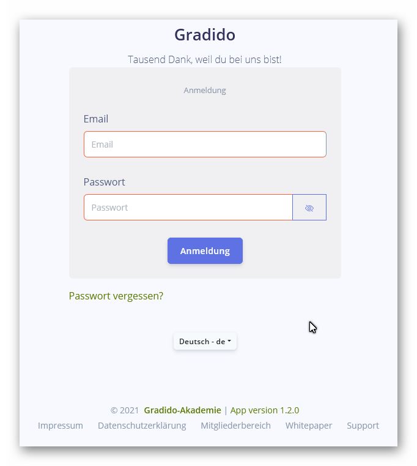

# Testfall: "T02-C001-02-LoginMaske"

## Thema: "T02-Benutzerverwaltung"

## Beschreibung:

*Welche(n) Anwendungsschritt/Oberfläche/Logik ist durch den Testfall betroffen?*

Es wird in der Login-Maske die Funktion des Buttons "Anmeldung"geprüft:

**Nicht enthalten in diesem Testfall:**

* die Anzeige, Layout und Validierung der Login-Maske; siehe dazu Testfall: [T02-C001-01-LoginMaske.md](./T02-C001-01-LoginMakse.md)
* die Funktion hinter dem Link "Passwort vergessen"; siehe dazu Testfall: [T02-C001-03-LoginMaske.md](./T02-C001-03-LoginMaske.md)

## Vorraussetzungen:

*Welche Vorraussetzungen (Daten/Anwendungschritte, etc.) müssen erfüllt sein, um den Testfall durchführen zu können?*

Die Eingabefelder Email und Passwort sind mit validen Inhalten gefüllt.

## Testfall-Schritte:

*Welche Schritte müssen zur Durchführung des Testfalles getätigt werden?  (Dateneingaben/ Navigationen/ Link- o Button-Klicks/ Schritte der Anwendungslogik/ etc.)*

Prüfung auf korrekten Funktionsweise des Buttons "Anmeldung":

1. In beiden Eingabefeldern Email und Passwort sind gültige und schon registrierte Anmeldedaten eines Mitglieds eingetragen
2. Mit Betätigen des Buttons "Anmeldung" wird der Login-Prozess gestartet
   1. *Gibt es noch weitere Prüfschritte (LOG-Ausgaben auf Login-, Community-Server o.ä.) die hier überprüft werden sollten?*
3. Bei erfolgreichem Login wird die URL angezeigt
   * Testumgebung: "https://stage1.gradido.net/vue/overview"
   * Produktionsumgebung: "https://gradido.net/vue/overview"
4. Bei fehlerhaftem Login wird eine entsprechend aussagekräftige Fehlermeldung angezeigt und die Anzeige verbleibt auf der Login-Maske.

## Ende-Bedingungen:

*Welche Bedingungen werden am Ende des Testfalles bei positivem Ergebnis erwartet? (Daten/ GUI/ Zustände/ etc)*

Der Login-Prozess wurde erfolgreich durchlaufen.

Alle zu überprüfende Schritte des Login-Prozesses sind erfolgreich abgeschlossen.

Es wird die Übersichtseite des angemeldeten Mitglieds angezeigt.

## erwartete Fehlerfälle:

*Welche Fehlerfälle können auftreten und wie ist das erwartete Verhalten/ Rückgabewerte/  Fehlercode?*

nicht registrierte Nutzerdaten in Eingabefeld "Email" und/oder "Passwort":

* ungültiger Login -> Fehlermeldung "Leider konnten wir keinen Account finden mit diesen Daten!"
