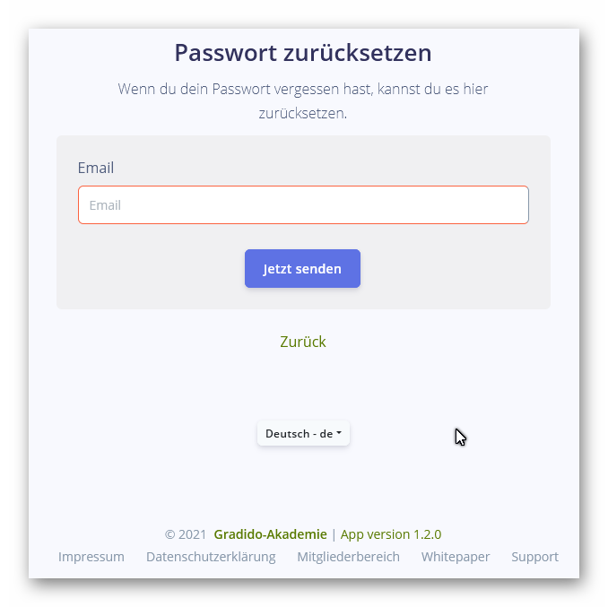
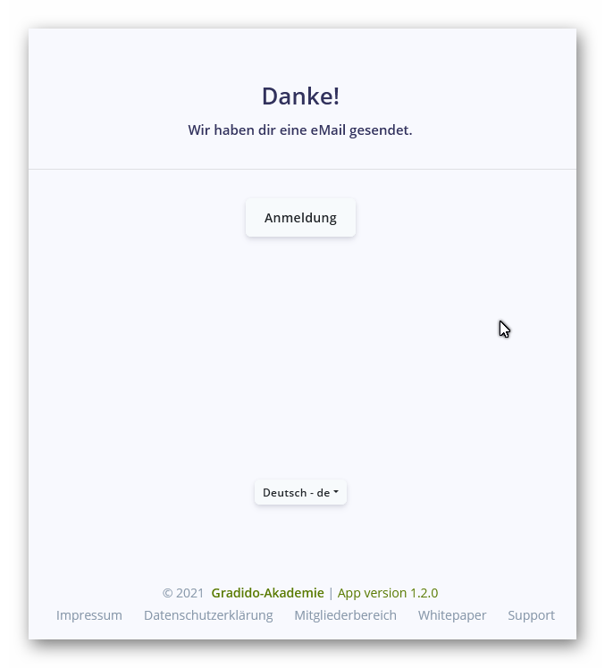
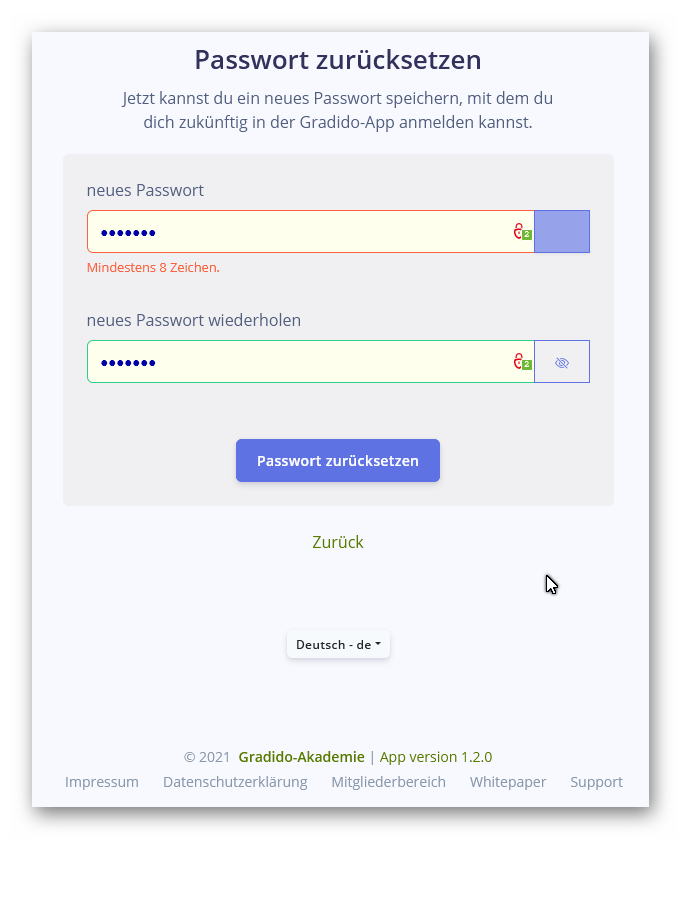

# Testfall: "T02-C001-03-LoginMaske"

## Thema: "T02-Benutzerverwaltung"

## Beschreibung:

*Welche(n) Anwendungsschritt/Oberfläche/Logik ist durch den Testfall betroffen?*

Es wird in der Login-Maske die Funktion des Links "Passwort vergessen?"geprüft:

**Nicht enthalten in diesem Testfall:**

* die Anzeige, Layout und Validierung der Login-Maske; siehe dazu Testfall: [T02-C001-01-LoginMaske](./T02-C001-01-LoginMaske.md)
* die Funktion hinter dem Link "Passwort vergessen"; siehe dazu Testfall: [T02-C001-02-LoginMaske](T02-C001-02-LoginMaske.md)

## Vorraussetzungen:

*Welche Vorraussetzungen (Daten/Anwendungschritte, etc.) müssen erfüllt sein, um den Testfall durchführen zu können?*

Es wird die URL

* Testumgebung: https://stage1.gradido.net/vue/login
* Produktionsumgebung: https://gradido.net/vue/login

aufgerufen und die Login-Maske wird angezeigt.

## Testfall-Schritte:

*Welche Schritte müssen zur Durchführung des Testfalles getätigt werden?  (Dateneingaben/ Navigationen/ Link- o Button-Klicks/ Schritte der Anwendungslogik/ etc.)*

* Prüfung auf korrekte Funktionsweise des Links "Passwort vergessen?"
* keine sonstigen Eingaben bzw. Vorraussetzungen notwendig
* Mit Betätigen des Links "Passwort vergessen?" wird der Passwort-Zurücksetzen-Prozess gestartet und unter
  * der Testumgebung: https://stage1.gradido.net/vue/password
  * der Produktionsumgebung: https://gradido.net/vue/password
* folgende Maske angezeigt:

1. **Prüfung der Anzeige-Elemente, Layout und Eingabevalidierungen des Eingabefeldes, Text, Rechtschreibung und Layout von:**

* Maskenüberschrift "Passwort zurücksetzen"
* Maskentext "Wenn du dein Passwort vergessen hast, kannst du es hier zurücksetzen"
* Label "Email"
* Default-Text "Email" bei ungefülltem Eingabefeld
* Button-Text "Jetzt senden"
* Linktext "zurück"
* Sprachauswahltexte
* Footer Copyright
* Footer Links:
  1. "Gradido-Akademie"
  2. "App-Version"
  3. "Impressum"
  4. "Datenschutzerklärung"
  5. "Mitgliederbereich"
  6. "Whitepaper"
  7. "Support"

2. **Prüfung der Eingabedynamik in der 1ten Passwort-Zurücksetzen-Maske:**

   1. Eingabefeld Email:
   2. valide Emailadresse gemäß Pattern: "name"@"domain"."ländercode"
   3. maximale Länge einer Email-Adresse?
   4. Sprachauswahl:

      1. entsprechen alle angezeigten Texte der aktuell eingestellten Sprache?
      2. Umstellung der Sprache über die Sprachauswahl-Box
      3. Wiederholung von Schritt 2.4.1 und 2.4.2 bis alle verfügbaren Sprachen geprüft sind
   5. Link "Zurück" ist aktiv und landet auf URL

      1. Testumgebung: https://stage1.gradido.net/vue/Login
      2. Produktionsumgebung: https://gradido.net/vue/Login
   6. Footer-Links:

      1. "Gradido-Akademie" reagiert und landet je nach aktuell eingestellter Sprache auf URL "https://gradido.net/de"
      2. "App-Version" reagiert und landet je nach aktuell eingestellter Sprache auf URL "https://github.com/gradido/gradido/releases/latest"
      3. "Impressum" reagiert und landet je nach aktuell eingestellter Sprache auf URL "https://gradido.net/de/impressum/"
      4. "Datenschutzerklärung" reagiert und landet je nach aktuell eingestellter Sprache auf URL "https://gradido.net/de/datenschutz/"
      5. "Mitgliederbereich" reagiert und landet je nach aktuell eingestellter Sprache auf URL "https://elopage.com/s/gradido/sign_in?locale=de"
      6. "Whitepaper" reagiert und landet je nach aktuell eingestellter Sprache auf URL "https://docs.google.com/document/d/1jZp-DiiMPI9ZPNXmjsvOQ1BtnfDFfx8BX7CDmA8KKjY/edit?usp=sharing"
      7. "Support"reagiert und landet je nach aktuell eingestellter Sprache auf URL "https://gradido.net/de/contact/"
3. **Prüfung des eigentlichen Passwort-Zurücksetzen Prozesses**

   1. Eingabe einer bekannten und validen Email.Adresse, auf die man Zugriff hat.
   2. Mit Betätigen des Links "Passwort zurücksetzen" wird der Passwort-Zurücksetzen Prozess gestartet
   3. *Gibt es noch weitere Prüfschritte (LOG-Ausgaben auf Login-, Community-Server o.ä.) die hier überprüft werden sollten?*
   4. Sobald der Prozess die Zurücksetzen-Email abgeschickt hat, wird die folgende Maske angezeigt:

5. **In dem angegebenen Email-Postfach wird eine Email empfangen, die ein Zurücksetzen-Link enthält:**
   1. Testumgebung: https://stage1.gradido.net/vue/reset/'erzeugter rest-code'
   2. Produktionsumgebung: https://gradido.net/vue/reset/'erzeugter reset-code'
6. **Mit Betätigen des Reset-Links bzw. Aufruf des Rest-Links im Browser wird folgende Maske angezeigt:**

7. **Prüfung der Anzeige-Elemente, Layout und Eingabevalidierungen der Eingabefelder ,Text, Rechtschreibung und Layout von:

* Maskenüberschrift "Passwort zurücksetzen"
* Maskentext "Jetzt kannst du ein neues Passwort speichern, mit dem du dich zukünftig in der Gradido-App anmelden kannst."
* Label "neues Passwort"
* Default-Text "neues Passwort" bei ungefülltem Eingabefeld
* Label "neues Passwort wiederholen"
* Default-Text "neues Passwort wiederholen" bei ungefülltem Eingabefeld
* Button-Text "Passwort zurücksetzen"
* Linktext "zurück"
* Sprachauswahltexte
* Footer Copyright
* Footer Links:

  * "Gradido-Akademie"
  * "App-Version"
  * "Impressum"
  * "Datenschutzerklärung"
  * "Mitgliederbereich"
  * "Whitepaper"
  * "Support"

8. **Prüfung der Eingabedynamik in der 2ten Passwort-Zurücksetzen-Maske:**
9. Eingabefeld "Neues Passwort":

   1. mindestens ein Zeichen
   2. maximale Länge eines Passwortes?
   3. Sichtbarschaltung und Verdeckung des eingegebenen Passwortes
10. Eingabefeld "Neues Passwort wiederholen":

    1. mindestens ein Zeichen
    2. maximale Länge eines Passwortes?
    3. Sichtbarschaltung und Verdeckung des eingegebenen Passwortes
11. Sprachauswahl:

    1. entsprechen alle angezeigten Texte der aktuell eingestellten Sprache?
    2. Umstellung der Sprache über die Sprachauswahl-Box
    3. Wiederholung von Schritt 8.3.1 und 8.3.2 bis alle verfügbaren Sprachen geprüft sind
12. Link "Zurück" ist aktiv und landet auf URL

    1. Testumgebung: https://stage1.gradido.net/vue/Login
    2. Produktionsumgebung: https://gradido.net/vue/Login
13. Footer-Links:

    1. "Gradido-Akademie" reagiert und landet je nach aktuell eingestellter Sprache auf URL "https://gradido.net/de"
    2. "App-Version" reagiert und landet je nach aktuell eingestellter Sprache auf URL "https://github.com/gradido/gradido/releases/latest"
    3. "Impressum" reagiert und landet je nach aktuell eingestellter Sprache auf URL "https://gradido.net/de/impressum/"
    4. "Datenschutzerklärung" reagiert und landet je nach aktuell eingestellter Sprache auf URL "https://gradido.net/de/datenschutz/"
    5. "Mitgliederbereich" reagiert und landet je nach aktuell eingestellter Sprache auf URL "https://elopage.com/s/gradido/sign_in?locale=de"
    6. "Whitepaper" reagiert und landet je nach aktuell eingestellter Sprache auf URL "https://docs.google.com/document/d/1jZp-DiiMPI9ZPNXmjsvOQ1BtnfDFfx8BX7CDmA8KKjY/edit?usp=sharing"
    7. "Support"reagiert und landet je nach aktuell eingestellter Sprache auf URL "https://gradido.net/de/contact/"

Bei erfolgreichem Passwort-Reset wird folgende Maske angezeigt:

## Ende-Bedingungen:

*Welche Bedingungen werden am Ende des Testfalles bei positivem Ergebnis erwartet? (Daten/ GUI/ Zustände/ etc)*

Der Login-Prozess wurde erfolgreich durchlaufen.

Alle zu überprüfende Schritte des Login-Prozesses sind erfolgreich abgeschlossen.

Es wird die Übersichtseite des angemeldeten Mitglieds angezeigt.

## erwartete Fehlerfälle:

*Welche Fehlerfälle können auftreten und wie ist das erwartete Verhalten/ Rückgabewerte/  Fehlercode?*

nicht registrierte Nutzerdaten in Eingabefeld "Email" und/oder "Passwort":

* ungültiger Login -> Fehlermeldung "Leider konnten wir keinen Account finden mit diesen Daten!"
