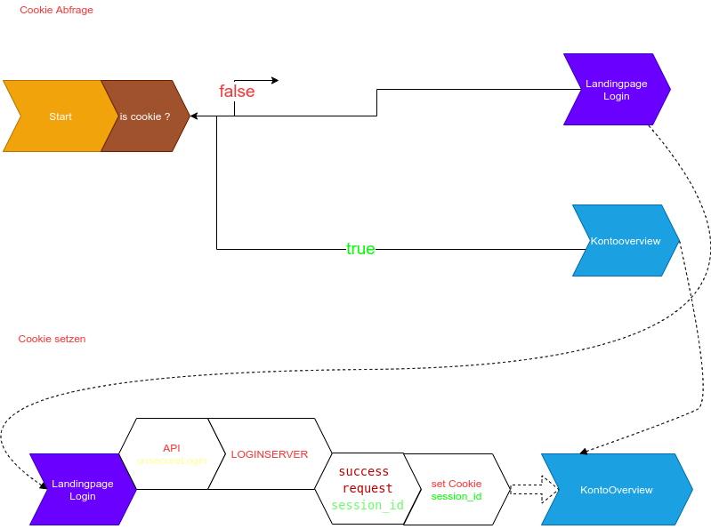
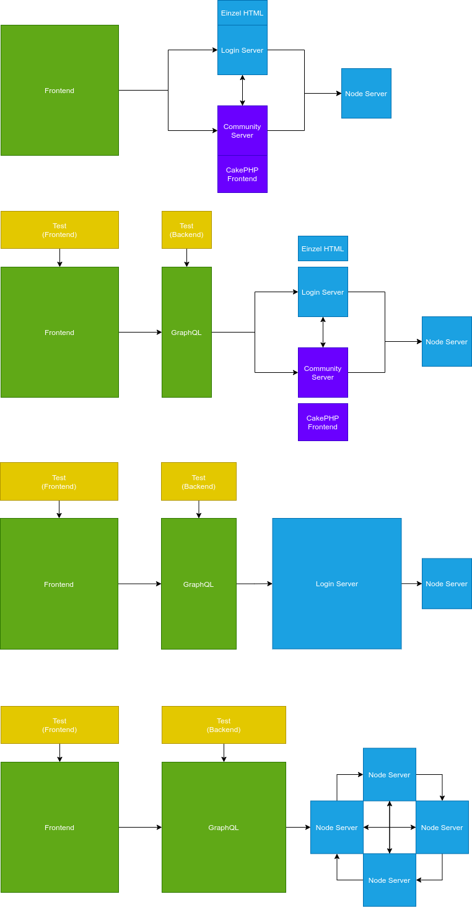
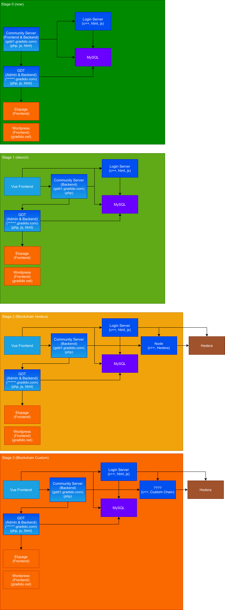
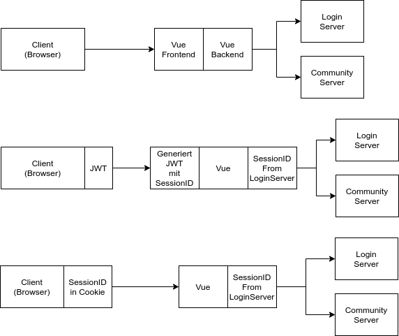
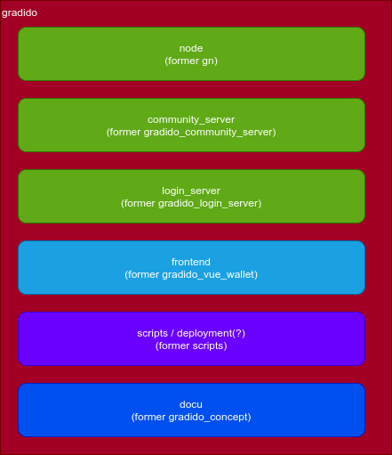

# Gradido Documentation

## APIs

The API Documentation is separated by which server answers them. Either the community server or login server. Therefore the documentation is split into two parts accordingly.

- [login-server API](./login_server.api.md)
- [community-server API](./community-server.api.md)

### Process - Reset password

1. Send user email with email verification code: [Send E-Mails](https://github.com/gradido/gradido/blob/master/docu/login_server.api.md#send-e-mails)
2. Login via emailVerificationCode: [Login by Email Verification Code](https://github.com/gradido/gradido/blob/master/docu/login_server.api.md#login-by-email-verification-code)
3. change password: [Update user data](https://github.com/gradido/gradido/blob/master/docu/login_server.api.md#update-user-data)

## Graphics

The following Graphics try to show certain mechanics, principles and structures of the gradido project

### Cookie mechanic

### Software structure transition

An Idea of how to transform the Software structure step by step to keep it working, while transitioning to a more modern and strict structure.
The basic Idea is to create a unified API to communicate with the outside world, while the existing services are hidden behind it. Furthermore the community server is under consideration to be absorbed by this new unified API Interface. This would remove PHP as language from the project, unify the API and separate front from backend.

In the long run (shown as the last section in the graphic) it could be wise to fully decentralize the login server completely.

### Old or outdated stuff

Graphics get outdated - this section is the graveyard for those.

#### Software release plan stage0-3

In the past a waterfall-like development method was used which resulted in multiple big branches not yet compatible. This graphic shows how and in which order those branches o existing code could be integrated.

We quickly managed to go from `stage0` to `stage1`. `stage2` and `stage3` will be one step now, if we can reuse this code.

#### Frontend authentication idea

Some ideas of regarding fixing the broken authentication

#### Repo structure

One upon a time the repository was split into multiple parts. This compartimalisation resulted in some inefficiencies which were resolved by merging (most of) them into a mono repository. The following graphic was made to explain the idea and plan the "mono-repoisation"

