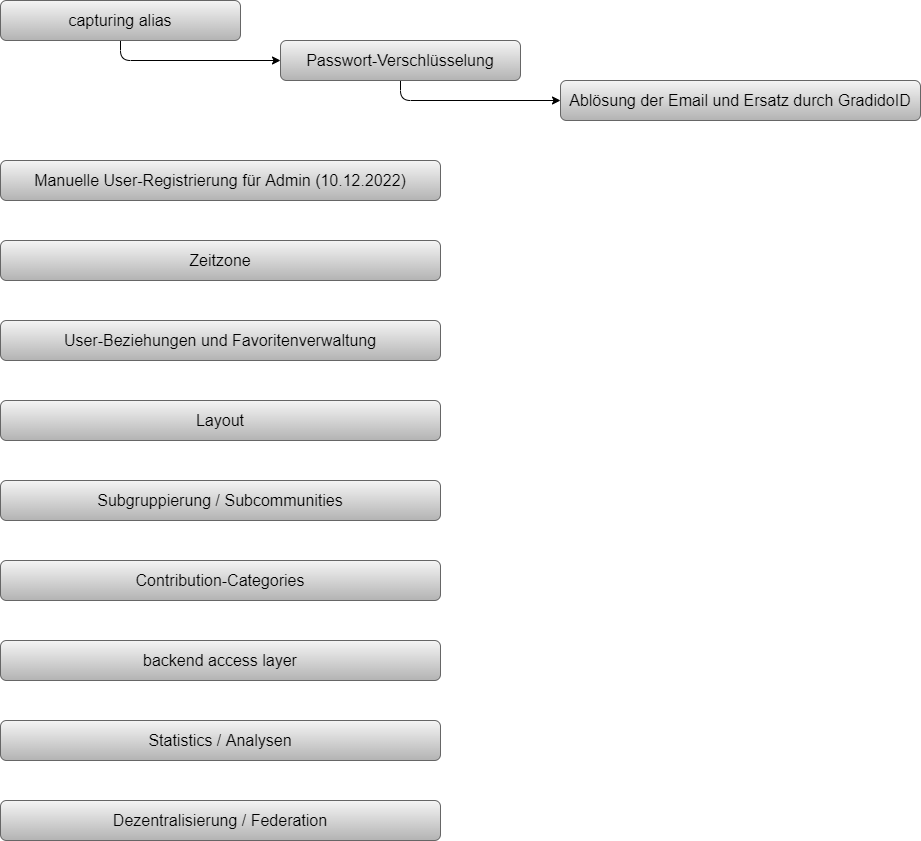

# Roadmap 2022 / 2023

## unsortierte Sammlung von Themen

1. backend access layer

   - Refactoring der Resolver-Klassen
   - Daten-Zugriffschicht zur Kapselung der DB-Schicht
   - Transfer-Datenmodel zum Austausch von Daten zwischen den Schichten
   - technisches Transaktion-Handling und Lösung von Deadlocks
   - Konzept in Arbeit
2. capturing alias

   - Konzept fertig
   - Änderungen in Register- und Login-Prozess
3. Passwort-Verschlüsselung

   - Konzept fertig
   - Unabhängigkeit von Email erzeugen
   - Änderung der User-Email ermöglichen
   - Versionierung der verwendeten Verschlüsselungslogik notwendig
4. Contribution-Categories

   - Bewertung und Kategorisierung von Schöpfungen: Was hat Wer für Wen geleistet?
   - Regeln auf Categories ermöglichen
   - Konzept in Arbeit
5. Statistics / Analysen
6. Subgruppierung / Subcommunities

   - **einfacher Ansatz:** innerhalb der existierenden Community gibt es Untergruppierungen, sprich SubCommunities

     - Einführung eine Community-Tabelle
     - In der Community-Tabelle gibt es zunächst eine Haupt-Community, die mehrere Sub-Communities haben kann
     - ein User ist in der Haupt-Community unique, kann aber in mehreren SubCommunities sein
     - Eine SubCommunity dient zur einfachen Gruppierung gleichgesinnter oder örtlich gebundener User
     - Eine SubCommunity hat eigene Moderatoren
     - Motivation einer SubCommunity: kleine lokale Gruppen und jeder kennt jeden
     - **ToDos**:
       - DB-Migration für Community-Tabelle, User-SubCommunity-Zuordnungen, UserRights-Tabelle
       - Berechtigungen für SubCommunities
       - Register- und Login-Prozess für SubCommunity-Anmeldung anpassen
         - Auswahl-Box einer SubCommunity
         - createUser mit Zuordnung zur ausgewählten SubCommunity
       - Schöpfungsprozess auf angemeldete SubCommunity anpassen
         - "Beitrag einreichen"-Dialog auf angemeldete SubCommunity anpassen
         - "meine Beiträge zum Gemeinwohl" mit Filter auf angemeldete SubCommunity anpassen
         - "Gemeinschaft"-Dialog auf angemeldete SubCommunity anpassen
       - "Mein Profil"-Dialog auf SubCommunities anpassen
         - Umzug-Service in andere SubCommunity
         - Löschen der Mitgliedschaft zu angemeldeter SubCommunity (Deaktivierung der Zuordnung "User-SubCommunity")
       - "Senden"-Dialog mit SubCommunity-Auswahl
       - "Transaktion"-Dialog mit Filter auf angemeldeter SubCommunity
       - AdminInterface auf angemeldete SubCommunity anpassen
         - "Übersicht"-Dialog mit Filter auf angemeldete SubCommunity
         - "Nutzersuche"-Dialog mit Filter auf angemeldete SubCommunity
         - "Mehrfachschöpfung"-Dialog mit Filter auf angemeldete SubComunity
       - Subject/Texte/Footer/... der Email-Benachrichtigungen auf angemeldete SubCommunity anpassen
7. User-Beziehungen und Favoritenverwaltung

   - User-User-Zuordnung
     - aus Tx-Liste die aktuellen Favoriten ermitteln
   - Verwaltung von Zuordnungen
     - Auswahl
     - Berechtigungen
     - Gruppierung
     - Community-übergreifend
     - User-Beziehungen
8. technische Ablösung der Email und Ersatz durch GradidoID

   * APIs / Links / etc mit Email anpassen, so dass keine Email mehr verwendet wird
   * Email soll aber im Aussen für User optional noch verwendbar bleiben
   * Intern erfolgt aber auf jedenfall ein Mapping auf GradidoID egal ob per Email oder Alias angefragt wird
9. Zeitzone

   - User sieht immer seine Locale-Zeit und Monate
   - Admin sieht immer UTC-Zeit und Monate
   - wichtiges Kriterium für Schöpfung ist das TargetDate ( heißt in DB contributionDate)
   - Berechnung der möglichen Schöpfungen muss somit auf dem TargetDate der Schöpfung ermittelt werden! **(Ist-Zustand)**
   - Kann es vorkommen, dass das TargetDate der Contribution vor dem CreationDate der TX liegt? Ja
   - Beispiel: User in Tokyo Locale mit Offest +09:00

     - aktiviert Contribution-Link mit Locale: 01.11.2022 07:00:00+09:00 = TargetDate = Zieldatum der Schöpfung
     - die Contribution wird gespeichert mit

       - creationDate=31.10.2022 22:00:00 UTC
       - contributionDate=01.11.2022 07:00:00
       - (neu) clientRequestTime=01.11.2022 07:00:00+09:00
     - durch automatische Bestätigung und sofortiger Transaktion wird die TX gespeichert mit

       - creationDate=31.10.2022 22:00:00 UTC
   - **zwingende Prüfung aller Requeste: auf -12h <= ClientRequestTime <= +12h**
   - zur Analyse und Problemverfolgung von Contributions immer original ClientRequestTime mit Offset in DB speichern
   - Beispiel für täglichen Contribution-Link während des Monats:

     - 17.10.2022 22:00 +09:00 => 17.10.2022	UTC: 17.10.2022 13:00 UTC => 17.10.2022
     - 18.10.2022 02:00 +09:00 => 18.10.2022	UTC: 17.10.2022 17:00 UTC => 17.10.2022 !!!! darf nicht weil gleicher Tag !!!
   - Beispiel für täglichen Contribution-Link am Monatswechsel:

     - 31.10.2022 22:00 +09:00 => 31.10.2022	UTC: 31.10.2022 15:00 UTC => 31.10.2022
     - 01.11.2022 07:00 +09:00 => 01.11.2022	UTC: 31.10.2022 22:00 UTC => 31.10.2022 !!!! darf nicht weil gleicher Tag !!!
10. Layout
11. Manuelle User-Registrierung für Admin

    - soll am 10.12.2022 für den Tag bei den Galliern produktiv sein
12. Dezentralisierung / Federation

    - Hyperswarm
    - Authentifizierungs- und Autorisierungs-Handshake
    - Inter-Community-Communication

## Priorisierung

1. capturing alias
2. Manuelle User-Registrierung für Admin (10.12.2022)	**Konzeption!!**!
3. Zeitzone
4. User-Beziehungen und Favoritenverwaltung
5. Layout
6. Passwort-Verschlüsselung
7. Subgruppierung / Subcommunities (einfacher Ansatz)
8. Contribution-Categories
9. backend access layer
10. Statistics / Analysen
11. technische Ablösung der Email und Ersatz durch GradidoID
12. Dezentralisierung / Federation

## Zeitleiste

