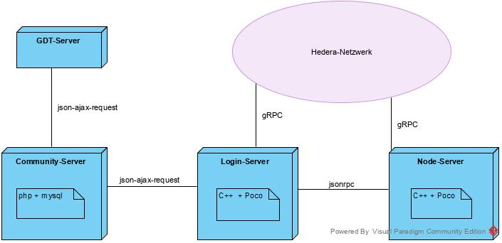

# Gradido Architecture

## Theory

### General requirements

- scalable to the point that it can be used by the whole world for their financial transactions
- subdivided into sub-networks which each belong to a group of people, e.g. a community
- secured against hackers and shutdown
- for the user as easy as paypal

### Approach

- Structured in several layers, similar to the OSI model
- Use of public-key signatures for transactions similar to Bitcoin
- Use of the Hedera Hashgraph Consensus Service for the chronological sorting of transactions
- Use of google protobuf to be able to exchange transactions with each other platform-independently
- Use of C++ based servers for the critical system areas for maximum security and performance
- Use of php and javascript for good usability and faster development of new comfort functions.

### Layers

#### Transaction protocol

- defined as google protocol buffers
- is stored like a block chain
- should not contain personal data
- based on the Hedera Hashgraph transactions format
- signed with ed25519 signatures 

#### Blockchain

- temporal sorting of the transaction in a chain per group, e.g. from Hedera
- make the transactions publicly available, store and verify them
- secured against subsequent modification, deletion and loss due to server failure

#### User accounts

- encrypted storage of private keys for the users
- only with the correct e-mail-password combination the private keys can be decrypted
- Account recovery/change password using a passphrase from which the private key can be calculated
- (Optional) Store the user's passphrase encrypted with Server Admin Key(s) if the user did not note his passphrase when opening the account. Security risk!
- Signing of user transactions

#### User interface

- Caching and displaying the transactions belonging to the user
- Creating transactions
- Comfort functions such as friend lists for fast transfers

## Implementation & Software Components

### Community-Server

#### Layer 4, user interface

- based on cakephp 
- Modern 
- User-friendly
- Communicates a lot with the sign-up server
- One instance per group
- Could also be hosted on a simple webspace with php and mysql

### Sign-up-Server

#### Layer 3, user accounts
- C++ with Poco
- relevant to security
- Communicates via json-ajax-request with the Community-Server
- Communicates via jsonrpc-request with the Sign-up-Server
- Maximum one Sign-up-Server per group
- can manage several groups
- Hosting requires ssh access e.g. a VPS or root server
- Server-Admin must be reliable and should know something about server security
- Sends signed transactions to the Hedera network

### Node-Server

#### Layer 2, Blockchain

- C++ with Poco
- high-performance
- one node server can manage many groups
- stores the block chain of each group in a separate folder
- connection to the Hedera network as mirror node
- receives transactions from the Hedera network
- provides transaction data for Sign-up- and Community-Servers
- there should be more than one per group in case one fails.
- should be able to be used for a Supernode, which receives, checks and stores all transactions of the world (currently about 40 transactions per ms, about 650 GByte per day)

### GDT-Server

For the transition phase to project funding

- cakephp
- Connection to Elopage and Digistore
- Manages GDT for all who support the Gradido project
- Communicates with the Community-Server via json-ajax requests
- Currently only one instance
- Should not play a role in the system later

