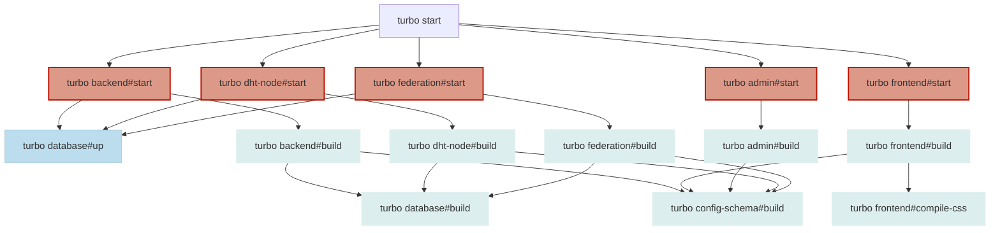
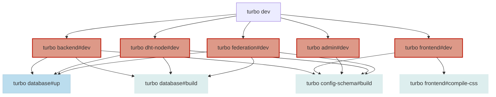
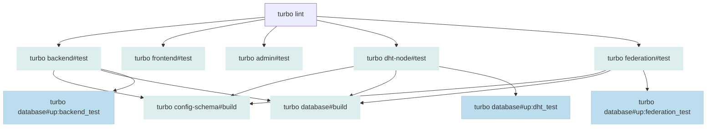

```mermaid
graph TD;
    %% Colors
    classDef cached fill:#dee,stroke:#dee,stroke-width:2px;
    classDef default fill:bbb,stroke:ccc,stroke-width:1px;
    
    %% Root
    TLint[turbo lint] --> BLint[turbo backend#lint]
    TLint --> FRLint[turbo frontend#lint]
    TLint --> ALint[turbo admin#lint]
    TLint --> DLint[turbo dht-node#lint]
    TLint --> FELint[turbo federation#lint]
    TLint --> DALint[turbo database#lint]
    TLint --> CLint[turbo config-schema#lint]

    class TLint default
    class BLint cached
    class FRLint cached
    class ALint cached
    class DLint cached
    class FELint cached
    class DAlint cached
    class CLint cached
    
    %% Backend
    BLint --> DBuild[turbo database#build]
    BLint --> BLocales[turbo backend#locales]

    class DBuild cached
    class BLocales cached

    %% Frontend
    FRLint --> FStyle[turbo frontend#stylelint]
    FRLint --> FLocales[turbo frontend#locales]

    class FStyle cached
    class FLocales cached

    %% Admin
    ALint --> AStyle[turbo admin#stylelint]
    ALint --> ALocales[turbo admin#locales]

    class AStyle cached
    class ALocales cached

```

# Working with Gradido Native

## Production
Called in Root-Directory
```bash
turbo start 
```


### Legende


- [Cached](https://turborepo.com/docs/crafting-your-repository/caching): Task will be only redone, if src, config or .env changed
- [Persistent](https://turborepo.com/docs/reference/configuration#persistent): will run a while, cannot be set as dependence

This will start all start jobs from all submodules (if executed in root directory).
Start Jobs usually have build as dependency.
Frontend has additional compile-css as dependency.
All backend modules have database:up as dependency which will make
sure that the db is running and the schema is up to date.

## Development
Called in Root-Directory
```bash
turbo dev 
```


### Legende


- [Cached](https://turborepo.com/docs/crafting-your-repository/caching): Task will be only redone, if src, config or .env changed
- [Persistent](https://turborepo.com/docs/reference/configuration#persistent): will run a while, cannot be set as dependence

This will start all dev jobs from all submodules (if executed in root directory).
Dev Jobs use hot-reload so if you change some code, the module will automatically restart or reload
Frontend has additional compile-css as dependency.
All backend modules have database:up as dependency which will make
sure that the db is running and the schema is up to date.

##  Lint
Called in Root-Directory
```bash
turbo lint 
```

### Legende


- [Cached](https://turborepo.com/docs/crafting-your-repository/caching): Task will be only redone, if src, config or .env changed

This will run linting for all modules and additional stylelint (css linter)
for frontend and admin and locales for backend, frontend and admin.
Locales check if all translations are in alphabetic order

## Test
Called in Root-Directory
```
turbo test 
```



### Legende


- [Cached](https://turborepo.com/docs/crafting-your-repository/caching): Task will be only redone, if src, config or .env changed
- [Persistent](https://turborepo.com/docs/reference/configuration#persistent): will run a while, cannot be set as dependence

Run test for all modules expect config-schema (hasn't any tests yet),
Build config-schema and database if needed

## Turborepo Tips

### Call every module with every job
With turbo you can call any job for any module with this syntax:
```
turbo module#job
```
For example if you like to run backend and frontend, both in dev:
```
turbo backend#dev frontend#dev
```
[Running Multiple Task... ](https://turborepo.com/docs/crafting-your-repository/using-environment-variables)

### Call inside module
If you for example inside backend folder and you use
```
cd backend
turbo start
```
you will only start backend module, and of course all dependency

### Env-Variables
When you use .env files or ENV-Variables you need to call 
turbo with --env-mode=loose to make sure that turbo will redirect all
env variables to the jobs

For example: 
```
turbo backend#dev --env-mode=loose
```

[Using env...](https://turborepo.com/docs/crafting-your-repository/using-environment-variables)

